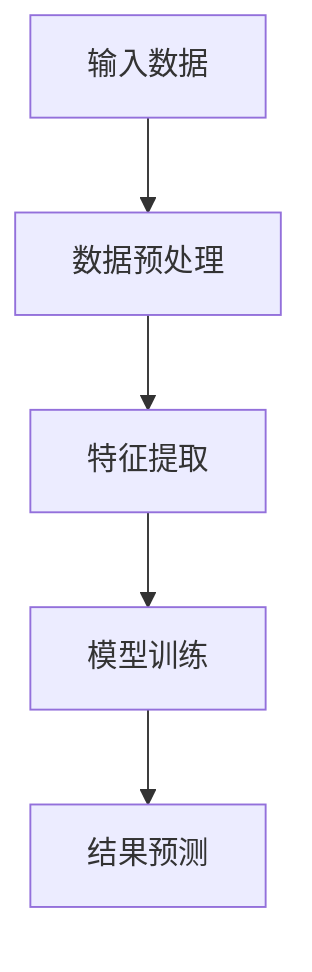
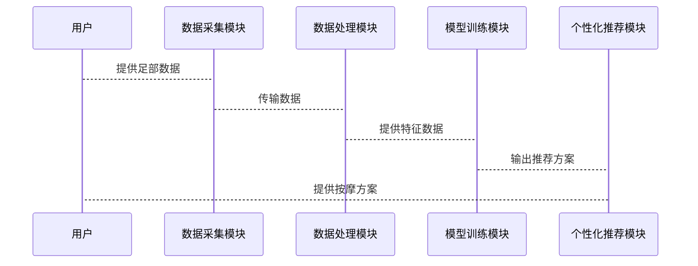

                 


# AI Agent在智能拖鞋中的足部按摩定制

> 关键词：AI Agent, 智能拖鞋, 足部按摩, 支持向量机, 个性化推荐

> 摘要：本文深入探讨了AI Agent在智能拖鞋中的足部按摩定制应用，从核心概念、算法原理到系统架构，再到项目实战，全面剖析了如何利用AI技术提升足部按摩体验。文章通过详细的技术分析和实际案例，展示了AI Agent在智能拖鞋中的巨大潜力和实现路径。

---

## 第一部分: AI Agent与智能拖鞋的背景与概念

### 第1章: AI Agent与智能拖鞋概述

#### 1.1 AI Agent的基本概念
- **1.1.1 什么是AI Agent**
  - AI Agent的定义：AI Agent（人工智能代理）是指能够感知环境、自主决策并执行任务的智能实体。
  - AI Agent的特点：自主性、反应性、目标导向、社会能力。

- **1.1.2 AI Agent的核心特点**
  - 感知能力：通过传感器或数据输入感知环境。
  - 决策能力：基于感知信息做出最优决策。
  - 执行能力：通过执行机构或输出模块实现决策。

- **1.1.3 AI Agent与传统算法的区别**
  - 传统算法：静态规则，无法动态调整。
  - AI Agent：动态感知与自适应，能够根据环境变化实时调整行为。

#### 1.2 智能拖鞋的发展历程
- **1.2.1 普通拖鞋的功能与局限**
  - 普通拖鞋的功能：基本保暖、舒适性。
  - 局限性：无法提供个性化足部健康服务。

- **1.2.2 智能拖鞋的定义与分类**
  - 定义：智能拖鞋是集成传感器、微处理器和AI算法的智能 footwear。
  - 分类：按功能可分为健康监测型、按摩理疗型、舒适优化型。

- **1.2.3 智能拖鞋的市场现状与发展趋势**
  - 市场现状：市场需求增长迅速，应用场景广泛。
  - 发展趋势：智能化、个性化、多功能化。

#### 1.3 足部按摩与健康
- **1.3.1 足部按摩的健康功效**
  - 提供血液循环、缓解疲劳、改善足部健康。

- **1.3.2 传统足部按摩方式的不足**
  - 手动按摩的效率低、标准化难。
  - 缺乏个性化、精准性。

- **1.3.3 AI Agent在足部按摩中的应用潜力**
  - 精准分析用户足部健康数据。
  - 提供个性化按摩方案。

### 1.4 本章小结
- 本章介绍了AI Agent的基本概念及其在智能拖鞋中的应用潜力，为后续技术实现奠定了基础。

---

## 第二部分: AI Agent在足部按摩中的核心原理

### 第2章: AI Agent的核心原理与算法

#### 2.1 AI Agent的基本原理
- **2.1.1 AI Agent的感知、决策与执行过程**
  - 感知：通过传感器采集足部数据（压力、温度、湿度等）。
  - 决策：基于数据进行分析，生成按摩方案。
  - 执行：通过执行机构实现按摩动作。

- **2.1.2 AI Agent的输入与输出**
  - 输入：足部健康数据、用户偏好。
  - 输出：个性化按摩方案、反馈信息。

- **2.1.3 AI Agent的分类与应用场景**
  - 分类：基于规则的AI Agent、基于学习的AI Agent。
  - 应用场景：足部健康监测、个性化按摩、舒适优化。

#### 2.2 支持向量机（SVM）算法原理
- **2.2.1 SVM的基本概念与数学模型**
  - 基本概念：SVM是一种监督学习算法，用于分类和回归。
  - 数学模型：$$ \text{目标函数} = \sum_{i=1}^{n} y_i w \cdot x_i + b $$
  - 最优化目标：最大化分类间隔，最小化分类误差。

- **2.2.2 SVM的优化目标与约束条件**
  - 优化目标：$$ \min \frac{1}{2}||w||^2 $$
  - 约束条件：$$ y_i (w \cdot x_i + b) \geq 1 $$

- **2.2.3 SVM的核函数与参数调优**
  - 核函数：线性核、多项式核、径向基函数（RBF）核。
  - 参数调优：C和gamma的调节。

#### 2.3 算法流程图


#### 2.4 算法实现代码
```python
from sklearn import svm
import numpy as np

# 数据预处理
X = np.array([[特征1, 特征2, ...], [...]])
y = np.array([标签1, 标签2, ...])

# 模型训练
model = svm.SVC(kernel='rbf', C=1.0)
model.fit(X, y)

# 结果预测
new_data = np.array([[新特征1, 新特征2, ...]])
print(model.predict(new_data))
```

---

## 第三部分: 智能拖鞋足部按摩系统架构设计

### 第3章: 系统架构与功能设计

#### 3.1 系统总体架构


#### 3.2 系统功能模块设计
- **数据采集模块**
  - 采集足部健康数据（压力、温度、湿度等）。
- **数据处理模块**
  - 数据清洗、特征提取、数据增强。
- **模型训练模块**
  - 使用SVM算法训练个性化按摩模型。
- **个性化推荐模块**
  - 根据用户数据推荐按摩方案。

#### 3.3 系统接口设计
- **硬件接口**
  - 传感器接口：与压力传感器、温度传感器等连接。
  - 执行机构接口：与按摩电机、震动模块连接。
- **软件接口**
  - 数据接口：与数据库交互。
  - 用户接口：提供个性化推荐和反馈界面。

#### 3.4 系统交互流程图


---

## 第四部分: 项目实战与实现

### 第4章: 项目实战

#### 4.1 项目介绍
- 项目目标：开发一个基于AI Agent的智能拖鞋足部按摩系统。
- 项目需求：实现个性化足部按摩方案推荐。

#### 4.2 系统核心实现
- **数据采集模块实现**
  ```python
  import sensor_library

  def collect_data():
      pressure = sensor_library.read_pressure()
      temperature = sensor_library.read_temperature()
      return [pressure, temperature]
  ```

- **模型训练模块实现**
  ```python
  from sklearn import svm

  def train_model(X_train, y_train):
      model = svm.SVC(kernel='rbf', C=1.0)
      model.fit(X_train, y_train)
      return model
  ```

- **个性化推荐模块实现**
  ```python
  def recommend_masseuse(model, new_data):
      return model.predict(new_data)
  ```

#### 4.3 实际案例分析
- 案例背景：用户A足部压力过高，需要个性化按摩方案。
- 案例实现：通过SVM算法推荐最佳按摩强度和时间。

#### 4.4 项目总结
- 成果展示：系统实现了个性化足部按摩推荐。
- 经验总结：数据质量和模型调优对系统性能影响显著。

---

## 第五部分: 最佳实践与注意事项

### 第5章: 最佳实践

#### 5.1 数据质量控制
- 数据清洗：去除异常值和噪声数据。
- 数据增强：通过数据扩展提升模型泛化能力。

#### 5.2 模型调优技巧
- 参数优化：调整C和gamma值，提升分类准确率。
- 模型评估：使用交叉验证评估模型性能。

#### 5.3 用户隐私保护
- 数据加密：保护用户足部健康数据。
- 权限控制：限制数据访问权限。

#### 5.4 项目注意事项
- 硬件兼容性：确保传感器与执行机构兼容。
- 软件稳定性：保证系统运行稳定，避免崩溃。

---

## 第六部分: 结论与展望

### 第6章: 结论与展望

#### 6.1 研究总结
- AI Agent在智能拖鞋中的应用前景广阔。
- 支持向量机算法在足部按摩定制中表现出色。

#### 6.2 未来展望
- 智能拖鞋的多功能化：集成更多健康监测功能。
- AI算法的优化：探索更高效的机器学习算法。

#### 6.3 致谢
- 感谢读者的支持与关注。

---

## 作者：AI天才研究院/AI Genius Institute & 禅与计算机程序设计艺术 /Zen And The Art of Computer Programming

