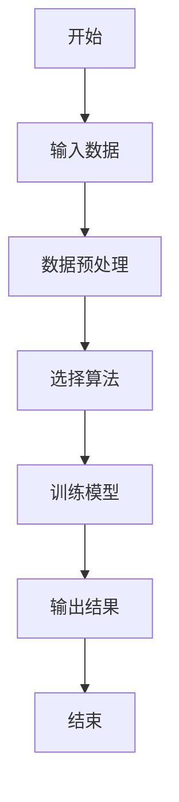
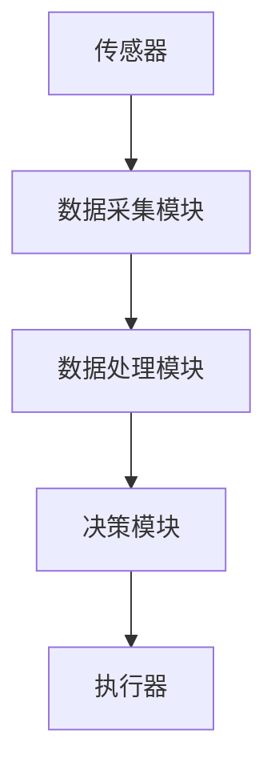
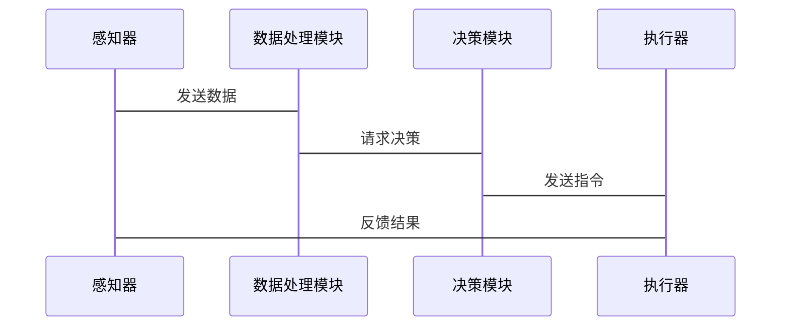

                 


# AI Agent 在智能水资源管理中的实践

> 关键词：AI Agent、智能水资源管理、算法、系统架构、实践应用

> 摘要：本文详细探讨了AI Agent在智能水资源管理中的实践应用，从背景介绍、核心概念、算法原理到系统架构、项目实战和最佳实践，全面分析了AI Agent在水资源管理中的重要作用和实现方法。

---

## 第一部分: AI Agent 在智能水资源管理中的背景与概念

### 第1章: AI Agent 的基本概念与水资源管理背景

#### 1.1 AI Agent 的基本概念
- **什么是 AI Agent**  
  AI Agent（人工智能代理）是指能够感知环境、自主决策并执行任务的智能体。它能够通过传感器获取信息，利用算法进行分析，并通过执行器与环境交互。AI Agent 的核心在于其智能性和自主性。

- **AI Agent 的核心特征**  
  AI Agent 具有以下几个核心特征：  
  1. **感知能力**：能够通过传感器或数据源获取环境信息。  
  2. **决策能力**：能够基于获取的信息进行推理和决策。  
  3. **自主性**：能够在没有人工干预的情况下独立运行。  
  4. **适应性**：能够根据环境变化动态调整行为。  

- **AI Agent 在水资源管理中的应用价值**  
  AI Agent 可以帮助水资源管理者实现智能化管理，例如实时监测水质、优化水资源分配、预测污染风险等。通过 AI Agent 的应用，可以显著提高水资源管理的效率和准确性。

#### 1.2 水资源管理的挑战与需求
- **水资源管理的基本概念**  
  水资源管理是指对水资源的开发、利用、保护和配置进行科学规划和管理的过程。其目标是实现水资源的可持续利用，同时满足社会、经济和生态的需求。

- **当前水资源管理的主要挑战**  
  1. **数据获取难**：水资源分布广泛，实时监测数据获取困难。  
  2. **决策复杂性**：水资源管理涉及多方利益，决策过程复杂。  
  3. **环境变化影响**：气候变化和人类活动对水资源的影响日益显著。  

- **智能化管理的需求与目标**  
  智能化管理的需求主要体现在对实时数据的处理、复杂决策的优化以及对环境变化的快速响应。目标是通过智能化手段实现水资源的高效利用和可持续管理。

#### 1.3 AI Agent 在水资源管理中的应用前景
- **国内外研究现状**  
  国内和国外在 AI Agent 方面的研究已经取得了一定的成果，特别是在智能监测、优化决策和预测分析方面。AI Agent 在水资源管理中的应用还处于起步阶段，但具有广阔的发展前景。

- **技术发展趋势**  
  随着人工智能技术的不断发展，AI Agent 在水资源管理中的应用将更加广泛，尤其是在大数据分析、深度学习和强化学习领域。

- **应用场景与案例**  
  目前，AI Agent 在水资源管理中的应用场景主要包括水质监测、水资源调度、污染控制等。例如，可以通过 AI Agent 实现实时水质监测和污染预警。

---

### 第2章: AI Agent 的核心概念与水资源管理的关联

#### 2.1 AI Agent 的核心概念
- **AI Agent 的定义与分类**  
  AI Agent 可以分为多种类型，例如基于规则的代理、基于模型的代理、强化学习代理等。每种代理类型都有其特点和适用场景。

- **AI Agent 的主要功能与特点**  
  1. **数据采集与处理**：通过传感器获取环境数据并进行预处理。  
  2. **智能决策与优化**：利用算法对数据进行分析，生成最优决策。  
  3. **实时监控与反馈**：能够实时监控环境变化并根据反馈调整行为。  

- **AI Agent 的工作原理**  
  AI Agent 的工作原理通常包括感知、推理、决策和执行四个阶段。感知阶段通过传感器获取数据，推理阶段通过算法对数据进行分析，决策阶段生成行动方案，执行阶段通过执行器将决策转化为实际行动。

#### 2.2 水资源管理中的关键问题
- **水资源分配与调度问题**  
  水资源的分配与调度需要考虑多方利益，例如农业、工业和居民用水的需求。通过 AI Agent 可以实现动态优化。

- **水质监测与污染控制问题**  
  水质监测是水资源管理的重要环节，通过 AI Agent 可以实现对水质的实时监测和污染控制。

- **水资源规划与决策优化问题**  
  水资源规划需要考虑长期的气候变化和人类活动的影响。通过 AI Agent 可以进行长期预测和优化决策。

#### 2.3 AI Agent 在水资源管理中的核心作用
- **数据采集与处理**  
  AI Agent 可以通过传感器和数据源获取水质、水量等信息，并进行预处理和分析。

- **智能决策与优化**  
  AI Agent 可以利用强化学习、监督学习等算法，对数据进行分析，生成最优决策方案。

- **实时监控与反馈**  
  AI Agent 可以实时监控水资源的变化，并根据反馈调整决策策略。

---

### 第3章: AI Agent 的算法原理与数学模型

#### 3.1 AI Agent 的核心算法
- **强化学习算法**  
  强化学习是一种通过与环境交互来学习最优策略的算法。AI Agent 在水资源管理中可以利用强化学习进行动态优化。

- **监督学习算法**  
  监督学习是一种基于标注数据进行学习的算法。AI Agent 可以利用监督学习对水质数据进行分类和预测。

- **聚类与分类算法**  
  聚类和分类算法可以用于对水资源数据进行模式识别和分类。

#### 3.2 算法原理的数学模型
- **强化学习的数学模型**  
  强化学习的目标是通过与环境交互最大化累计奖励。其数学模型可以表示为：  
  $$ V(s) = \max_{a} [ r(s,a) + \gamma V(s') ] $$  
  其中，\( s \) 是状态，\( a \) 是动作，\( r(s,a) \) 是奖励，\( \gamma \) 是折扣因子，\( s' \) 是下一个状态。

- **监督学习的数学模型**  
  监督学习的目标是最小化预测值与真实值的差异。其数学模型可以表示为：  
  $$ y = \theta x + b $$  
  其中，\( \theta \) 是权重，\( x \) 是输入，\( b \) 是偏置。

#### 3.3 算法流程图（mermaid）


---

### 第4章: 系统分析与架构设计

#### 4.1 项目场景介绍
- **项目背景**  
  本项目旨在利用 AI Agent 技术实现对水资源的智能化管理，包括水质监测、水资源调度和污染控制。

- **系统功能设计**  
  系统功能包括数据采集、数据处理、智能决策、实时监控和结果输出。

#### 4.2 系统架构设计
- **领域模型类图**  
```mermaid
classDiagram
    class 水资源管理系统 {
        +传感器数据
        +水质数据
        +决策模型
        +执行器
    }
    水资源管理系统的<<使用>>传感器数据
    水资源管理系统的<<使用>>水质数据
    水资源管理系统的<<使用>>决策模型
    水资源管理系统的<<使用>>执行器
```

- **系统架构图**  


#### 4.3 系统接口设计
- **接口设计**  
  系统接口包括传感器接口、数据处理接口、决策接口和执行器接口。

- **交互流程图**  


---

### 第5章: 项目实战

#### 5.1 环境安装
- **安装 Python 环境**  
  需要安装 Python 3.8 或更高版本，以及必要的库如 NumPy、Pandas、Scikit-learn 等。

- **安装 AI Agent 环境**  
  安装必要的深度学习框架如 TensorFlow 或 PyTorch。

#### 5.2 核心代码实现
```python
import numpy as np
from sklearn.linear_model import LinearRegression

# 示例代码：水质预测模型
class WaterQualityPredictor:
    def __init__(self):
        self.model = LinearRegression()
    
    def train(self, X, y):
        self.model.fit(X, y)
    
    def predict(self, X):
        return self.model.predict(X)
```

#### 5.3 代码应用解读与分析
- **代码解读**  
  上面的代码是一个简单的水质预测模型，使用线性回归算法进行训练和预测。

- **实际案例分析**  
  例如，可以通过传感器获取水质数据，利用上述模型进行水质预测，并根据预测结果调整水资源管理策略。

---

### 第6章: 总结与展望

#### 6.1 小结
- **AI Agent 在水资源管理中的核心作用**  
  AI Agent 可以通过感知、决策和执行实现对水资源的智能化管理，显著提高管理效率和准确性。

- **项目总结**  
  本项目展示了 AI Agent 在水资源管理中的广泛应用，从算法原理到系统设计再到实际应用，为后续研究提供了参考。

#### 6.2 注意事项
- **数据质量**  
  数据的质量直接影响 AI Agent 的性能，需要确保数据的准确性和完整性。

- **算法选择**  
  根据具体应用场景选择合适的算法，避免过度复杂化。

#### 6.3 拓展阅读
- **推荐书籍**  
  1. 《机器学习实战》  
  2. 《深度学习》  
  3. 《人工智能：一种现代的方法》  

---

## 作者信息

作者：AI天才研究院/AI Genius Institute & 禅与计算机程序设计艺术 /Zen And The Art of Computer Programming

