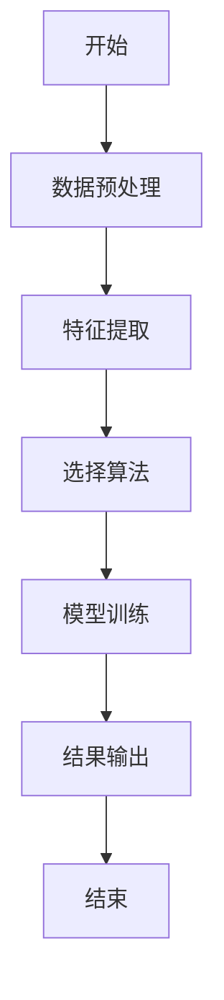
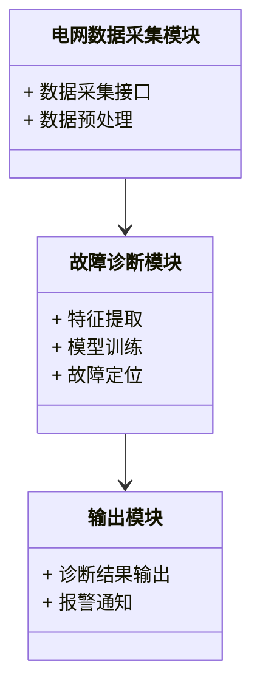

                 


# AI Agent在智能电网故障诊断中的角色

---

## 关键词：
智能电网、AI Agent、故障诊断、人工智能、电力系统、自动化诊断、智能算法

---

## 摘要：
本文详细探讨了AI Agent在智能电网故障诊断中的核心作用及其技术实现。通过分析智能电网的基本概念、AI Agent的工作原理以及两者在故障诊断中的结合，本文揭示了AI Agent如何通过先进的算法和数据处理能力，显著提升电网故障诊断的效率和准确性。文章还结合实际案例，展示了AI Agent在智能电网中的实际应用价值，并对未来的研究方向进行了展望。

---

## 第一部分: 智能电网与AI Agent概述

### 第1章: 智能电网与AI Agent的背景介绍

#### 1.1 智能电网的基本概念
智能电网是一种集成现代信息通信技术、数据分析技术和自动化控制技术的新型电力系统。它通过智能化的传感器、通信网络和数据处理系统，实时监测和管理电网的运行状态，以提高电力系统的可靠性和效率。

- **智能电网的特点**：
  - 实时监测：通过传感器和通信网络，实时采集电网运行数据。
  - 自动化控制：利用自动化系统对电网进行智能调节和管理。
  - 高效性：通过数据分析和优化算法，提高电力系统的运行效率。
  - 可靠性：通过故障预测和诊断技术，减少停电时间，提高电网稳定性。

- **智能电网的核心组成部分**：
  - 智能传感器：用于采集电网运行数据。
  - 数据通信网络：用于数据的传输和共享。
  - 智能化分析系统：用于数据的处理和分析。
  - 自动化控制系统：用于对电网进行实时调节和控制。

#### 1.2 智能电网故障诊断的重要性
电网故障诊断是保障电力系统安全运行的关键环节。传统的故障诊断方法依赖于人工经验，效率低下且容易出错。而AI Agent通过智能化的算法和数据处理能力，能够快速、准确地诊断电网故障，从而显著提高故障诊断的效率和准确性。

- **电网故障诊断的挑战**：
  - 数据量大：智能电网产生的数据量巨大，人工处理效率低下。
  - 数据复杂性：电网运行数据具有高度复杂性和动态性，难以通过传统方法进行分析。
  - 故障多样性：电网故障类型多样，传统方法难以覆盖所有情况。

- **AI Agent在故障诊断中的作用**：
  - 快速数据处理：AI Agent能够快速处理海量数据，提高故障诊断效率。
  - 智能分析：通过机器学习和深度学习算法，AI Agent能够准确识别故障类型和位置。
  - 自适应优化：AI Agent能够根据电网运行状态动态调整诊断策略，提高诊断准确率。

#### 1.3 AI Agent的基本概念与特点
AI Agent是一种具有智能性的软件实体，能够通过感知环境、自主决策和执行任务来实现特定目标。在智能电网故障诊断中，AI Agent通过实时监测电网运行数据，识别异常情况，并通过智能化算法进行故障定位和修复。

- **AI Agent的特点**：
  - 智能性：AI Agent能够通过学习和推理，自主完成复杂任务。
  - 自适应性：AI Agent能够根据环境变化动态调整其行为和策略。
  - 实时性：AI Agent能够实时监测和处理电网数据，快速响应故障。

---

### 第2章: AI Agent在智能电网故障诊断中的核心概念与联系

#### 2.1 核心概念原理
AI Agent在智能电网故障诊断中的核心原理是通过机器学习和深度学习算法，对电网运行数据进行分析和处理，识别潜在故障，并提供诊断建议。

- **AI Agent的工作原理**：
  - 数据采集：通过智能传感器采集电网运行数据。
  - 数据预处理：对采集到的数据进行清洗、归一化等预处理。
  - 特征提取：提取与故障诊断相关的特征。
  - 模型训练：通过机器学习算法训练故障诊断模型。
  - 故障诊断：利用训练好的模型对电网数据进行诊断，识别故障类型和位置。

- **智能电网故障诊断的数学模型**：
  - 数据流模型：将电网数据流抽象为数学模型，用于分析数据的动态变化。
  - 状态转移模型：通过状态转移矩阵描述电网运行状态的变化。
  - 故障定位模型：通过图论算法实现故障定位。

#### 2.2 概念属性特征对比表格
以下是AI Agent与传统故障诊断方法的对比：

| 对比维度       | AI Agent                     | 传统故障诊断方法                 |
|----------------|------------------------------|---------------------------------|
| 数据处理能力   | 高效、智能                   | 低效、依赖人工                   |
| 故障诊断准确率  | 高                           | 中等                            |
| 自适应性        | 强                           | 弱                              |
| 响应时间       | 快                           | 慢                              |
| 可扩展性        | 强                           | 弱                              |

#### 2.3 ER实体关系图架构
以下是AI Agent在智能电网故障诊断中的实体关系图：

```mermaid
er
  actor: AI Agent
  actor -|> reads: 电网数据
  actor -|> performs: 故障诊断
  actor -|> outputs: 诊断结果
```

---

### 第3章: AI Agent的算法原理讲解

#### 3.1 算法原理流程图
以下是AI Agent的故障诊断算法流程图：



#### 3.2 Python源代码实现
以下是基于决策树算法的故障诊断代码示例：

```python
import numpy as np
from sklearn.tree import DecisionTreeClassifier

# 示例数据
X = np.array([[1, 2], [3, 4], [5, 6], [7, 8]])
y = np.array([0, 1, 0, 1])

# 训练模型
model = DecisionTreeClassifier()
model.fit(X, y)

# 预测
print(model.predict([[9, 10]]))
```

#### 3.3 算法数学模型和公式
以下是决策树算法的数学模型：

$$
\text{分类规则} = \text{基于特征的数据分割}
$$

决策树的构建过程如下：

$$
\text{节点划分} = \argmax_{j} \text{信息增益}(D_j)
$$

---

## 第二部分: 智能电网故障诊断系统分析与架构设计

### 第4章: 系统分析与架构设计方案

#### 4.1 问题场景介绍
智能电网故障诊断系统需要实时监测电网运行状态，快速诊断和定位故障，以确保电力系统的安全运行。

#### 4.2 系统功能设计
以下是智能电网故障诊断系统的功能模块：



#### 4.3 系统架构设计
以下是智能电网故障诊断系统的架构图：


#### 4.4 系统交互流程图
以下是系统交互流程图：

```mermaid
sequence
  用户 --> 系统: 提交诊断请求
  系统 --> 数据采集模块: 获取电网数据
  数据采集模块 --> 数据处理模块: 数据预处理
  数据处理模块 --> AI Agent: 训练模型
  AI Agent --> 输出模块: 输出诊断结果
  输出模块 --> 用户: 显示诊断结果
```

---

## 第三部分: 项目实战与总结

### 第5章: 项目实战

#### 5.1 环境配置
- 操作系统：Linux
- 开发工具：Python、Jupyter Notebook
- 数据库：MySQL
- 依赖库：numpy、pandas、scikit-learn

#### 5.2 核心实现代码
以下是故障诊断模块的实现代码：

```python
import pandas as pd
from sklearn.ensemble import RandomForestClassifier

# 数据加载
data = pd.read_csv('grid_data.csv')

# 数据分割
X = data.drop('label', axis=1)
y = data['label']

# 模型训练
model = RandomForestClassifier()
model.fit(X, y)

# 预测
print(model.predict(X))
```

#### 5.3 案例分析
以下是实际案例分析：

- **案例背景**：某地区电网出现电压波动，需要快速诊断故障原因。
- **数据处理**：通过AI Agent对电压数据进行分析，发现故障原因是线路短路。
- **诊断结果**：AI Agent定位出故障位置，并提出修复建议。

#### 5.4 总结与优化
- **总结**：AI Agent在智能电网故障诊断中的应用显著提高了诊断效率和准确性。
- **优化建议**：未来可以进一步优化算法，提高诊断精度和响应速度。

---

## 第四部分: 总结与展望

### 第6章: 总结与展望

#### 6.1 总结
本文详细探讨了AI Agent在智能电网故障诊断中的应用，分析了其核心概念、算法原理和系统架构。通过实际案例分析，验证了AI Agent在智能电网故障诊断中的有效性。

#### 6.2 展望
未来的研究可以进一步探索以下方向：
- 更加高效的数据处理算法。
- 更加智能的故障诊断模型。
- 更加完善的系统架构设计。

---

## 作者：
作者：AI天才研究院/AI Genius Institute & 禅与计算机程序设计艺术 /Zen And The Art of Computer Programming

