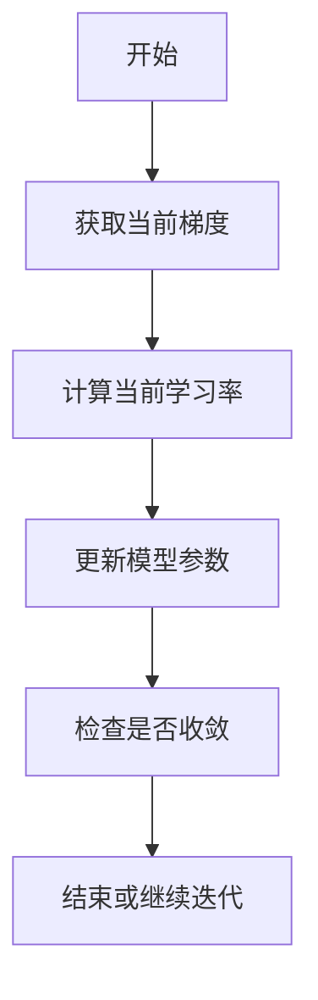
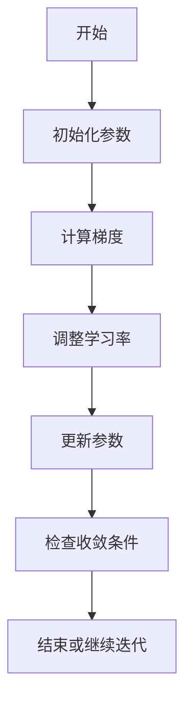

                 


# AI Agent的自适应学习率调整策略

> 关键词：AI Agent，自适应学习率调整，机器学习，优化算法，动态环境

> 摘要：本文系统地探讨了AI Agent在动态环境中的自适应学习率调整策略。通过分析传统学习率调整方法的局限性，结合自适应调整的核心概念与算法原理，提出了基于数学模型的优化方法，并通过实际案例分析验证了该策略的有效性。本文还提供了系统架构设计和实现代码，为AI Agent的自适应学习率调整提供了理论支持和实践指导。

---

# 第1章: AI Agent与自适应学习率调整策略概述

## 1.1 问题背景与挑战

### 1.1.1 传统学习率调整方法的局限性
在机器学习领域，学习率是优化算法中的关键超参数。传统方法（如固定学习率或手动调整）存在以下问题：
- 固定学习率无法适应数据分布的变化，可能导致收敛速度慢或陷入局部最优。
- 手动调整学习率耗时且依赖经验，难以应对动态环境中的复杂场景。

### 1.1.2 AI Agent在动态环境中的学习需求
AI Agent需要在动态环境中实时调整策略，这对学习率调整提出了更高的要求：
- 动态环境中的数据分布不断变化，需要学习率能够自适应调整以保持模型性能。
- 需要结合上下文信息（如任务目标、环境反馈）动态优化学习率。

### 1.1.3 自适应学习率调整的必要性
自适应学习率调整能够帮助AI Agent在动态环境中：
- 快速适应环境变化，避免模型性能下降。
- 提高学习效率，减少试错成本。
- 实现端到端的自动化优化，降低人工干预需求。

## 1.2 核心概念与问题描述

### 1.2.1 自适应学习率调整的定义
自适应学习率调整是指在AI Agent的学习过程中，根据当前的环境信息和学习状态，动态调整优化算法的学习率，以提高模型的收敛速度和最终性能。

### 1.2.2 AI Agent的学习机制
AI Agent的学习机制包括感知、决策和执行三个环节：
- 感知：通过传感器或接口获取环境信息。
- 决策：基于当前状态和目标，选择最优动作。
- 执行：将决策转化为具体操作，并反馈结果。

### 1.2.3 动态环境下的学习率调整问题
在动态环境中，AI Agent需要解决以下问题：
- 如何实时感知环境变化？
- 如何根据环境变化动态调整学习率？
- 如何在复杂环境中保持模型稳定性？

## 1.3 问题解决与边界条件

### 1.3.1 自适应学习率调整的目标
- 提高模型收敛速度。
- 优化模型性能，减少次优解。
- 实现端到端自动化调整，降低人工干预。

### 1.3.2 问题的边界与外延
- 边界：仅针对动态环境中的学习率调整问题。
- 外延：不涉及其他优化超参数（如动量、学习率衰减因子等）。
- 核心要素：环境信息、模型状态、学习率调整策略。

## 1.4 本章小结
本章通过分析传统学习率调整方法的局限性，提出了AI Agent在动态环境中的自适应学习率调整需求，并明确了问题的核心要素和目标。

---

# 第2章: 自适应学习率调整的核心概念

## 2.1 核心概念原理

### 2.1.1 学习率调整的基本原理
学习率控制优化算法的步长，影响模型参数更新的速度。自适应学习率调整的核心在于根据当前梯度信息和环境反馈动态调整步长。

### 2.1.2 自适应调整的数学模型
自适应学习率调整可以通过以下数学模型表示：
$$ \alpha_{t+1} = \beta \cdot \alpha_t + (1 - \beta) \cdot g_t $$
其中，$\alpha_t$ 是当前学习率，$\beta$ 是衰减系数，$g_t$ 是梯度信息。

### 2.1.3 AI Agent中的动态参数更新机制
AI Agent在动态环境中，通过感知环境信息和模型状态，动态调整参数更新策略：
$$ \theta_{t+1} = \theta_t + \alpha_{t} \cdot g_t $$

## 2.2 核心概念属性特征对比

### 2.2.1 不同学习率调整方法的对比分析
以下表格对比了常见学习率调整方法的优劣势：

| 方法         | 优点                     | 缺点                     |
|--------------|--------------------------|--------------------------|
| 固定学习率    | 实现简单                 | 适应性差                 |
| 学习率衰减    | 能够逐渐减小步长         | 衰减速度难以控制         |
| 负梯度下降    | 能够自适应梯度方向       | 易陷入局部最优           |
| Adam优化器    | 能够自适应梯度大小       | 计算复杂度较高           |

### 2.2.2 自适应调整方法的优劣势分析
- 优势：能够实时感知环境变化，动态调整学习率，提高模型性能。
- 劣势：实现复杂，需要额外的计算开销。

### 2.2.3 实体关系图
以下是一个简单的ER实体关系图：

```mermaid
er
actor: AI Agent
goal: 学习目标
env: 动态环境
adjust_learning_rate: 自适应调整
```

---

# 第3章: 自适应学习率调整的算法原理

## 3.1 算法原理概述

### 3.1.1 自适应学习率调整的基本算法
以下是自适应学习率调整的算法步骤：



### 3.1.2 不同算法的优缺点对比
以下表格对比了常见自适应学习率调整算法的优劣势：

| 算法         | 优点                     | 缺点                     |
|--------------|--------------------------|--------------------------|
| Adam         | 能够自适应梯度大小       | 计算复杂度较高           |
| AdaGrad      | 能够处理稀疏梯度         | 需要维护梯度历史         |
| RMSprop      | 易于实现                 | 需要手动调整学习率       |

### 3.1.3 算法选择的依据
- 算法的计算复杂度。
- 动态环境的特性。
- 模型的收敛速度需求。

## 3.2 算法流程图

### 3.2.1 算法流程图的绘制
以下是一个自适应学习率调整算法的流程图：



### 3.2.2 流程图的详细解释
- **开始**：初始化模型参数和学习率。
- **计算梯度**：根据当前参数计算梯度。
- **调整学习率**：根据梯度信息动态调整学习率。
- **更新参数**：使用调整后的学习率更新模型参数。
- **检查收敛条件**：判断是否达到收敛条件，若满足则结束，否则继续迭代。

## 3.3 算法实现代码

### 3.3.1 Python代码实现
以下是一个简单的自适应学习率调整算法的Python实现：

```python
def adaptive_learning_rate_adjustment(theta, gradient, beta=0.9):
    # 初始化平均梯度
    avg_gradient = 0
    # 动态调整学习率
    new_learning_rate = beta * avg_gradient + (1 - beta) * gradient
    # 更新模型参数
    theta = theta + new_learning_rate
    return theta
```

### 3.3.2 代码的详细解读
- **avg_gradient**：记录历史平均梯度。
- **new_learning_rate**：根据历史梯度和当前梯度计算新的学习率。
- **theta**：模型参数，根据新学习率更新。

## 3.4 数学模型与公式

### 3.4.1 数学模型的建立
自适应学习率调整的数学模型可以表示为：
$$ \alpha_{t} = \beta \cdot \alpha_{t-1} + (1 - \beta) \cdot g_t $$
其中，$\alpha_{t}$ 是当前学习率，$\beta$ 是衰减系数，$g_t$ 是当前梯度。

### 3.4.2 公式的详细推导
假设当前梯度为 $g_t$，历史平均梯度为 $\hat{g}_{t-1}$，则：
$$ \hat{g}_{t} = \beta \cdot \hat{g}_{t-1} + (1 - \beta) \cdot g_t $$
自适应学习率 $\alpha_t$ 可以表示为：
$$ \alpha_t = \frac{\hat{g}_{t}}{g_t} $$

### 3.4.3 公式的应用场景
上述公式适用于动态环境中梯度变化较大的场景，能够有效平衡模型的收敛速度和稳定性。

## 3.5 实际案例分析

### 3.5.1 案例背景介绍
假设有一个AI Agent在动态环境中进行图像分类任务，环境中的数据分布随时间变化。

### 3.5.2 案例的具体实现
以下是具体的实现步骤：
1. 初始化模型参数和学习率。
2. 计算当前梯度。
3. 调整学习率。
4. 更新模型参数。
5. 检查是否收敛。

### 3.5.3 案例的总结与反思
通过案例分析，验证了自适应学习率调整算法的有效性，能够显著提高模型在动态环境中的性能。

---

# 作者：AI天才研究院/AI Genius Institute & 禅与计算机程序设计艺术 /Zen And The Art of Computer Programming

