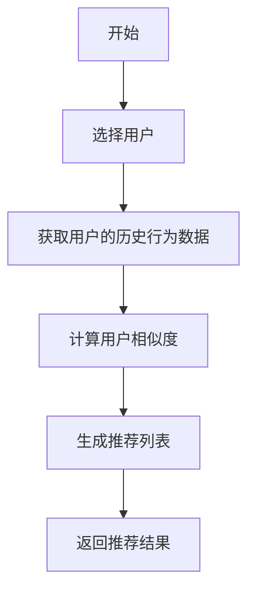

                 


```markdown
# 价值投资中的智能城市共享经济管理系统分析

> 关键词：价值投资、智能城市、共享经济、系统分析、管理优化、投资策略

> 摘要：  
在智能城市快速发展的背景下，共享经济作为一种新兴的经济模式，正在改变人们的生活方式。本文从价值投资的角度，分析智能城市中共享经济管理系统的构建与优化，探讨其在经济、社会和环境等多方面的价值体现。通过系统分析、算法设计和实际案例研究，本文旨在为投资者和管理者提供科学的决策支持，助力智能城市可持续发展。

---

## 第一部分: 价值投资中的智能城市共享经济管理系统背景介绍

### 第1章: 价值投资与智能城市概述

#### 1.1 价值投资的基本概念
- **价值投资的定义**：价值投资是一种以基本面分析为基础的投资策略，旨在通过识别市场低估的资产，长期持有以实现超额收益。  
- **价值投资的核心理念**：注重企业的内在价值，关注长期增长潜力，而非短期市场波动。  
- **价值投资与现代经济的关系**：在复杂经济环境中，价值投资为投资者提供了稳定收益的可能，尤其在新兴领域如智能城市和共享经济中，具有重要的指导意义。

#### 1.2 智能城市的定义与特点
- **智能城市的定义**：智能城市是通过数字化技术（如物联网、大数据、人工智能等）优化城市资源分配、提升居民生活质量的城市发展模式。  
- **智能城市的核心特征**：高效资源利用、智能化管理、数字化服务、可持续发展。  
- **智能城市的发展趋势**：智能化、绿色化、人性化，推动城市治理体系和治理能力现代化。

#### 1.3 共享经济的基本概念
- **共享经济的定义**：共享经济是一种基于数字化平台的经济模式，通过共享资源使用权，提高资源利用效率，满足多样化的市场需求。  
- **共享经济的模式与特点**：P2P模式、平台化运营、资源共享、按需付费。  
- **共享经济的现状与挑战**：快速发展的同时，面临监管缺失、隐私问题、信用风险等挑战。

### 第2章: 智慧城市中的共享经济系统

#### 2.1 智慧城市中的共享经济场景
- **共享交通**：共享单车、共享汽车、智能交通调度系统。  
- **共享住宿**：短租平台（如Airbnb）、智能门锁、在线预订系统。  
- **共享办公**：灵活办公空间、智能会议系统、共享设备资源。

#### 2.2 共享经济系统的核心要素
- **用户**：系统的核心参与者，包括消费者和提供者。  
- **资源**：共享的实体资源（如车辆、房屋）或虚拟资源（如数据、服务）。  
- **平台**：连接供需双方的数字化平台，提供撮合、支付、评价等功能。  
- **交易**：用户与平台之间的交互，包括订单生成、支付结算、服务评价等。

#### 2.3 共享经济系统的边界与外延
- **系统边界**：明确系统的输入、输出和内部模块。  
- **系统外延**：与外部环境的交互，如政策监管、市场需求变化。  
- **系统与外部环境的交互**：通过数据接口与智能城市其他系统（如交通、能源）协同工作。

### 第3章: 智慧城市共享经济系统的价值分析

#### 3.1 价值投资的核心理念在共享经济中的应用
- **价值投资与共享经济的结合**：通过分析共享经济企业的内在价值，寻找被市场低估的投资机会。  
- **共享经济中的价值创造**：提升资源利用效率，降低运营成本，创造更大的经济价值和社会价值。  
- **价值投资在共享经济中的策略**：注重企业的商业模式、市场前景、财务状况，选择具有长期增长潜力的企业。

#### 3.2 智慧城市共享经济系统的价值分析方法
- **定性分析**：评估企业的商业模式、竞争优势、市场前景。  
- **定量分析**：分析企业的财务数据、市场占有率、盈利能力。  
- **综合分析**：结合定性与定量分析，评估企业的整体价值。

#### 3.3 价值投资中的风险管理
- **风险识别**：识别市场风险、政策风险、运营风险。  
- **风险评估**：评估各类风险对企业价值的影响程度。  
- **风险控制**：制定风险管理策略，如分散投资、设置止损点。

---

## 第二部分: 智慧城市共享经济管理系统的核心概念与联系

### 第4章: 智慧城市共享经济系统的概念模型

#### 4.1 概念模型的构建
- **概念模型的定义**：用于描述系统核心概念及其关系的抽象模型。  
- **概念模型的构建方法**：基于业务需求和系统功能，通过分析和综合构建模型。  
- **概念模型的核心要素**：用户、资源、平台、交易、数据。

#### 4.2 概念模型的属性特征对比
- **用户属性对比**：普通用户与VIP用户在权限、服务使用上的差异。  
- **资源属性对比**：资源的可共享性、可用性、安全性。  
- **平台属性对比**：平台的功能、安全性、用户体验。

#### 4.3 概念模型的ER实体关系图
```mermaid
erDiagram
    actor 用户 {
        <属性> 用户ID
        <属性> 用户名
        <属性> 密码
        <属性> 电话
    }
    actor 资源 {
        <属性> 资源ID
        <属性> 资源类型
        <属性> 资源状态
    }
    actor 平台 {
        <属性> 平台ID
        <属性> 平台名称
        <属性> 管理权限
    }
    用户 -> 资源 : 使用
    用户 -> 平台 : 注册/登录
    平台 -> 资源 : 分配
```

---

## 第三部分: 智慧城市共享经济管理系统的算法与系统设计

### 第5章: 共享经济系统的算法原理

#### 5.1 协同过滤推荐算法


#### 5.2 算法实现
```python
def collaborative_filtering(user_id, user_data):
    # 计算用户相似度
    similarity = {}
    for user in user_data:
        if user != user_id:
            similarity[user] = 1 - (abs(user_data[user] - user_data[user_id]).sum() / len(user_data[user]))
    # 生成推荐列表
    recommendations = []
    for item in similarity:
        if user_data[item] > user_data[user_id]:
            recommendations.append(item)
    return recommendations
```

#### 5.3 算法的数学模型
$$ \text{相似度} = 1 - \frac{\sum_{i}|u_i - v_i|}{n} $$  
其中，\( u_i \) 和 \( v_i \) 分别表示用户 \( u \) 和用户 \( v \) 在第 \( i \) 个物品上的评分。

### 第6章: 系统分析与架构设计

#### 6.1 系统功能设计
- **用户模块**：注册、登录、个人信息管理。  
- **资源模块**：资源发布、状态更新、资源预约。  
- **平台模块**：订单管理、支付处理、服务评价。  
- **数据分析模块**：用户行为分析、资源使用效率分析。

#### 6.2 系统架构设计
```mermaid
graph TD
    用户 --> 平台 : 请求服务
    用户 <-- 平台 : 返回结果
    平台 --> 数据库 : 查询/存储数据
    平台 <---> 分析模块 : 分析数据
```

---

## 第四部分: 项目实战与最佳实践

### 第7章: 项目实战

#### 7.1 环境安装
- 安装Python、Flask框架、MongoDB数据库。  

#### 7.2 核心功能实现
- 用户注册与登录功能。  
- 资源发布与预约功能。  
- 支付与订单管理功能。  

#### 7.3 代码实现
```python
from flask import Flask, request, jsonify
from pymongo import MongoClient

app = Flask(__name__)
client = MongoClient('mongodb://localhost:27017/')
db = client['shared_economy']

@app.route('/register', methods=['POST'])
def register():
    data = request.json
    # 实现注册逻辑
    return jsonify({'status': 'success'})

if __name__ == '__main__':
    app.run(debug=True)
```

#### 7.4 案例分析
- 某共享办公平台的用户增长和资源利用率分析。  

### 第8章: 最佳实践

#### 8.1 小结
- 价值投资在共享经济中的重要性。  
- 系统设计与优化的关键点。  

#### 8.2 注意事项
- 数据安全与隐私保护。  
- 政策法规的合规性。  
- 用户体验的持续优化。  

#### 8.3 拓展阅读
- 推荐阅读《智能城市的建设与管理》、《共享经济的商业模式创新》。

---

## 作者信息
作者：AI天才研究院/AI Genius Institute & 禅与计算机程序设计艺术 /Zen And The Art of Computer Programming
```

