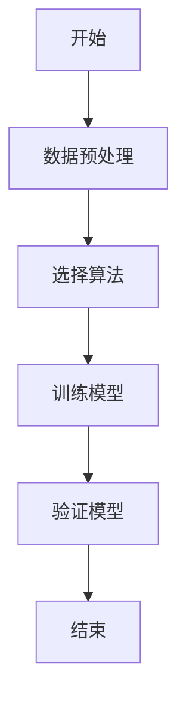
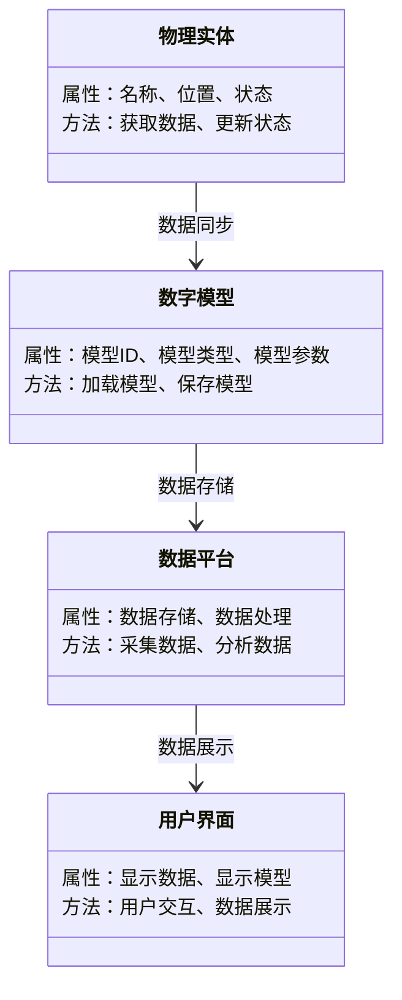
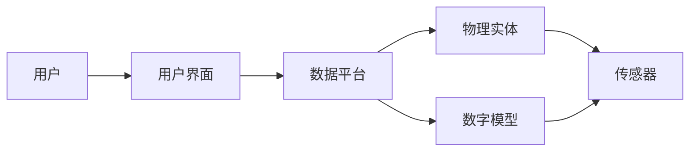

                 


# 价值投资中的智能工厂数字孪生系统分析

## 关键词
数字孪生系统，价值投资，智能工厂，工业4.0，数据驱动决策，系统建模

## 摘要
本文探讨了数字孪生系统在价值投资中的应用，特别是在智能工厂中的数字化转型。通过分析数字孪生系统的构成、算法原理和系统架构，展示了如何利用数字孪生技术优化生产效率、降低成本，并提升投资决策的准确性。文章结合实际案例，详细讲解了数字孪生系统的实现过程，并给出了最佳实践建议，帮助读者在实际项目中有效应用这些技术。

---

## 第一部分: 数字孪生系统与价值投资概述

### 第1章: 数字孪生系统与价值投资概述

#### 1.1 数字孪生系统的定义与背景
##### 1.1.1 数字孪生系统的定义
数字孪生系统（Digital Twin）是一种基于物理模型、传感器数据和计算分析的虚拟模型，能够实时反映物理对象的状态。它通过模拟、分析和优化，帮助实现物理系统的高效运行和管理。

##### 1.1.2 数字孪生系统的背景与发展
随着工业4.0的推进，制造业对智能化、数字化的需求日益增长。数字孪生技术作为连接物理世界和数字世界的桥梁，成为推动智能制造发展的重要技术。其发展历程可以追溯到20世纪90年代的虚拟产品建模，但随着物联网（IoT）和大数据技术的发展，数字孪生系统的应用范围和深度得到了极大的扩展。

##### 1.1.3 价值投资的背景与意义
价值投资是通过分析企业的基本面，寻找具有长期竞争优势和良好发展前景的企业进行投资。在智能制造背景下，数字孪生系统能够提供实时的生产数据和预测分析，帮助投资者更准确地评估企业的生产效率和盈利能力，从而做出更明智的投资决策。

#### 1.2 数字孪生系统的核心概念
##### 1.2.1 数字孪生系统的构成要素
数字孪生系统主要由以下要素组成：
- **物理实体**：如工厂设备、生产线等。
- **数字模型**：基于物理实体的几何模型、行为模型等。
- **传感器数据**：实时采集物理实体的运行数据。
- **数据平台**：存储和分析数据，提供决策支持。
- **用户界面**：用于交互和展示分析结果。

##### 1.2.2 数字孪生系统与价值投资的关系
数字孪生系统通过实时数据采集和分析，能够提供工厂的实时运营状态，包括生产效率、设备利用率、成本控制等关键指标。这些数据为价值投资者提供了更全面的评估依据，帮助投资者识别潜在的投资机会和风险。

---

### 第2章: 数字孪生系统的核心原理

#### 2.1 数据采集与处理
##### 2.1.1 数据采集技术
数字孪生系统的数据采集主要依赖于传感器技术。常用的传感器包括温度传感器、压力传感器、位移传感器等。这些传感器可以实时采集物理实体的运行数据，并通过物联网技术传输到数据平台。

##### 2.1.2 数据清洗与预处理
采集的数据通常存在噪声、缺失或冗余等问题，需要进行数据清洗和预处理。常用的数据清洗方法包括：
- 去除异常值。
- 补充缺失值。
- 标准化数据。

##### 2.1.3 数据存储与管理
数据存储与管理是数字孪生系统的核心部分。常用的数据存储技术包括：
- **关系型数据库**：如MySQL、PostgreSQL，适用于结构化数据的存储。
- **NoSQL数据库**：如MongoDB、Cassandra，适用于非结构化数据的存储。
- **大数据平台**：如Hadoop、Spark，适用于大规模数据的存储和处理。

#### 2.2 模型构建与仿真
##### 2.2.1 数字孪生模型的构建方法
数字孪生模型的构建通常包括以下几个步骤：
1. **数据采集**：收集物理实体的运行数据。
2. **模型建模**：基于物理实体的特点，建立几何模型和行为模型。
3. **模型仿真**：通过仿真软件对模型进行模拟，验证其准确性。

##### 2.2.2 模型仿真技术
常用的模型仿真技术包括：
- **动态仿真**：通过实时数据更新模型状态，模拟物理系统的运行。
- **预测仿真**：基于历史数据和机器学习算法，预测未来系统的运行状态。

##### 2.2.3 模型优化与迭代
模型优化是数字孪生系统的重要环节。通过不断优化模型参数和算法，可以提高模型的准确性和实时性。常用的优化方法包括：
- **遗传算法**：通过模拟自然进化过程，优化模型参数。
- **粒子群优化算法**：通过模拟粒子的运动，寻找最优解。

---

### 第3章: 数字孪生系统中的算法原理

#### 3.1 优化算法
##### 3.1.1 线性回归算法
线性回归是一种常用的回归算法，适用于预测连续型变量。其基本原理是通过最小化预测值与实际值之间的平方差，找到最佳拟合直线。

##### 3.1.2 遗传算法
遗传算法是一种基于自然选择和遗传机制的优化算法。它通过模拟生物进化的过程，寻找最优解。

##### 3.1.3 支持向量机算法
支持向量机是一种常用的分类算法，适用于高维数据的分类和回归问题。其基本原理是通过构建超平面，将数据分成不同的类别。

#### 3.2 算法流程图


#### 3.3 算法实现代码
```python
import numpy as np
from sklearn.linear_model import LinearRegression

# 示例数据
X = np.array([[1], [2], [3], [4]])
y = np.array([2, 4, 6, 8])

# 创建模型
model = LinearRegression()
model.fit(X, y)

# 预测
print(model.predict([[5]]))
```

---

### 第4章: 系统分析与架构设计

#### 4.1 项目场景介绍
##### 4.1.1 智能工厂的数字化转型
随着工业4.0的推进，越来越多的工厂开始采用数字孪生技术，实现生产的智能化和数字化。

##### 4.1.2 数字孪生系统的应用价值
数字孪生系统在智能工厂中的应用价值主要体现在以下几个方面：
- 提高生产效率。
- 降低生产成本。
- 提高设备利用率。
- 提升产品质量。

#### 4.2 系统功能设计
##### 4.2.1 领域模型


#### 4.3 系统架构设计
##### 4.3.1 架构图


#### 4.4 系统接口设计
系统接口设计主要涉及以下几个部分：
- 用户界面接口：用于用户与系统的交互。
- 数据平台接口：用于数据的采集和分析。
- 数字模型接口：用于模型的加载和保存。

---

### 第5章: 项目实战

#### 5.1 环境安装
要实现数字孪生系统，首先需要安装以下环境：
- Python编程语言。
- 数据库（如MySQL、PostgreSQL）。
- 仿真软件（如MATLAB、Simulink）。

#### 5.2 系统核心实现
##### 5.2.1 数据采集与处理
```python
import pandas as pd
import numpy as np

# 示例数据
data = pd.DataFrame({
    '时间': [1, 2, 3, 4],
    '温度': [20, 22, 24, 26],
    '压力': [100, 105, 110, 115]
})

# 数据清洗
data['温度'] = data['温度'].replace(20, 25)
```

##### 5.2.2 模型构建与仿真
```python
from sklearn import linear_model

# 数据准备
X = data[['时间']]
y = data['温度']

# 创建模型
model = linear_model.LinearRegression()
model.fit(X, y)

# 预测
print(model.predict([[5]]))
```

#### 5.3 实际案例分析
以某智能工厂为例，分析数字孪生系统的应用效果。通过采集工厂设备的运行数据，构建数字模型，并进行仿真分析，优化生产流程，降低生产成本。

---

### 第6章: 最佳实践

#### 6.1 小结
数字孪生系统在价值投资中的应用具有重要意义。通过实时数据采集和分析，可以帮助投资者更准确地评估企业的生产效率和盈利能力。

#### 6.2 注意事项
- 数据采集的准确性是数字孪生系统的核心，需要确保传感器的精度和数据传输的稳定性。
- 模型的构建需要结合企业的实际情况，选择合适的建模方法和算法。

#### 6.3 拓展阅读
推荐阅读《工业4.0: �制胜未来的生产方式》、《数字孪生技术及其应用》等书籍，深入了解数字孪生系统在不同领域的应用。

---

## 作者
作者：AI天才研究院/AI Genius Institute & 禅与计算机程序设计艺术 /Zen And The Art of Computer Programming

---

希望这篇文章能够为您提供有价值的信息和启发，帮助您更好地理解数字孪生系统在价值投资中的应用。

