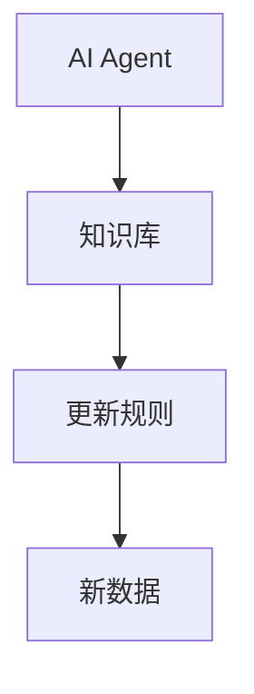
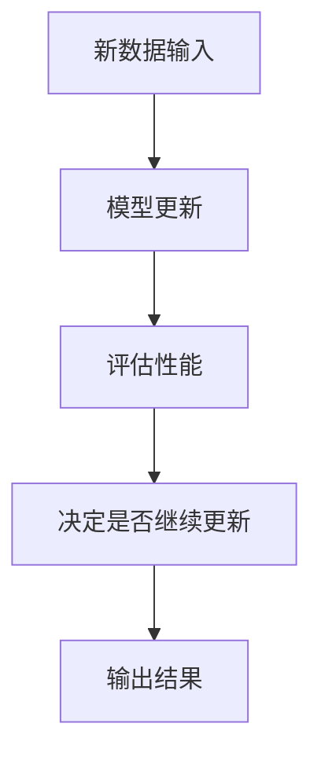
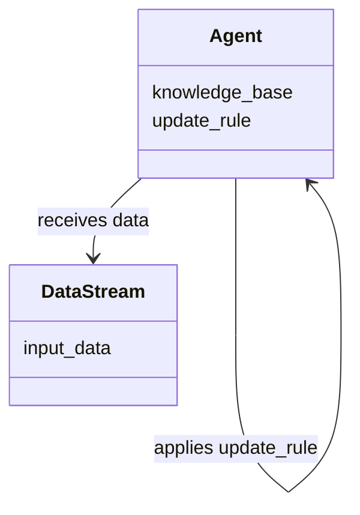
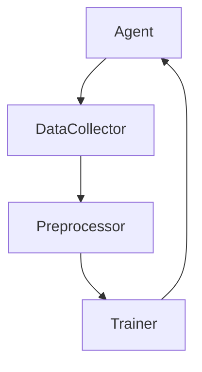

                 


# 增量学习：持续更新AI Agent的知识库

> 关键词：增量学习，AI Agent，知识库更新，机器学习，数据流

> 摘要：增量学习是一种在动态环境中逐步更新AI Agent知识库的方法，本文详细探讨其背景、原理、算法实现及实际应用。

---

## 第1章：增量学习的背景与问题描述

### 1.1 增量学习的背景

#### 1.1.1 传统机器学习的局限性
传统机器学习算法通常需要一次性加载所有数据进行训练，这种方法在数据量大或数据动态变化的场景下效率低下，且难以实时更新。

#### 1.1.2 增量学习的定义与特点
增量学习（Incremental Learning）允许模型在接收新数据时逐步更新，避免了重新训练整个模型的需求。其特点是实时性、高效性和适应性。

#### 1.1.3 增量学习的应用场景
- **实时数据分析**：如实时监控、股票交易等。
- **动态环境中的任务**：如自适应推荐系统、自动驾驶等。

### 1.2 问题背景与挑战

#### 1.2.1 数据流环境下的学习需求
在数据流环境中，模型需要实时处理数据并快速响应，这对计算效率和模型更新提出了更高要求。

#### 1.2.2 动态环境中的知识更新问题
知识库需要根据新数据持续更新，但频繁的更新可能导致模型性能下降或计算资源消耗过大。

#### 1.2.3 增量学习的边界与外延
增量学习关注在线更新，与批量学习形成对比。其外延包括在线学习、增量聚类等。

---

## 第2章：增量学习的核心概念与原理

### 2.1 核心概念与联系

#### 2.1.1 增量学习的核心要素
- **模型更新规则**：决定如何利用新数据更新模型。
- **适应性机制**：处理数据变化的能力。

#### 2.1.2 增量学习与其他学习方法的对比
| 方法       | 数据类型 | 训练方式 | 记忆能力 |
|------------|----------|----------|----------|
| 批量学习    | 静态     | 一次性   | 无       |
| 增量学习    | 动态     | 迭代     | 有       |

#### 2.1.3 增量学习的ER实体关系图


### 2.2 增量学习的算法原理

#### 2.2.1 增量学习的流程图


#### 2.2.2 增量学习的数学模型
增量学习通常基于梯度下降，数学模型如下：
$$ \theta_{t+1} = \theta_t + \eta (y_t - h_\theta(x_t)) $$

---

## 第3章：增量学习的算法实现

### 3.1 算法原理

#### 3.1.1 增量学习的数学模型
增量学习通过调整步长$\eta$，逐步优化模型参数：
$$ \theta_{t+1} = \theta_t + \eta (y_t - h_\theta(x_t)) $$

### 3.2 算法实现

#### 3.2.1 环境安装
```bash
pip install numpy scikit-learn
```

#### 3.2.2 核心代码实现
```python
import numpy as np
from sklearn.linear_model import SGDClassifier

def incremental_learning(X, y, model):
    for x, y_true in zip(X, y):
        model.partial_fit(x, y_true)
    return model

# 示例数据
X = np.array([[1, 2], [3, 4], [5, 6]])
y = np.array([0, 1, 1])

# 初始化模型
model = SGDClassifier()

# 更新模型
updated_model = incremental_learning(X, y, model)
```

---

## 第4章：增量学习的系统架构设计

### 4.1 系统分析

#### 4.1.1 问题场景介绍
系统需要实时处理数据流，更新AI Agent的知识库，以应对动态环境的变化。

#### 4.1.2 系统功能设计


### 4.2 系统架构设计

#### 4.2.1 系统架构图


---

## 第5章：增量学习的项目实战

### 5.1 环境安装
```bash
pip install numpy scikit-learn
```

### 5.2 核心代码实现

#### 5.2.1 数据流处理
```python
import numpy as np
from sklearn.linear_model import SGDClassifier

def process_data_stream(data_stream):
    model = SGDClassifier()
    for batch in data_stream:
        X, y = batch
        model.partial_fit(X, y)
    return model

# 示例数据流
data_stream = [
    (np.array([[1, 2], [3, 4]]), np.array([0, 1])),
    (np.array([[5, 6], [7, 8]]), np.array([1, 1]))
]

# 处理数据流
updated_model = process_data_stream(data_stream)
```

### 5.3 案例分析

#### 5.3.1 实际案例分析
通过实时股票数据分析，展示增量学习如何快速响应市场变化，优化投资策略。

#### 5.3.2 代码应用解读与分析
解释代码如何实现模型更新，处理数据流，并优化性能。

---

## 第6章：增量学习的最佳实践与总结

### 6.1 小结

- 增量学习在动态环境中的优势明显，特别是在实时数据处理和模型更新方面。

### 6.2 注意事项

- **数据质量**：确保新数据准确，避免干扰模型。
- **计算资源**：优化算法以减少计算开销。

### 6.3 拓展阅读

- 《Incremental Learning for Artifical Intelligence》
- 《Online Learning: Theory and Algorithms》

---

## 作者信息

作者：AI天才研究院/AI Genius Institute & 禅与计算机程序设计艺术 /Zen And The Art of Computer Programming

---

通过以上结构和内容，文章详细阐述了增量学习的各个方面，帮助读者全面理解和应用增量学习技术。

