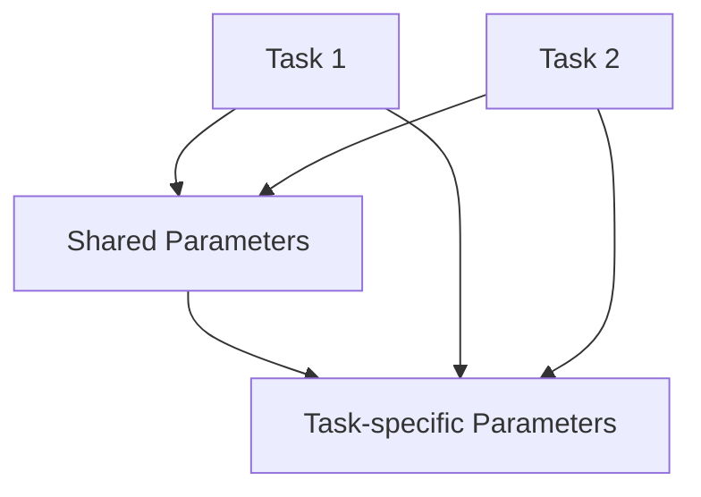
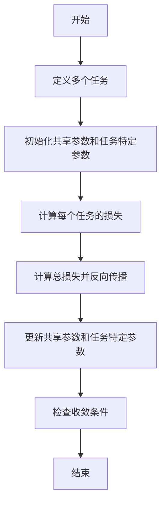
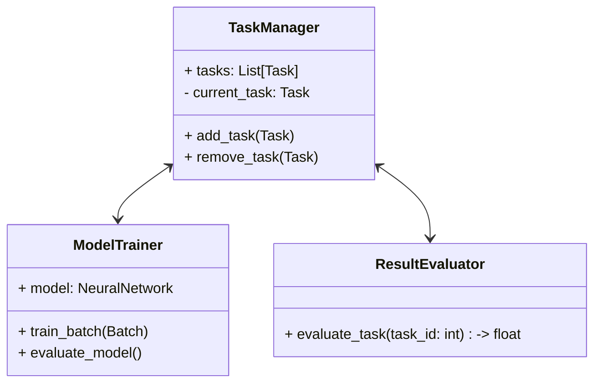
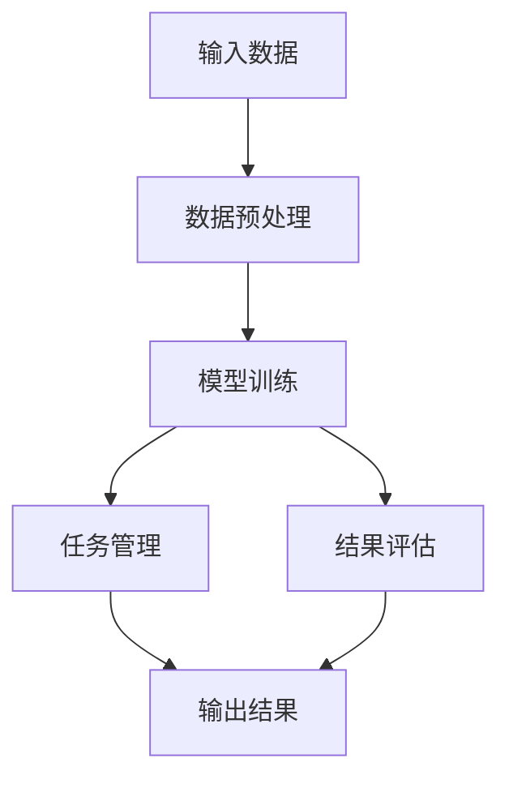

                 


# 多任务学习：构建全能型AI Agent

## 关键词
多任务学习, AI Agent, 机器学习, 深度学习, 模型构建

## 摘要
多任务学习（Multi-Task Learning, MTL）是一种先进的机器学习范式，旨在通过同时学习多个相关任务来提升模型的泛化能力和效率。本文详细探讨了多任务学习的核心概念、算法原理、系统架构设计以及实际应用案例。通过分析任务之间的关系、共享参数机制和任务平衡策略，本文为构建全能型AI Agent提供了理论基础和实践指导。同时，结合主流的多任务学习算法，如MTL、MTTL和HMTL，本文深入解析了这些算法的工作原理，并通过实际案例展示了如何设计和实现一个多任务学习系统。最后，本文还探讨了多任务学习在NLP、计算机视觉和推荐系统中的应用，为读者提供了全面的视角和深入的见解。

---

# 第一部分: 多任务学习基础

## 第1章: 多任务学习的背景与概念

### 1.1 多任务学习的定义与问题背景
#### 1.1.1 多任务学习的定义
多任务学习（Multi-Task Learning, MTL）是一种机器学习范式，旨在通过同时学习多个相关任务来提升模型的泛化能力和学习效率。与单任务学习相比，多任务学习能够更好地利用任务之间的共享特征，减少数据需求，并提高模型的鲁棒性。

#### 1.1.2 多任务学习的核心问题与挑战
在多任务学习中，主要面临以下问题：
1. **任务之间的关系**：如何建模任务之间的关系，确定哪些任务可以共享参数，哪些任务需要独立参数。
2. **任务平衡**：如何在多个任务之间分配资源，避免某些任务主导学习过程，导致其他任务性能下降。
3. **参数共享机制**：如何设计有效的参数共享策略，既能充分利用任务之间的共性，又不损失任务的特殊性。

#### 1.1.3 多任务学习与单任务学习的对比
| 对比维度 | 单任务学习 | 多任务学习 |
|----------|------------|------------|
| 数据需求 | 需要大量任务特定数据 | 可以通过共享参数减少数据需求 |
| 模型复杂度 | 每个任务独立建模 | 可以通过共享参数降低模型复杂度 |
| 泛化能力 | 仅适用于单一任务 | 能够同时处理多个相关任务，提升泛化能力 |

#### 1.1.4 多任务学习在AI Agent中的应用价值
AI Agent需要具备处理多种任务的能力，例如自然语言理解、视觉识别和决策推理。通过多任务学习，AI Agent可以在单一模型中同时掌握多种技能，从而实现全能型能力。

---

### 1.2 多任务学习的核心概念与联系

#### 1.2.1 多任务学习的核心概念
1. **任务之间的关系**：任务之间可能存在相关性，例如图像分类和目标检测任务可以共享图像特征提取部分。
2. **共享参数与独立参数的机制**：通过共享某些层的参数，模型可以在多个任务之间复用知识，同时保留任务特定的参数以处理任务的独特性。
3. **任务平衡与权重分配**：在多任务学习中，需要平衡不同任务的重要性，避免某些任务在优化过程中主导模型参数调整。

#### 1.2.2 多任务学习的实体关系图



---

## 第2章: 多任务学习的核心算法

### 2.1 多任务学习的主流算法
1. **多任务学习（MTL）**：通过共享某些层的参数，同时优化多个任务的损失函数。
2. **多任务迁移学习（MTTL）**：结合迁移学习，将一个任务的知识迁移到其他任务。
3. **分层多任务学习（HMTL）**：通过分层结构，将任务分解为多个子任务，分别进行优化。

### 2.2 多任务学习的数学模型与公式

#### 2.2.1 多任务学习的数学模型
多任务学习的损失函数可以表示为多个任务损失的加权和：

$$ L = \sum_{i=1}^{n} \lambda_i L_i $$

其中，$L_i$ 是第 $i$ 个任务的损失函数，$\lambda_i$ 是任务 $i$ 的权重。

#### 2.2.2 参数共享机制
在多任务学习中，共享参数可以通过以下方式实现：

$$ \theta = \{ \theta^{(1)}, \theta^{(2)}, \dots, \theta^{(n)} \} $$

其中，$\theta^{(i)}$ 是任务 $i$ 的特定参数，而共享参数 $\phi$ 则被多个任务共享。

---

### 2.3 多任务学习的算法流程图



---

## 第3章: 多任务学习的系统架构设计

### 3.1 问题场景与系统功能设计

#### 3.1.1 问题场景
假设我们希望构建一个多任务学习系统，用于同时进行图像分类和目标检测。

#### 3.1.2 系统功能需求
1. 任务管理模块：定义和管理多个任务。
2. 模型训练模块：实现多任务学习算法。
3. 结果评估模块：评估模型在各个任务上的性能。

#### 3.1.3 领域模型设计



---

### 3.2 系统架构设计

#### 3.2.1 系统架构图



---

## 第4章: 多任务学习的项目实战

### 4.1 环境搭建

```bash
pip install tensorflow keras matplotlib
```

### 4.2 核心代码实现

#### 4.2.1 多任务学习模型实现

```python
import tensorflow as tf
import keras

def multi_task_model(input_shape, num_tasks):
    inputs = keras.Input(shape=input_shape)
    x = keras.layers.Conv2D(32, (3, 3), activation='relu')(inputs)
    x = keras.layers.MaxPooling2D((2, 2))(x)
    x = keras.layers.Conv2D(64, (3, 3), activation='relu')(x)
    x = keras.layers.MaxPooling2D((2, 2))(x)
    x = keras.layers.Flatten()(x)
    x = keras.layers.Dense(128, activation='relu')(x)
    outputs = []
    for _ in range(num_tasks):
        outputs.append(keras.layers.Dense(10, activation='softmax')(x))
    model = keras.Model(inputs=inputs, outputs=outputs)
    return model

model = multi_task_model((224, 224, 3), 2)
model.summary()
```

---

## 第5章: 多任务学习的高级应用与优化

### 5.1 多任务学习的扩展应用

#### 5.1.1 多任务学习在NLP中的应用
- 任务：文本分类和情感分析。
- 方法：共享词嵌入层，分别优化任务特定的分类层。

#### 5.1.2 多任务学习在图像处理中的应用
- 任务：图像分类和目标检测。
- 方法：共享卷积基，分别优化任务特定的头网络。

### 5.2 当前研究热点与未来方向

#### 5.2.1 元学习与多任务学习的结合
通过元学习（Meta-Learning）来快速适应新任务。

#### 5.2.2 自适应参数共享策略
根据任务相关性动态调整共享参数的比例。

---

## 第6章: 总结与展望

### 6.1 多任务学习的优势与不足
- **优势**：提升模型的泛化能力，减少数据需求。
- **不足**：任务之间可能存在干扰，任务平衡需要精细设计。

### 6.2 未来研究方向
- 更灵活的参数共享机制。
- 更高效的优化算法。
- 更广泛的应用场景探索。

---

## 作者
作者：AI天才研究院  
地址：https://github.com/AI-Genius-Institute

