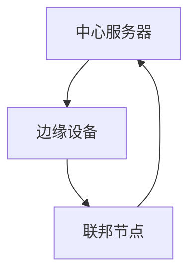
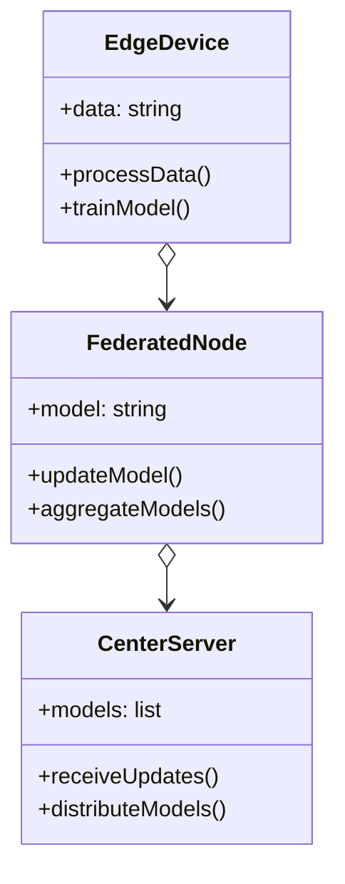
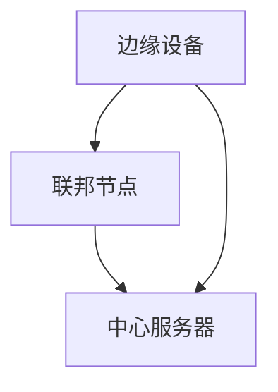

                 

# 如何识别企业的边缘计算联邦学习优势

> 关键词：边缘计算，联邦学习，企业优势，技术原理，数据隐私，系统架构

> 摘要：本文将详细探讨如何识别企业在边缘计算和联邦学习中的优势，分析两者的结合如何提升企业的数据处理效率和隐私保护能力，为企业技术决策者提供深度的技术分析和实践指导。

---

# 第一部分：边缘计算与联邦学习背景介绍

# 第1章：边缘计算与联邦学习概述

## 1.1 边缘计算的基本概念

### 1.1.1 边缘计算的定义与特点

边缘计算是一种分布式计算范式，将数据处理从中心服务器转移到靠近数据源的边缘设备。其特点包括低延迟、高实时性、分布式架构和本地数据处理能力。

### 1.1.2 边缘计算的核心优势

边缘计算的优势主要体现在实时性、带宽节省、隐私保护和可靠性。通过在边缘设备上处理数据，可以减少对中心服务器的依赖，提高数据处理的效率和安全性。

### 1.1.3 边缘计算的应用场景

边缘计算广泛应用于物联网、智能制造、智慧城市、自动驾驶等领域。例如，在智能制造中，边缘计算可以实时监控生产线的状态，快速响应异常情况。

## 1.2 联邦学习的基本概念

### 1.2.1 联邦学习的定义与特点

联邦学习是一种分布式机器学习技术，允许多个参与方在不共享原始数据的情况下共同训练模型。其特点包括数据隐私保护、模型协作更新和去中心化架构。

### 1.2.2 联邦学习的核心优势

联邦学习的优势在于保护数据隐私、降低数据传输成本、提高模型泛化能力。通过在各个参与方本地训练模型，联邦学习可以在不共享数据的情况下获得全局模型。

### 1.2.3 联邦学习的应用场景

联邦学习广泛应用于金融风控、医疗数据共享、推荐系统等领域。例如，在金融风控中，多个银行可以通过联邦学习共同训练欺诈检测模型，同时保护各自的客户数据。

## 1.3 边缘计算与联邦学习的结合

### 1.3.1 边缘计算与联邦学习的协同优势

边缘计算与联邦学习的结合可以实现数据的本地处理和模型的协作训练，从而在保证数据隐私的同时提高数据处理的实时性和效率。

### 1.3.2 边缘计算与联邦学习的结合场景

边缘计算与联邦学习的结合场景包括智能制造、智慧城市、智能医疗等领域。例如，在智能制造中，边缘计算可以实时处理生产线数据，联邦学习可以在各个工厂之间协作训练质量检测模型。

### 1.3.3 边缘计算与联邦学习的未来趋势

未来，边缘计算与联邦学习的结合将更加紧密，应用场景将更加广泛。随着技术的进步，边缘计算和联邦学习将为企业提供更高效、更安全的数据处理解决方案。

## 1.4 本章小结

---

# 第二部分：边缘计算与联邦学习的核心概念与联系

# 第2章：边缘计算与联邦学习的核心概念

## 2.1 边缘计算的核心概念

### 2.1.1 边缘计算的计算模型

边缘计算的计算模型基于分布式架构，数据在边缘设备上进行处理，减少对中心服务器的依赖。

### 2.1.2 边缘计算的通信机制

边缘计算的通信机制包括设备间的点对点通信和设备与中心服务器的通信。通过边缘网关进行数据聚合和传输。

### 2.1.3 边缘计算的数据管理

边缘计算的数据管理包括数据采集、存储、处理和分析。通过边缘设备本地存储和处理数据，减少数据传输成本。

## 2.2 联邦学习的核心概念

### 2.2.1 联邦学习的算法模型

联邦学习的算法模型包括垂直联邦学习和水平联邦学习。垂直联邦学习适用于数据特征分布不同的场景，水平联邦学习适用于数据样本分布不同的场景。

### 2.2.2 联邦学习的通信协议

联邦学习的通信协议包括基于安全多方计算和基于区块链的通信协议。通过加密算法和区块链技术确保数据隐私和模型安全。

### 2.2.3 联邦学习的数据隐私保护

联邦学习通过数据加密、差分隐私和同态加密等技术保护数据隐私，确保模型训练过程中数据不被泄露。

## 2.3 边缘计算与联邦学习的对比分析

### 2.3.1 核心概念对比表格

| 对比维度 | 边缘计算 | 联邦学习 |
|----------|----------|----------|
| 计算位置 | 边缘设备 | 分布式节点 |
| 数据处理 | 实时性高 | 隐私保护 |
| 通信方式 | 点对点 | 联邦协议 |

### 2.3.2 实体关系图（ER图）

## 2.4 本章小结

---

# 第三部分：边缘计算与联邦学习的算法原理

# 第3章：边缘计算与联邦学习的算法原理

## 3.1 边缘计算的算法流程

### 3.1.1 边缘计算的基本流程

边缘计算的基本流程包括数据采集、数据处理、模型训练和结果反馈。数据在边缘设备上进行实时处理，减少对中心服务器的依赖。

### 3.1.2 边缘计算的算法实现

边缘计算的算法实现包括边缘设备上的实时数据处理和模型训练。通过边缘计算框架（如Kubernetes、Flink）实现分布式计算和任务调度。

## 3.2 联邦学习的算法流程

### 3.2.1 联邦学习的基本流程

联邦学习的基本流程包括模型初始化、局部模型训练、模型更新和全局模型聚合。通过安全通信协议确保模型更新过程中的数据隐私。

### 3.2.2 联邦学习的算法实现

联邦学习的算法实现包括本地模型训练、加密通信和模型聚合。通过联邦学习框架（如Federated Learning Framework）实现分布式模型训练。

## 3.3 边缘计算与联邦学习的协同算法

### 3.3.1 边缘计算与联邦学习的协同流程

边缘计算与联邦学习的协同流程包括数据采集、边缘计算处理、联邦学习模型训练和结果反馈。通过边缘设备本地处理数据，联邦学习节点协作训练模型。

### 3.3.2 边缘计算与联邦学习的协同算法实现

边缘计算与联邦学习的协同算法实现包括边缘设备本地处理数据，联邦学习节点协作训练模型，通过安全通信协议确保数据隐私和模型安全。

## 3.4 本章小结

---

# 第四部分：边缘计算与联邦学习的系统分析与架构设计

# 第4章：边缘计算与联邦学习的系统分析与架构设计

## 4.1 问题场景介绍

### 4.1.1 问题背景

企业在数据处理中面临数据隐私保护和数据处理效率的双重挑战。边缘计算和联邦学习可以提供高效的解决方案。

### 4.1.2 问题描述

企业需要在保证数据隐私的前提下，提高数据处理效率和模型训练能力。边缘计算和联邦学习的结合可以实现这一目标。

## 4.2 系统功能设计

### 4.2.1 系统功能模型

系统功能模型包括数据采集、数据处理、模型训练和结果反馈。通过边缘设备本地处理数据，联邦学习节点协作训练模型。

### 4.2.2 系统功能设计的类图

## 4.3 系统架构设计

### 4.3.1 系统架构图

### 4.3.2 系统接口设计

系统接口设计包括边缘设备与联邦节点之间的接口、联邦节点与中心服务器之间的接口以及边缘设备与中心服务器之间的接口。

### 4.3.3 系统交互设计

系统交互设计包括数据采集、数据处理、模型训练和结果反馈四个阶段。通过边缘设备本地处理数据，联邦学习节点协作训练模型，中心服务器进行模型管理和分发。

## 4.4 本章小结

---

# 第五部分：边缘计算与联邦学习的项目实战

# 第5章：边缘计算与联邦学习的项目实战

## 5.1 环境安装与配置

### 5.1.1 环境要求

项目实战需要安装Python、TensorFlow、Kubernetes和Federated Learning Framework等工具。

### 5.1.2 环境配置

配置边缘设备和联邦学习节点，搭建中心服务器，安装必要的软件和框架。

## 5.2 系统核心实现

### 5.2.1 边缘计算核心代码实现

边缘计算核心代码实现包括数据采集、数据处理和模型训练。通过Python和Kubernetes实现边缘设备的本地处理和任务调度。

### 5.2.2 联邦学习核心代码实现

联邦学习核心代码实现包括局部模型训练、模型更新和全局模型聚合。通过TensorFlow和Federated Learning Framework实现模型协作训练。

## 5.3 项目实现与分析

### 5.3.1 项目实现过程

项目实现过程包括环境搭建、代码编写、系统测试和结果分析。通过边缘设备本地处理数据，联邦学习节点协作训练模型，中心服务器进行模型管理和分发。

### 5.3.2 项目分析与优化

项目分析与优化包括性能优化、数据隐私保护和系统可扩展性优化。通过优化算法和架构设计，提高系统的效率和安全性。

## 5.4 本章小结

---

# 第六部分：边缘计算与联邦学习的最佳实践

# 第6章：边缘计算与联邦学习的最佳实践

## 6.1 小结与总结

### 6.1.1 核心内容回顾

本文详细介绍了边缘计算和联邦学习的核心概念、算法原理、系统架构和项目实战。通过边缘计算与联邦学习的结合，为企业提供高效、安全的数据处理解决方案。

### 6.1.2 本章总结

边缘计算与联邦学习的结合是未来企业数据处理的发展趋势。通过本文的分析和实践，企业可以更好地识别和利用边缘计算与联邦学习的优势，提升数据处理效率和隐私保护能力。

## 6.2 注意事项与建议

### 6.2.1 实际应用中的注意事项

在实际应用中，需要注意数据隐私保护、系统安全性、模型可解释性和系统可扩展性。通过合理设计系统架构和选择合适的算法，确保系统的高效和安全。

### 6.2.2 对未来发展的建议

未来，边缘计算与联邦学习的结合将更加紧密。企业需要关注技术发展趋势，合理规划系统架构，积极尝试新技术和新方法，提升企业的核心竞争力。

## 6.3 拓展阅读与学习资源

### 6.3.1 拓展阅读

推荐阅读《分布式系统与边缘计算》、《联邦学习原理与应用》等相关书籍和论文，深入理解边缘计算和联邦学习的技术细节和应用案例。

### 6.3.2 学习资源

推荐学习资源包括Coursera上的相关课程、GitHub上的开源项目和行业技术博客。通过实践和学习，不断提升自己的技术水平和应用能力。

## 6.4 本章小结

---

# 作者信息

作者：AI天才研究院/AI Genius Institute & 禅与计算机程序设计艺术 /Zen And The Art of Computer Programming

