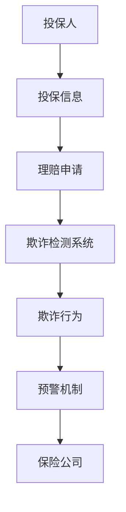

                 

# 智能保险理赔欺诈预防系统

**关键词**：保险欺诈、人工智能、机器学习、深度学习、NLP、图神经网络、智能系统

**摘要**：本文将详细探讨智能保险理赔欺诈预防系统的构建与实现。通过分析保险行业的现状与挑战，介绍系统的核心概念与技术原理，讲解常见的欺诈检测算法，设计系统的架构与功能模块，提供项目实战的代码实现与案例分析，并总结最佳实践、注意事项与未来发展方向。

---

# 第一部分: 智能保险理赔欺诈预防系统概述

# 第1章: 保险行业的现状与挑战

## 1.1 保险行业的现状分析

### 1.1.1 保险行业的基本概念

保险行业是通过风险转移来保障个人和企业财产安全的重要金融领域。随着数字化技术的快速发展，保险行业正在经历从传统模式向智能化、数据化转型的过程。保险公司通过大数据、人工智能等技术手段，提升服务效率、优化客户体验，并降低运营成本。

### 1.1.2 保险行业的数字化转型趋势

近年来，保险行业迎来了数字化转型的浪潮。保险公司开始广泛采用人工智能、大数据分析、区块链等技术，以实现业务流程的自动化、智能化。例如，智能客服、自动核保、在线理赔等服务模式的普及，显著提升了保险行业的运营效率。

### 1.1.3 保险行业的痛点与挑战

尽管数字化转型为保险行业带来了诸多好处，但也面临一些痛点与挑战：

1. **保险欺诈问题日益严重**：随着保险产品的多样化和投保渠道的便捷化，保险欺诈行为（如虚假理赔、夸大损失等）屡见不鲜，给保险公司带来了巨大的经济损失。
2. **数据孤岛与信息不对称**：保险行业涉及多个数据来源（如医疗机构、公安系统、维修企业等），但由于数据分散、标准不统一，导致信息难以有效整合，影响了欺诈检测的准确性。
3. **传统理赔流程效率低下**：传统的理赔流程通常依赖人工审核，存在耗时长、成本高等问题，难以满足客户对快速理赔的需求。

---

## 1.2 保险理赔中的欺诈问题

### 1.2.1 保险欺诈的定义与分类

保险欺诈是指在保险理赔过程中，投保人或受益人通过虚构事实、隐瞒真相等手段，骗取保险金的行为。根据欺诈行为的主体和手段，保险欺诈可以分为以下几类：

1. **投保人欺诈**：投保人在投保时故意隐瞒健康状况、职业风险等重要信息，以获取更高的保额或更低的保费。
2. **受益人欺诈**：受益人在理赔时提供虚假的医疗证明、事故报告等文件，夸大损失金额。
3. **保险从业人员欺诈**：部分保险销售人员或内部员工利用职务之便，伙同投保人或受益人进行欺诈。

### 1.2.2 保险欺诈的常见手段与案例

常见的保险欺诈手段包括：

1. **制造假事故**：如故意制造交通事故，伪造事故现场，骗取保险赔偿。
2. **夸大损失**：在理赔时虚报损失金额，如在车辆维修中报高价。
3. **冒名顶替**：使用他人的身份信息投保或理赔。

例如，某车主故意制造单方事故，声称车辆损坏严重，但实际仅需小额维修费用。保险公司通过智能系统分析后发现理赔金额与实际损失不符，从而拒绝赔付。

### 1.2.3 保险欺诈对行业的影响

保险欺诈不仅给保险公司带来直接的经济损失，还增加了运营成本，影响了保险产品的定价和风险评估。此外，欺诈行为还会损害保险行业的信誉，削弱客户对保险服务的信任。

---

## 1.3 智能保险理赔欺诈预防系统的提出

### 1.3.1 系统的目标与意义

智能保险理赔欺诈预防系统的目标是通过人工智能技术，实时监测和分析保险理赔数据，识别潜在的欺诈行为，从而降低保险公司的赔付风险。该系统的意义在于：

1. **提升理赔效率**：通过自动化分析，缩短理赔周期，提高客户满意度。
2. **降低欺诈风险**：利用智能算法识别异常行为，减少虚假理赔的发生。
3. **优化成本结构**：通过技术手段降低人工审核成本，提升运营效率。

### 1.3.2 系统的核心功能与价值

智能保险理赔欺诈预防系统的核心功能包括：

1. **数据采集与处理**：整合多方数据源（如医疗记录、事故报告、维修记录等），进行数据清洗、特征提取。
2. **欺诈检测**：基于机器学习模型，对理赔申请进行风险评估，识别欺诈行为。
3. **预警与反馈**：对高风险理赔案件发出预警，并提供欺诈行为的详细分析报告。

该系统的价值体现在以下几个方面：

1. **提高欺诈检测的准确性**：通过大数据分析和机器学习算法，实现精准的欺诈识别。
2. **降低运营成本**：自动化处理减少人工审核的工作量，节省时间和资金。
3. **提升客户体验**：通过快速理赔和精准识别，优化客户服务流程。

### 1.3.3 系统的应用场景与边界

智能保险理赔欺诈预防系统主要应用于保险公司的理赔业务，具体场景包括：

1. **车险理赔**：识别虚假交通事故、夸大损失等行为。
2. **健康保险理赔**：检测虚假医疗记录或夸大病情的行为。
3. **财产保险理赔**：防范虚假损失报告和重复理赔。

系统的边界在于，仅针对保险理赔环节的欺诈行为进行预防，不涉及其他业务领域的欺诈检测。

---

## 1.4 本章小结

本章通过分析保险行业的现状与挑战，重点介绍了保险理赔中的欺诈问题，并提出了智能保险理赔欺诈预防系统的概念。系统的目标是通过人工智能技术，提高欺诈检测的准确性和效率，降低保险公司的运营风险。接下来的章节将详细讲解系统的实现原理与技术架构。

---

# 第2章: 智能保险理赔欺诈预防系统的原理与架构

## 2.1 系统的核心概念

### 2.1.1 数据来源与处理

智能保险理赔欺诈预防系统的数据来源主要包括：

1. **投保人信息**：包括姓名、年龄、职业、健康状况等。
2. **理赔申请数据**：包括理赔金额、理赔原因、理赔时间等。
3. **外部数据**：如医疗记录、事故报告、维修记录等。

数据处理流程包括数据清洗、特征提取和数据标注。

---

### 2.1.2 模型训练与部署

系统的核心是基于机器学习的欺诈检测模型。常用的算法包括逻辑回归、随机森林、支持向量机（SVM）和深度学习模型（如神经网络、循环神经网络等）。模型训练过程如下：

1. 数据预处理：清洗数据，处理缺失值、异常值等。
2. 特征工程：提取关键特征（如理赔金额与历史赔付的差异、报案时间与事故发生时间的间隔等）。
3. 模型训练：使用训练数据训练模型，调整超参数，优化模型性能。
4. 模型部署：将训练好的模型部署到生产环境中，实时处理理赔申请。

---

### 2.1.3 预警与反馈机制

系统通过设置阈值，对异常的理赔申请发出预警，并提供欺诈行为的详细分析报告。预警机制包括：

1. **实时监控**：对每笔理赔申请进行实时分析，识别异常情况。
2. **历史数据分析**：基于历史数据，发现潜在的欺诈模式。
3. **反馈优化**：根据实际欺诈案例，优化模型参数，提升检测准确率。

---

## 2.2 系统的关键技术

### 2.2.1 机器学习与深度学习

机器学习是欺诈检测的核心技术。常用的算法包括：

- **逻辑回归**：用于分类问题，预测理赔申请是否为欺诈。
- **随机森林**：通过树投票机制，提高模型的泛化能力。
- **深度学习**：如卷积神经网络（CNN）和循环神经网络（RNN），适用于非结构化数据（如文本、图像）的分析。

---

### 2.2.2 自然语言处理（NLP）

NLP技术用于分析理赔申请中的文本信息，如事故报告、医疗记录等。通过文本分类、实体识别等技术，识别文本中的异常信息。

---

### 2.2.3 图神经网络

图神经网络（Graph Neural Network）适用于复杂关系的分析，如投保人之间的关联、理赔事件的关联等。通过构建知识图谱，识别欺诈网络。

---

## 2.3 系统的架构设计

### 2.3.1 数据层架构

系统数据层包括：

1. **数据源**：投保人信息、理赔申请、外部数据。
2. **数据仓库**：存储清洗后的数据，支持多种数据格式。
3. **数据接口**：提供API接口，方便其他系统调用数据。

---

### 2.3.2 模型层架构

模型层包括：

1. **特征工程**：提取关键特征，如时间特征、金额特征等。
2. **模型训练**：训练欺诈检测模型。
3. **模型部署**：将模型部署到生产环境，实时处理请求。

---

### 2.3.3 接口层架构

接口层包括：

1. **API接口**：提供RESTful API，供前端调用。
2. **预警通知**：通过邮件、短信等方式通知相关人员。

---

## 2.4 系统的实体关系图

以下是系统的实体关系图：

---

## 2.5 本章小结

本章详细介绍了智能保险理赔欺诈预防系统的原理与架构，包括数据处理、模型训练、预警机制等核心部分。接下来的章节将从算法与模型的角度，进一步探讨系统的实现细节。

---

**（本文后续内容将按照上述目录继续展开，涵盖算法原理、系统架构、项目实战等部分。）**

---

**作者：AI天才研究院/AI Genius Institute & 禅与计算机程序设计艺术 /Zen And The Art of Computer Programming**

