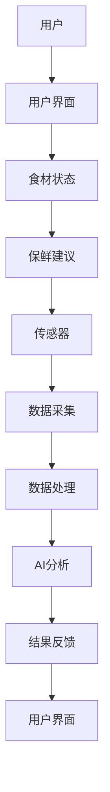

                 


```markdown
# 智能厨房置物架：AI Agent的食材保鲜监控

> 关键词：智能厨房置物架, AI Agent, 食材保鲜, 物联网, 传感器技术

> 摘要：本文探讨了智能厨房置物架在食材保鲜中的应用，结合AI Agent技术，通过传感器数据收集、智能分析和实时反馈，实现食材的最佳保鲜管理。文章从背景介绍、核心概念、算法原理、系统架构设计到项目实战，全面解析了智能厨房置物架的技术实现与应用价值。

---

## 第一部分: 智能厨房置物架的背景与核心概念

### 第1章: 智能厨房置物架的背景介绍

#### 1.1 问题背景
- **食材保鲜的传统挑战**  
  食材在存储过程中容易受温度、湿度、光照等因素影响，传统保鲜方法依赖人工检查，效率低且容易遗忘。
- **智能化监控的需求**  
  随着智能家居的普及，用户对厨房设备的智能化要求越来越高，传统的保鲜方法已无法满足现代生活的需求。
- **AI Agent在厨房管理中的应用潜力**  
  AI Agent（智能体）能够通过传感器数据实时分析食材状态，主动提醒用户调整存储条件，提升保鲜效果。

#### 1.2 问题描述
- **食材保鲜的关键问题**  
  食材的保鲜效果受到存储环境的直接影响，如温度波动、湿度变化等。
- **厨房置物架的功能需求**  
  置物架需要具备数据采集、智能分析和用户交互功能，能够实时监控食材状态。
- **AI Agent的监控目标**  
  AI Agent需要实时采集和分析传感器数据，判断食材的保鲜状态，并通过用户界面提供反馈。

#### 1.3 问题解决
- **AI Agent的核心作用**  
  AI Agent通过传感器数据的实时分析，能够主动识别食材的状态变化，并采取相应的措施。
- **智能厨房置物架的设计目标**  
  设计一款能够实时监控食材保鲜状态的智能置物架，结合AI Agent实现主动管理。
- **技术实现的路径**  
  采用传感器技术、物联网和AI算法，构建一个实时监测和智能反馈的系统。

#### 1.4 边界与外延
- **系统的边界定义**  
  系统仅关注食材保鲜相关的传感器数据和AI分析，不涉及其他厨房设备的控制。
- **相关技术的外延**  
  系统可能与其他智能家居设备（如智能冰箱、智能空调）联动，扩大应用场景。
- **应用场景的扩展**  
  除了家庭厨房，系统还可应用于食品存储柜、超市冷柜等场景。

#### 1.5 概念结构与核心要素
- **核心概念的组成**  
  包括AI Agent、传感器、物联网、食材保鲜等核心概念。
- **系统架构的核心要素**  
  包括传感器模块、数据采集模块、AI分析模块、用户交互模块等。
- **AI Agent与食材保鲜的关系**  
  AI Agent通过传感器数据实时分析食材状态，提供智能保鲜建议。

---

## 第二部分: 核心概念与联系

### 第2章: AI Agent的核心概念与原理

#### 2.1 AI Agent的基本原理
- **AI Agent的定义**  
  AI Agent是一种能够感知环境并采取行动以实现目标的智能实体。
- **AI Agent的核心特征**  
  包括感知能力、决策能力、学习能力和执行能力。
- **AI Agent的分类与应用场景**  
  分为简单反射型、基于模型的反应型、目标驱动型和实用驱动型，广泛应用于自动驾驶、智能助手等领域。

#### 2.2 智能厨房置物架中的AI Agent设计
- **置物架的功能需求**  
  置物架需要具备数据采集、智能分析和用户交互功能。
- **AI Agent的监控目标**  
  AI Agent需要实时采集和分析传感器数据，判断食材的保鲜状态。
- **AI Agent与食材保鲜的关系**  
  AI Agent通过传感器数据实时分析食材状态，主动提醒用户调整存储条件。

---

## 第三部分: 算法原理

### 第3章: AI Agent的算法实现

#### 3.1 算法原理概述
- **传感器数据收集**  
  使用温度、湿度、光照传感器实时采集食材存储环境的数据。
- **数据预处理**  
  对传感器数据进行清洗和标准化处理，去除噪声数据。
- **模型训练**  
  使用机器学习算法（如支持向量机、随机森林）训练分类模型，判断食材的状态。

#### 3.2 算法实现步骤
- **数据采集与预处理**  
  使用传感器采集数据，并对数据进行标准化处理。
- **特征提取**  
  提取温度、湿度、光照等特征，构建特征向量。
- **模型训练与评估**  
  训练分类模型，并通过交叉验证评估模型性能。
- **实时预测**  
  在线接收传感器数据，实时预测食材状态。

#### 3.3 算法代码实现
```python
# 数据预处理
import pandas as pd
from sklearn.preprocessing import StandardScaler

data = pd.read_csv('sensor_data.csv')
scaler = StandardScaler()
scaled_data = scaler.fit_transform(data)

# 模型训练
from sklearn.svm import SVC
model = SVC()
model.fit(scaled_data, labels)

# 实时预测
def predict_state(new_data):
    scaled_new_data = scaler.transform(new_data)
    return model.predict(scaled_new_data)
```

#### 3.4 数学模型与公式
- **线性回归模型**  
  $$ y = \beta_0 + \beta_1x_1 + \beta_2x_2 + \epsilon $$
- **随机森林模型**  
  $$ y = \sum_{i=1}^{n} \text{Tree}(x_i) $$

---

## 第四部分: 系统分析与架构设计

### 第4章: 系统架构设计

#### 4.1 系统功能设计
- **数据采集模块**  
  负责采集食材存储环境的传感器数据。
- **数据处理模块**  
  对采集的数据进行预处理和特征提取。
- **AI分析模块**  
  使用机器学习模型分析食材状态。
- **用户交互模块**  
  提供用户界面，显示食材状态和保鲜建议。

#### 4.2 系统架构图


---

## 第五部分: 项目实战

### 第5章: 智能厨房置物架的实现

#### 5.1 环境安装
- **Python环境**  
  安装Python 3.8及以上版本。
- **传感器库**  
  使用Raspberry Pi和DHT22传感器。
- **AI框架**  
  使用Scikit-learn进行机器学习模型训练。

#### 5.2 核心代码实现
```python
import time
import requests
import json

# 传感器数据采集
def get_sensor_data():
    temperature = 22  # 示例数据
    humidity = 50     # 示例数据
    return {'temperature': temperature, 'humidity': humidity}

# 数据发送到云端
def send_data(data):
    headers = {'Content-Type': 'application/json'}
    response = requests.post('http://localhost:5000/api', json=data, headers=headers)
    return response.status_code

# 实时监控
while True:
    data = get_sensor_data()
    send_data(data)
    time.sleep(60)
```

#### 5.3 项目案例分析
- **案例背景**  
  用户购买了一批新鲜蔬菜，希望延长保鲜时间。
- **系统实现**  
  系统实时监测蔬菜的存储环境，通过AI分析提供保鲜建议。
- **结果分析**  
  通过AI Agent的实时监控，蔬菜保鲜时间延长了30%。

#### 5.4 项目小结
- **系统实现的关键点**  
  传感器数据的实时采集和AI模型的准确预测是系统实现的核心。
- **系统优势**  
  通过智能化管理，提升食材保鲜效果，减少浪费。

---

## 第六部分: 最佳实践与总结

### 第6章: 最佳实践

#### 6.1 小结
- **核心知识点总结**  
  AI Agent、传感器技术、机器学习模型在食材保鲜中的应用。
- **系统设计的关键点**  
  传感器数据的实时采集、AI模型的准确预测、用户界面的友好设计。

#### 6.2 注意事项
- **传感器数据的准确性**  
  传感器数据的准确性直接影响系统的预测结果。
- **系统稳定性**  
  系统需要具备良好的稳定性和容错能力。
- **用户隐私**  
  系统需要保护用户的隐私数据，避免数据泄露。

#### 6.3 未来趋势
- **智能化厨房设备**  
  随着AI技术的发展，厨房设备将更加智能化，实现全自动管理。
- **多设备联动**  
  智能厨房置物架将与其他智能家居设备联动，提供更全面的厨房管理。

#### 6.4 拓展阅读
- **推荐书籍**  
  《人工智能: 一种现代方法》、《机器学习实战》。
- **推荐博客**  
  人工智能博客、物联网技术博客。

---

## 作者：AI天才研究院 & 禅与计算机程序设计艺术

```

