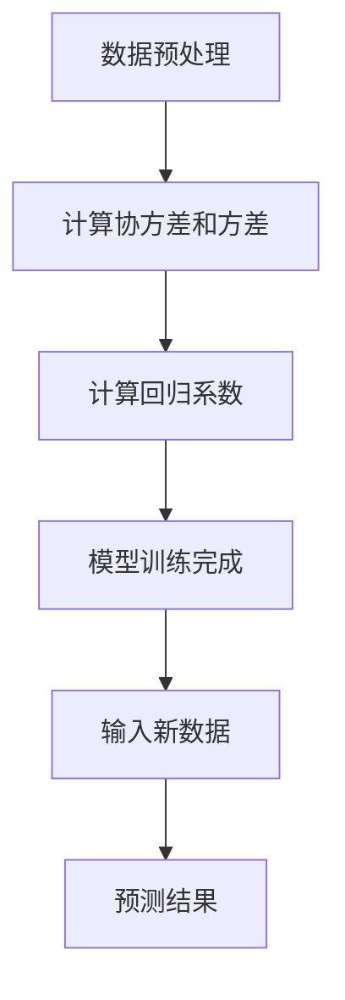
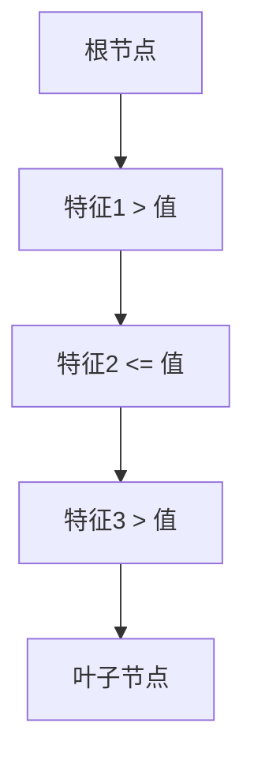
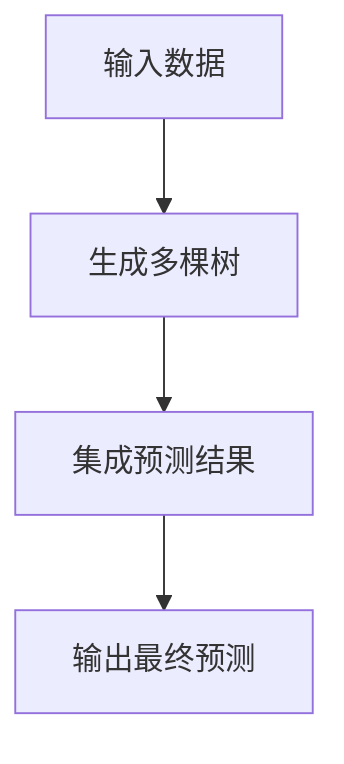
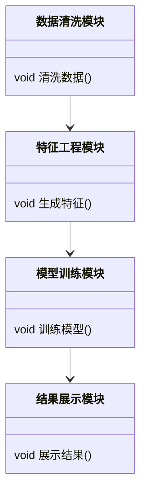
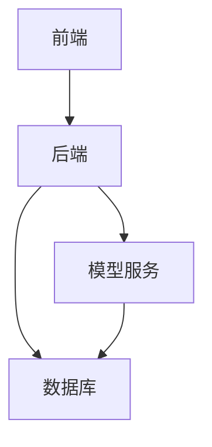

                 


# 《构建企业级预测性分析平台：跨业务领域的综合预测模型》

---

## 关键词  
企业级预测平台、跨业务预测模型、数据特征、模型算法、系统架构、预测性分析

---

## 摘要  
本文详细探讨了构建企业级预测性分析平台的各个方面，从理论到实践，涵盖核心概念、算法原理、系统架构设计及项目实战。文章通过具体案例，结合多种预测算法和系统设计方法，展示了如何在跨业务领域中构建高效的预测模型，为企业的数据驱动决策提供支持。

---

## 第一部分：背景介绍

### 第1章：预测性分析的背景与价值

#### 1.1 预测性分析的背景
- **数据驱动决策的兴起**：随着大数据技术的发展，企业越来越依赖数据来做决策，预测性分析成为核心工具。
- **预测性分析的应用现状**：在金融、医疗、零售等多个行业，预测性分析已广泛应用于风险评估、客户行为预测等领域。
- **构建平台的意义**：统一的预测平台可以整合不同业务的数据，提高预测效率和准确性。

#### 1.2 问题背景与描述
- **传统数据分析的局限性**：仅依赖历史数据，缺乏对未来趋势的预测能力。
- **预测性分析的核心问题**：如何准确预测未来事件，减少不确定性。
- **构建平台的目的**：解决跨业务数据整合难题，提升企业整体预测能力。

---

## 第二部分：核心概念与联系

### 第2章：预测性分析的核心概念

#### 2.1 数据特征与模型算法
- **数据特征**：包括数值型、分类型和文本型数据，特征的选择直接影响模型性能。
- **模型算法对比**：线性回归适合线性关系，决策树适合非线性数据，随机森林则通过集成学习提高准确性。

| 模型算法 | 特点 | 适用场景 |
|----------|------|----------|
| 线性回归 | 简单，适合线性关系 | 销量预测 |
| 决策树   | 易解释，适合非线性 | 客户分类 |
| 随机森林 | 高准确性，适合复杂场景 | 风险评估 |

- **ER图**：展示了数据表之间的关系，如客户表与订单表的关系。


#### 2.2 模型评估指标
- **准确率与召回率**：准确率衡量整体预测准确程度，召回率关注正类的识别能力。
- **AUC-ROC曲线**：衡量分类模型的整体性能。

| 指标 | 定义 | 示例 |
|------|------|------|
| 准确率 | 正确预测的比例 | 85% |
| 召回率 | 正类被正确识别的比例 | 90% |
| F1分数 | 平衡准确率和召回率的指标 | 88% |

#### 2.3 业务场景与模型选择
- **场景分析**：不同业务场景需要不同的模型，如时间序列预测适合销售趋势分析。
- **模型选择策略**：根据数据类型和业务需求选择模型，如树模型适合分类问题。

---

## 第三部分：算法原理讲解

### 第3章：常用预测算法原理

#### 3.1 线性回归
- **数学模型**：$$y = a + bx + e$$，其中$a$是截距，$b$是斜率，$e$是误差项。
- **算法流程图**：使用mermaid展示线性回归的训练和预测流程。



#### 3.2 决策树
- **结构特点**：树状结构，根节点到叶子节点代表决策路径。
- **ID3算法实现**：基于信息增益构建树，代码示例：

```python
def information_gain(data, feature, label):
    # 计算信息增益
    pass
```

- **流程图**：展示决策树的构建过程。



#### 3.3 随机森林
- **工作原理**：通过bootstrap采样生成多棵树，并取多数投票结果。
- **代码示例**：集成学习实现。

```python
from sklearn.ensemble import RandomForestClassifier
model = RandomForestClassifier(n_estimators=100)
model.fit(X, y)
```

- **流程图**：展示随机森林的训练和预测流程。



---

## 第四部分：系统分析与架构设计

### 第4章：系统架构设计

#### 4.1 问题场景介绍
- **需求分析**：企业需要整合多个业务线的数据，构建统一的预测平台。
- **系统功能设计**：包括数据清洗、特征工程、模型训练和结果展示。

#### 4.2 领域模型类图
- **领域模型**：展示各个模块之间的关系。



#### 4.3 系统架构设计
- **分层架构**：前端、后端和数据库三层。



#### 4.4 接口设计
- **RESTful API**：如`POST /predict`用于模型预测。

#### 4.5 系统交互流程
- **序列图**：展示用户请求预测的流程。

```mermaid
sequenceDiagram
    用户 --> 请求预测
    后端 --> 调用模型服务
    模型服务 --> 返回结果
    后端 --> 返回结果给用户
```

---

## 第五部分：项目实战

### 第5章：项目实战

#### 5.1 环境安装
- **工具安装**：Python、Jupyter、Scikit-learn、Flask。

#### 5.2 核心代码实现
- **数据清洗代码**：

```python
import pandas as pd
data = pd.read_csv('data.csv')
data_cleaned = data.dropna()
```

- **模型训练代码**：

```python
from sklearn.linear_model import LinearRegression
model = LinearRegression()
model.fit(X_train, y_train)
```

#### 5.3 案例分析
- **实际案例**：使用随机森林预测客户流失。

---

## 第六部分：最佳实践与小结

### 第6章：最佳实践

#### 6.1 小结
- 构建企业级预测平台需要跨业务数据整合和多种算法的结合。
- 关键点包括数据预处理、模型选择和系统架构设计。

#### 6.2 注意事项
- 数据质量和特征选择直接影响模型性能。
- 模型部署需要考虑性能和可扩展性。

#### 6.3 拓展阅读
- 推荐学习深度学习模型如神经网络，探索其在预测分析中的应用。

---

## 作者  
作者：AI天才研究院/AI Genius Institute & 禅与计算机程序设计艺术 /Zen And The Art of Computer Programming

---

希望这篇文章能为读者提供构建企业级预测性分析平台的全面指导，帮助他们在跨业务领域中实现高效的预测模型。

