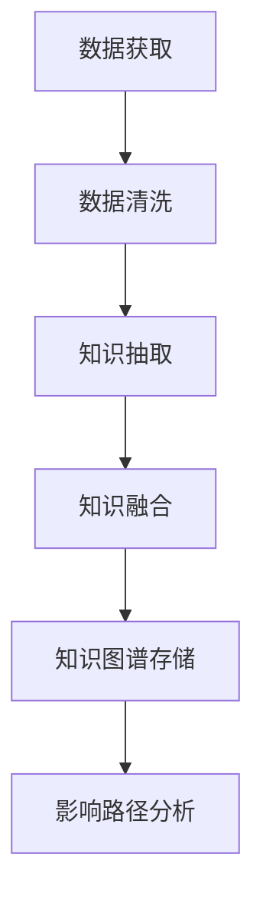
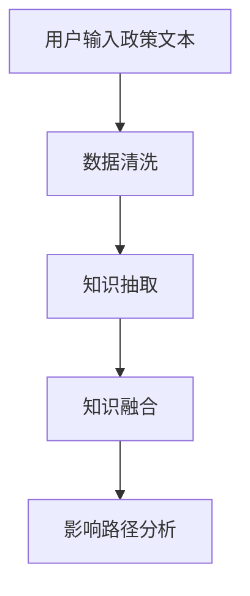

                 


# 《构建基于知识图谱的金融监管政策影响链追踪系统》

## 关键词：知识图谱、金融监管、政策影响链、影响路径分析、系统架构

## 摘要：  
本文探讨了如何利用知识图谱技术构建金融监管政策影响链的追踪系统。通过对金融监管政策的实体识别、关系抽取和影响路径分析，构建了一个高效的金融监管政策影响链追踪系统。该系统结合了知识图谱的构建技术和图算法，能够实现政策影响的可视化和分析，为金融监管部门提供了有力的决策支持。

---

# 第1章: 金融监管政策影响链与知识图谱概述

## 1.1 问题背景与描述

### 1.1.1 金融监管的重要性  
金融监管是维护金融市场稳定、保护投资者利益的重要手段。随着金融市场复杂性的增加，监管政策的影响力需要被准确追踪和分析。

### 1.1.2 现有监管体系的局限性  
现有监管体系主要依赖人工分析，存在效率低、覆盖面窄、难以量化等问题。监管政策的影响难以系统性地追踪和评估。

### 1.1.3 知识图谱技术的应用潜力  
知识图谱通过构建实体之间的关系网络，能够直观地展示政策影响链，为政策评估提供数据支持。

## 1.2 系统边界与核心要素

### 1.2.1 系统边界  
系统聚焦于金融监管政策的实体识别、关系抽取和影响路径分析，不涉及具体的政策执行过程。

### 1.2.2 核心要素  
- **实体**：政策、金融机构、市场参与者、监管机构。  
- **关系**：政策影响、政策关联、市场反应。  

## 1.3 本章小结  
知识图谱技术为金融监管政策的影响分析提供了新的思路，通过构建政策影响链，能够帮助监管部门更好地理解政策效果。

---

# 第2章: 知识图谱基础

## 2.1 知识图谱的基本概念

### 2.1.1 知识图谱的定义  
知识图谱是一种以图结构表示知识的技术，由实体和关系构成，用于描述现实世界中的概念及其联系。

### 2.1.2 知识图谱的属性特征对比  
| 特性 | 描述 | 示例 |  
|------|------|------|  
| 实体 | 具有独立存在意义的概念 | 金融机构、监管政策 |  
| 关系 | 实体之间的关联 | 政策影响、市场反应 |  

### 2.1.3 知识图谱的构建流程  
1. 数据采集：获取多源异构数据。  
2. 数据清洗：去重、标准化。  
3. 知识抽取：识别实体和关系。  
4. 知识融合：消除冲突，构建统一图谱。  

## 2.2 知识图谱的核心原理

### 2.2.1 实体与关系的定义  
- 实体：金融机构、监管政策。  
- 关系：政策影响、市场反应。  

### 2.2.2 知识表示与推理  
知识图谱通过关系网络表示知识，支持基于图的推理。

## 2.3 本章小结  
知识图谱通过构建实体关系网络，为金融监管政策的分析提供了结构化的数据基础。

---

# 第3章: 金融监管政策影响链建模

## 3.1 政策影响链的概念与特点

### 3.1.1 政策影响链的定义  
政策影响链是指政策通过影响金融机构、市场参与者，最终对金融市场产生影响的过程。

### 3.1.2 政策影响链的特征  
- **层次性**：政策影响从上层到下层逐步传导。  
- **复杂性**：涉及多个实体和关系。  

## 3.2 知识图谱在政策影响链中的应用

### 3.2.1 实体识别  
通过自然语言处理技术，识别政策文本中的实体。  

### 3.2.2 关系建模  
构建政策与金融机构之间的关系网络。  

### 3.2.3 影响路径分析  
通过图算法，分析政策影响的路径。  

## 3.3 政策影响链的算法实现

### 3.3.1 基于图的最短路径算法  
使用BFS算法找到政策影响的最短路径。

### 3.3.2 基于深度学习的关系抽取  
使用预训练模型进行关系抽取。

## 3.4 本章小结  
通过知识图谱和图算法，能够有效建模金融监管政策的影响链。

---

# 第4章: 系统架构与设计

## 4.1 系统架构设计

### 4.1.1 系统设计原则  
- **模块化**：功能模块化设计。  
- **可扩展性**：支持新增数据和功能。  

### 4.1.2 系统架构图  



## 4.2 系统功能设计

### 4.2.1 功能模块  
- 数据获取与清洗。  
- 知识抽取与融合。  
- 影响路径分析。  

### 4.2.2 功能流程图  



## 4.3 系统接口设计

### 4.3.1 API接口  
- `GET /policy`：获取政策文本。  
- `POST /analyze`：进行影响路径分析。  

## 4.4 本章小结  
系统架构设计为金融监管政策影响链的追踪提供了高效的实现框架。

---

# 第5章: 项目实战与案例分析

## 5.1 项目环境配置

### 5.1.1 环境要求  
- Python 3.8+  
- 知识图谱构建工具（如NetworkX）。  

## 5.2 核心代码实现

### 5.2.1 数据清洗代码  

```python
def clean_data(data):
    # 数据清洗逻辑
    pass
```

### 5.2.2 知识抽取代码  

```python
def extract_entities(text):
    # 使用NLP模型抽取实体
    pass
```

## 5.3 案例分析

### 5.3.1 案例背景  
分析某金融监管政策对市场的具体影响。

### 5.3.2 分析结果  
展示政策影响的路径和效果。

## 5.4 本章小结  
通过项目实战，验证了系统设计的有效性和可行性。

---

# 第6章: 总结与展望

## 6.1 系统总结

### 6.1.1 核心功能总结  
- 数据获取与清洗。  
- 知识抽取与融合。  
- 影响路径分析。  

## 6.1.2 系统优化建议  
- 提高知识抽取的准确率。  
- 增强系统的可扩展性。  

## 6.2 未来展望

### 6.2.1 技术发展方向  
- 引入更先进的深度学习模型。  
- 增强系统的实时性。  

## 6.3 注意事项

### 6.3.1 数据隐私问题  
注意数据的安全性和隐私保护。

## 6.4 本章小结  
本系统为金融监管政策的影响分析提供了新的思路和工具。

---

# 作者：AI天才研究院 & 禅与计算机程序设计艺术

---

**本文总结**：通过构建基于知识图谱的金融监管政策影响链追踪系统，我们能够更高效地分析政策的影响力，为金融监管部门提供有力的决策支持。

