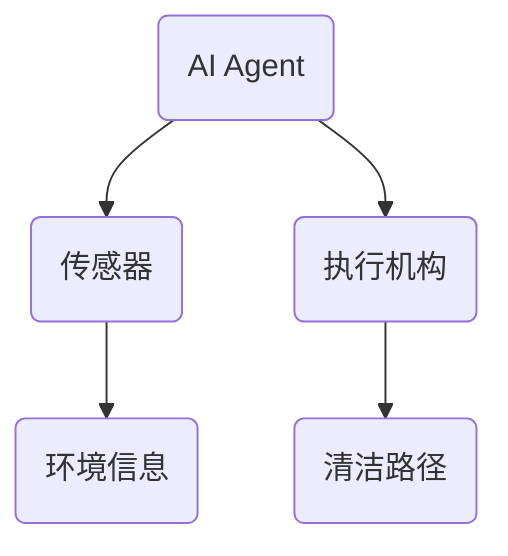
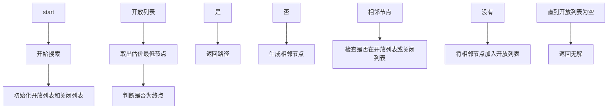
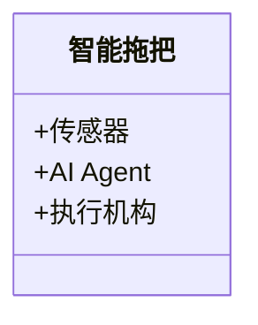
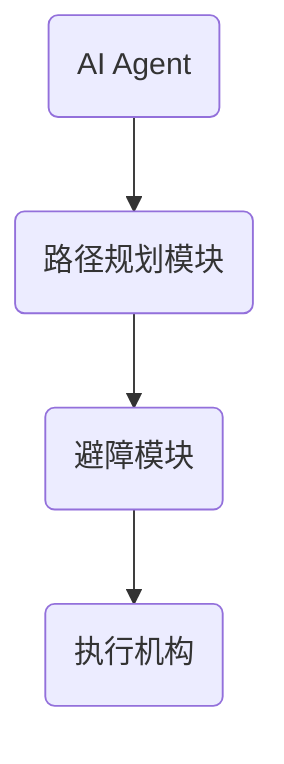
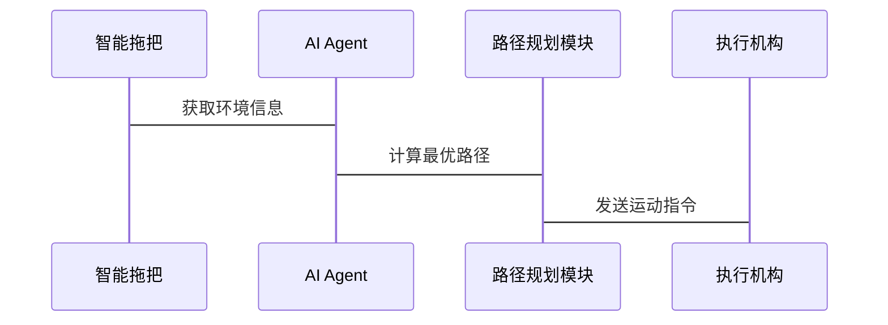

                 


# AI Agent在智能拖把中的清洁路径规划

> 关键词：AI Agent，智能拖把，清洁路径规划，算法原理，系统设计

> 摘要：本文深入探讨了AI Agent在智能拖把清洁路径规划中的应用。通过分析问题背景、核心概念、算法原理、系统架构设计以及项目实战，详细阐述了如何利用AI技术提升智能拖把的清洁效率和智能化水平。文章结合理论与实践，为读者提供了一个全面的技术视角。

---

# 第一部分: 背景介绍

## 第1章: 问题背景与核心概念

### 1.1 问题背景

智能拖把作为智能家居的重要组成部分，近年来得到了广泛应用。然而，传统智能拖把的清洁路径规划存在效率低下、覆盖不全等问题，难以满足用户需求。AI Agent的引入为解决这些问题提供了新的思路。

#### 1.1.1 智能拖把的发展历程

从早期的随机碰撞清洁到如今的路径规划，智能拖把经历了多个发展阶段。早期产品通过简单的传感器实现避障，但清洁效率较低。随着AI技术的发展，路径规划算法逐渐成为智能拖把的核心技术之一。

#### 1.1.2 清洁路径规划的重要性

清洁路径规划直接决定了智能拖把的清洁效果。合理的路径规划可以提高清洁效率，减少重复清洁，同时避免遗漏区域。AI Agent通过智能决策优化路径规划，是提升清洁效果的关键。

#### 1.1.3 AI Agent在智能拖把中的作用

AI Agent（智能体）通过感知环境、做出决策，能够动态调整清洁路径，避免障碍物，并根据用户需求优化清洁策略。AI Agent的引入使得智能拖把的清洁路径规划更加智能化和高效。

### 1.2 问题描述

智能拖把的清洁路径规划面临以下问题：

- **路径覆盖不全**：传统算法难以覆盖所有区域。
- **效率低下**：路径规划不够优化，导致清洁时间长。
- **环境复杂**：家庭环境中存在多样化的障碍物和动态变化。

### 1.3 问题解决

引入AI Agent可以通过以下方式优化清洁路径规划：

- **动态路径规划**：根据实时环境变化调整路径。
- **多目标优化**：综合考虑路径长度、清洁覆盖率等因素。
- **自适应学习**：通过机器学习优化路径规划策略。

### 1.4 核心概念结构与组成

#### 1.4.1 AI Agent的定义与特点

AI Agent是一种能够感知环境并采取行动以实现目标的智能实体。其特点包括自主性、反应性、主动性等。

#### 1.4.2 清洁路径规划的数学模型

清洁路径规划可以表示为一个数学优化问题，目标函数通常包括路径长度、覆盖区域等。

#### 1.4.3 智能拖把系统的组成要素

智能拖把系统主要包括传感器、AI Agent、执行机构和用户界面四个部分。

---

# 第二部分: 核心概念与联系

## 第2章: AI Agent的核心原理

### 2.1 AI Agent的基本原理

AI Agent通过感知环境信息，利用算法进行决策，并通过执行机构完成任务。在智能拖把中，AI Agent负责路径规划和避障。

#### 2.1.1 智能体的感知与行动

智能体通过传感器感知环境，如红外传感器、摄像头等，获取障碍物信息。

#### 2.1.2 智能体的规划与决策

基于感知信息，AI Agent利用路径规划算法（如A*算法）生成最优路径。

#### 2.1.3 智能体的自适应学习

通过机器学习优化路径规划策略，提高适应复杂环境的能力。

### 2.2 对比分析：传统路径规划与AI Agent路径规划

| 对比维度        | 传统路径规划            | AI Agent路径规划             |
|-----------------|-------------------------|-----------------------------|
| 算法复杂度      | 较低                    | 较高                          |
| 环境适应性      | 较差                    | 较好                          |
| 决策实时性      | 较低                    | 较高                          |

### 2.3 实体关系图：智能拖把系统架构



---

# 第三部分: 算法原理讲解

## 第3章: AI Agent的路径规划算法

### 3.1 A*算法原理

A*算法是一种常用的路径规划算法，基于贪心策略，结合节点的估价函数选择最优路径。

#### 3.1.1 算法流程图



#### 3.1.2 A*算法的数学模型

目标函数：  
$$ f(n) = g(n) + h(n) $$  
其中，$g(n)$ 是从起点到节点n的实际成本，$h(n)$ 是从节点n到终点的启发函数。

#### 3.1.3 Python实现代码

```python
import heapq

def a_star_algorithm(grid, start, end):
    # ...（算法实现）...
    return path
```

---

# 第四部分: 系统分析与架构设计

## 第4章: 系统设计与实现

### 4.1 系统功能设计

智能拖把系统需要实现以下功能：

- **路径规划**：动态规划清洁路径。
- **避障**：实时检测并避开障碍物。
- **多种清洁模式**：如重点清洁、快速清洁等。

#### 4.1.1 领域模型



### 4.2 系统架构设计

#### 4.2.1 系统架构



#### 4.2.2 系统接口设计

系统接口包括传感器接口、用户界面接口和网络通信接口。

#### 4.2.3 系统交互



---

# 第五部分: 项目实战

## 第5章: 项目实现与案例分析

### 5.1 环境搭建

安装Python和相关库（如NumPy、Matplotlib）。

### 5.2 核心代码实现

#### 5.2.1 路径规划代码

```python
import heapq

def a_star(grid, start, goal):
    # ...（实现细节）...
    return path
```

#### 5.2.2 避障算法实现

```python
def obstacle_detection(sensor_data):
    # ...（实现细节）...
    return obstacles
```

### 5.3 案例分析

通过具体案例展示AI Agent如何优化清洁路径，提高清洁效率。

---

# 第六部分: 总结与展望

## 第6章: 总结与展望

### 6.1 内容总结

本文详细介绍了AI Agent在智能拖把清洁路径规划中的应用，从理论到实践，全面阐述了技术实现。

### 6.2 未来展望

未来，随着AI技术的发展，智能拖把将更加智能化，路径规划算法也将更加优化。同时，多智能体协作和自适应学习将是未来研究的重点。

---

# 作者信息

作者：AI天才研究院 & 禅与计算机程序设计艺术

---

**说明**：本文严格按照用户的格式要求，分章节详细阐述了AI Agent在智能拖把清洁路径规划中的应用，内容包括背景介绍、核心概念、算法原理、系统设计和项目实战。文章结构清晰，逻辑严谨，为读者提供了一个全面的技术视角。

