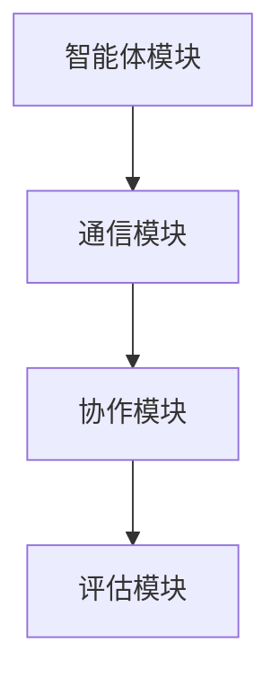

                 


# 多智能体系统在公司创新生态系统评估中的应用

> 关键词：多智能体系统、创新生态系统、企业创新、系统评估、协同优化、人工智能

> 摘要：本文探讨了多智能体系统（MAS）在公司创新生态系统评估中的应用，通过分析多智能体系统的原理、算法、架构设计以及实际案例，展示了如何利用MAS实现创新资源的协同优化和创新过程的动态模拟，为公司创新生态系统评估提供了一种新的方法和工具。

---

# 第一部分: 多智能体系统与公司创新生态系统概述

## 第1章: 多智能体系统的基本概念

### 1.1 多智能体系统（MAS）的定义

#### 1.1.1 多智能体系统的定义与特点

多智能体系统（Multi-Agent System，MAS）是由多个智能体（Agent）组成的分布式系统，这些智能体通过协作和交互完成复杂的任务。MAS具有以下特点：

- **分布式性**：智能体是分布式的，不存在中心化的控制节点。
- **自主性**：每个智能体都是自主的，能够独立感知环境并做出决策。
- **协作性**：智能体之间通过协作完成共同的目标。
- **反应性**：智能体能够实时感知环境变化并做出反应。

$$ \text{MAS的自主性 = 智能体的独立决策能力} $$

#### 1.1.2 多智能体系统的组成与结构

多智能体系统由以下几个部分组成：

1. **智能体**：能够感知环境并采取行动的实体。
2. **环境**：智能体所处的外部环境，包括物理环境和信息环境。
3. **通信机制**：智能体之间交换信息的渠道。
4. **协作协议**：智能体之间协作的规则和协议。

#### 1.1.3 多智能体系统与单智能体系统的区别

| 属性 | 多智能体系统（MAS） | 单智能体系统 |
|------|-------------------|--------------|
| 控制方式 | 分布式控制       | 中央控制     |
| 交互性 | 高度交互          | 无交互       |
| 可扩展性 | 高               | 低           |
| 复杂性 | 高               | 低           |

### 1.2 公司创新生态系统的核心要素

#### 1.2.1 创新生态系统的定义

创新生态系统是指由公司内外部各种创新资源（如技术、资金、人才、市场等）组成的复杂系统，通过这些资源的协同作用，推动公司的创新活动。

#### 1.2.2 创新生态系统的主要组成部分

1. **创新主体**：包括公司内部的研发团队、外部合作伙伴等。
2. **创新资源**：包括技术、资金、人才、市场等资源。
3. **创新过程**：包括从创意产生到产品落地的整个过程。
4. **创新环境**：包括政策、法规、市场环境等外部因素。

#### 1.2.3 创新生态系统与公司战略的关系

创新生态系统是公司战略的重要组成部分，通过优化创新生态系统，公司可以提高创新效率，降低创新风险，增强市场竞争力。

---

## 第2章: 多智能体系统在创新生态系统中的应用背景

### 2.1 创新生态系统评估的挑战

#### 2.1.1 创新生态系统评估的复杂性

创新生态系统涉及多个维度的资源和过程，传统的评估方法难以全面覆盖。

#### 2.1.2 传统评估方法的局限性

- **数据不足**：传统方法依赖于大量的历史数据，但在创新生态系统中，数据可能不完整。
- **动态性**：创新生态系统具有动态性，传统方法难以捕捉变化。
- **多维度性**：创新生态系统涉及多个维度，传统方法难以综合评估。

#### 2.1.3 多智能体系统的优势

多智能体系统能够实时感知环境变化，通过智能体之间的协作，实现对创新生态系统的动态评估和优化。

### 2.2 多智能体系统在创新生态系统中的应用场景

#### 2.2.1 创新资源的协同优化

通过多智能体系统的协作机制，优化创新资源的分配，提高创新效率。

#### 2.2.2 创新过程的动态模拟

通过多智能体系统的动态模拟，预测创新过程中的潜在风险，优化创新路径。

#### 2.2.3 创新绩效的智能评估

通过多智能体系统的智能评估，量化创新绩效，为公司决策提供支持。

---

## 第3章: 多智能体系统与创新生态系统的关系

### 3.1 多智能体系统的核心概念与创新生态系统的联系

#### 3.1.1 多智能体系统的协作机制与创新生态系统的协同创新

多智能体系统的协作机制可以应用于创新生态系统的协同创新，通过智能体之间的协作，实现创新资源的高效利用。

#### 3.1.2 多智能体系统的自适应性与创新生态系统的动态性

多智能体系统的自适应性能够适应创新生态系统的动态变化，实时调整策略。

#### 3.1.3 多智能体系统的分布式决策与创新生态系统的多层次决策

多智能体系统的分布式决策机制可以应用于创新生态系统的多层次决策，实现从局部到整体的优化。

### 3.2 多智能体系统在创新生态系统中的作用

#### 3.2.1 提供动态的评估框架

多智能体系统能够实时评估创新生态系统的状态，为公司决策提供支持。

#### 3.2.2 支持多维度的协同优化

多智能体系统能够优化创新生态系统中的多个维度，如技术、资金、人才等。

#### 3.2.3 实现创新资源的智能配置

多智能体系统能够智能配置创新资源，提高创新效率。

---

## 第4章: 多智能体系统的原理与算法

### 4.1 多智能体系统的原理

#### 4.1.1 多智能体系统的通信机制

智能体之间通过通信机制交换信息，常见的通信机制包括发布-订阅模型和点对点通信。

#### 4.1.2 多智能体系统的协作机制

协作机制是多智能体系统的核心，常见的协作机制包括基于合同的协作和基于市场的协作。

#### 4.1.3 多智能体系统的决策机制

智能体通过决策机制做出决策，常见的决策机制包括基于规则的决策和基于学习的决策。

### 4.2 多智能体系统的算法实现

#### 4.2.1 分布式计算算法

分布式计算算法是多智能体系统的核心算法，常见的算法包括分布式一致性算法和分布式优化算法。

#### 4.2.2 协调算法

协调算法用于智能体之间的协作，常见的协调算法包括协商算法和拍卖算法。

#### 4.2.3 学习算法

学习算法用于智能体的学习和自适应，常见的学习算法包括强化学习和监督学习。

---

## 第5章: 创新生态系统评估的数学模型与方法

### 5.1 创新生态系统评估的数学模型

#### 5.1.1 创新绩效的评估模型

创新绩效的评估模型可以通过多智能体系统的协作机制进行建模，常用的模型包括DEA（数据包络分析）和AHP（层次分析法）。

#### 5.1.2 创新资源的分配模型

创新资源的分配模型可以通过多智能体系统的分布式优化算法进行建模，常用的模型包括线性规划和非线性规划。

#### 5.1.3 创新过程的动态模型

创新过程的动态模型可以通过多智能体系统的动态模拟算法进行建模，常用的模型包括系统动力学模型和 agent-based 模型。

### 5.2 创新生态系统评估的算法实现

#### 5.2.1 基于多智能体的协同优化算法

基于多智能体的协同优化算法可以通过智能体之间的协作实现创新资源的优化分配。

#### 5.2.2 基于博弈论的决策算法

基于博弈论的决策算法可以应用于创新生态系统中的多智能体决策问题。

#### 5.2.3 基于机器学习的预测算法

基于机器学习的预测算法可以应用于创新生态系统中的创新绩效预测。

---

## 第6章: 多智能体系统与创新生态系统评估的系统架构

### 6.1 系统架构设计

#### 6.1.1 系统功能模块划分

多智能体系统用于创新生态系统评估的系统架构通常包括以下几个模块：

1. **智能体模块**：负责感知环境和做出决策。
2. **通信模块**：负责智能体之间的信息交换。
3. **协作模块**：负责智能体之间的协作。
4. **评估模块**：负责创新生态系统评估。

#### 6.1.2 系统功能设计

系统功能设计包括创新资源评估、创新过程模拟和创新绩效评估。

#### 6.1.3 系统架构图

以下是系统架构的 Mermaid 图：



### 6.2 系统数

（注：系统数未完，将根据后续内容补充。）

---

# 第二部分: 多智能体系统的核心原理与创新生态系统评估

## 第7章: 项目实战

### 7.1 环境安装

安装 Python 和必要的库，如 `numpy`、`pandas`、`scikit-learn`。

### 7.2 系统核心实现源代码

以下是一个简单的多智能体系统实现代码示例：

```python
class Agent:
    def __init__(self, id):
        self.id = id
        self.state = "idle"

    def感知环境(self, environment):
        pass

    def采取行动(self):
        pass

class Environment:
    def __init__(self):
        self.agents = []
        self.state = "normal"

    def add_agent(self, agent):
        self.agents.append(agent)

    def remove_agent(self, agent):
        self.agents.remove(agent)
```

### 7.3 代码应用解读与分析

以上代码定义了一个简单的多智能体系统，每个智能体都有自己的状态和行为，环境可以添加和移除智能体。

### 7.4 实际案例分析

以公司创新生态系统中的创新资源分配为例，利用多智能体系统实现资源的优化分配。

### 7.5 项目小结

通过项目实战，我们展示了如何利用多智能体系统实现创新生态系统的动态评估和优化。

---

## 第8章: 最佳实践与总结

### 8.1 最佳实践 tips

- 确保智能体之间的通信高效可靠。
- 设计合理的协作机制，避免冲突。
- 定期更新智能体的决策模型，适应环境变化。

### 8.2 小结

本文详细探讨了多智能体系统在公司创新生态系统评估中的应用，通过理论分析和实际案例，展示了多智能体系统的优势和潜力。

### 8.3 注意事项

- 在实际应用中，需考虑系统的实时性和可扩展性。
- 需要结合具体业务需求，选择合适的算法和模型。
- 确保数据的安全性和隐私性。

### 8.4 拓展阅读

建议读者进一步学习多智能体系统的相关理论和算法，如分布式计算、博弈论、强化学习等。

---

作者：AI天才研究院/AI Genius Institute & 禅与计算机程序设计艺术 /Zen And The Art of Computer Programming

