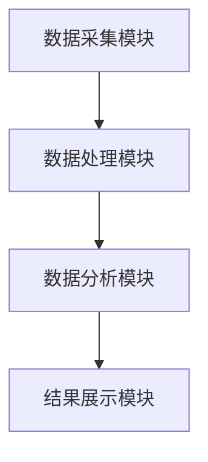
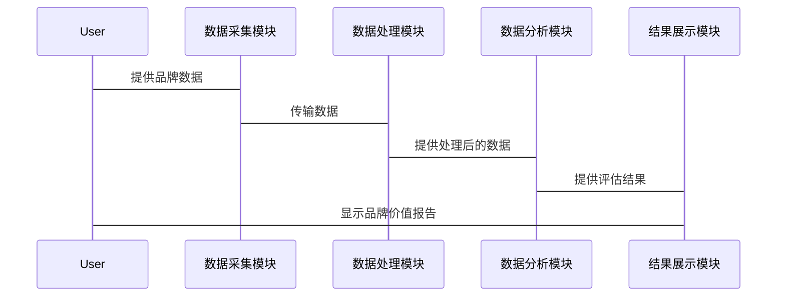

                 


# 巴菲特的品牌价值评估：无形资产的重要性

## 关键词：
- 巴菲特
- 品牌价值评估
- 无形资产
- 企业价值
- 品牌资产

## 摘要：
本文通过分析巴菲特的品牌价值评估方法，探讨无形资产在企业价值中的重要性。文章首先介绍品牌价值的核心概念和其与无形资产的关系，接着分析巴菲特的投资理念及其对品牌价值的重视。随后，详细讲解品牌价值评估的核心方法，包括理论基础、评估指标和算法原理。最后，结合实际案例，展示品牌价值评估在企业战略中的应用，并总结品牌价值评估的重要性和未来发展趋势。

---

# 第一章：品牌价值评估的背景与意义

## 1.1 品牌价值的核心概念

### 1.1.1 无形资产的定义与特征
- 无形资产是企业无法用实物形态表示的资产，主要包括品牌、专利、商标、商誉等。
- 无形资产的特征包括长期性、不可分割性、价值波动性等。
- 无形资产的价值通常通过对企业未来收益的贡献来衡量。

### 1.1.2 品牌价值的定义与内涵
- 品牌价值是指品牌在市场中所能带来的超额收益。
- 品牌价值的核心要素包括品牌知名度、品牌忠诚度、品牌认知度等。
- 品牌价值是企业市场竞争力的重要体现。

### 1.1.3 品牌价值与企业价值的关系
- 品牌价值是企业价值的重要组成部分。
- 品牌价值的提升能够显著增强企业的市场地位和盈利能力。
- 品牌价值与企业价值的关系可以通过财务指标（如市盈率、市净率）进行量化分析。

## 1.2 巴菲特的投资理念与品牌价值

### 1.2.1 巴菲特的价值投资哲学
- 巴菲特主张长期投资，注重企业的内在价值。
- 他强调企业品牌的价值，认为品牌是企业最重要的无形资产之一。

### 1.2.2 巴菲特对品牌的独特见解
- 巴菲特认为，强大的品牌能够为企业带来持续的竞争优势。
- 他特别关注品牌忠诚度和品牌影响力，认为这些是品牌价值的核心驱动力。

### 1.2.3 品牌价值在巴菲特投资决策中的作用
- 巴菲特在选择投资标的时，重点关注企业的品牌价值。
- 他倾向于投资那些具有强大品牌价值和稳定现金流的企业。

---

# 第二章：品牌价值评估的核心概念与联系

## 2.1 品牌价值评估的理论基础

### 2.1.1 品牌价值的构成要素
- 品牌认知度：品牌在目标市场中的知名度。
- 品牌忠诚度：消费者对品牌的偏好程度。
- 品牌影响力：品牌在市场中的影响力和话语权。

### 2.1.2 品牌资产的分类与衡量
- 品牌资产包括品牌知名度、品牌忠诚度、品牌认知度等。
- 品牌资产可以通过市场调研、消费者行为分析等方式进行衡量。

### 2.1.3 品牌生命周期与价值评估的关系
- 品牌生命周期包括导入期、成长期、成熟期和衰退期。
- 不同生命周期阶段的品牌价值评估方法和侧重点不同。

## 2.2 品牌价值与财务指标的关系

### 2.2.1 品牌价值与企业财务报表
- 品牌价值通常反映在企业的商誉中，商誉是企业并购时产生的无形资产。
- 品牌价值可以通过企业并购后的协同效应来评估。

### 2.2.2 品牌价值对股价的影响
- 品牌价值的提升能够显著提高企业的市场估值。
- 品牌价值与股价之间的关系可以通过市盈率、市净率等指标进行分析。

### 2.2.3 品牌价值与企业利润的关系
- 品牌价值的提升能够降低企业的营销成本，提高销售效率。
- 品牌价值的增强能够为企业带来更高的利润率和市场份额。

---

# 第三章：品牌价值评估的核心方法

## 3.1 品牌价值评估的主要方法

### 3.1.1 品牌资产的评估方法
- 品牌资产可以通过市场调研、消费者行为分析等方式进行评估。
- 品牌资产的评估通常采用定性分析和定量分析相结合的方法。

### 3.1.2 品牌强度评估模型
- 品牌强度评估模型是基于品牌的核心竞争力进行评估。
- 该模型包括品牌知名度、品牌忠诚度、品牌创新力等多个维度。

### 3.1.3 品牌价值的市场法评估
- 市场法评估是通过比较同类企业的品牌价值来确定目标企业的品牌价值。
- 该方法通常用于企业并购中的品牌价值评估。

## 3.2 品牌价值评估的关键指标

### 3.2.1 品牌认知度与忠诚度的衡量
- 品牌认知度可以通过市场调研和消费者调查来衡量。
- 品牌忠诚度可以通过消费者行为分析和市场细分来衡量。

### 3.2.2 品牌影响力与市场地位的评估
- 品牌影响力可以通过媒体曝光、社交媒体影响力等指标来评估。
- 市场地位可以通过市场份额、竞争对手分析等指标来评估。

---

# 第四章：品牌价值评估的算法原理

## 4.1 品牌价值评估的算法原理

### 4.1.1 加权平均法
- 加权平均法是一种常用的品牌价值评估方法。
- 该方法通过给品牌价值的不同维度赋予不同的权重，计算出综合的品牌价值。

### 4.1.2 层次分析法（AHP）
- 层次分析法是一种基于专家意见的品牌价值评估方法。
- 该方法通过构建层次结构模型，对品牌价值的不同维度进行权重分配和综合评估。

### 4.1.3 逻辑回归模型
- 逻辑回归模型是一种基于统计学的品牌价值预测方法。
- 该方法通过分析品牌价值与相关变量之间的关系，建立预测模型。

## 4.2 算法实现

### 4.2.1 加权平均法的实现步骤
1. 确定品牌价值的不同维度，例如品牌知名度、品牌忠诚度等。
2. 为每个维度赋予相应的权重。
3. 计算每个维度的得分，并进行加权求和，得出综合品牌价值。

### 4.2.2 逻辑回归模型的实现步骤
1. 收集品牌价值的相关数据，包括品牌知名度、品牌忠诚度、市场份额等。
2. 对数据进行预处理，包括缺失值处理、数据标准化等。
3. 建立逻辑回归模型，进行变量选择和模型训练。
4. 使用训练好的模型对品牌价值进行预测。

---

# 第五章：品牌价值评估的系统架构设计

## 5.1 系统功能设计

### 5.1.1 数据采集模块
- 数据采集模块负责收集品牌价值相关数据，包括市场数据、消费者行为数据等。

### 5.1.2 数据处理模块
- 数据处理模块对采集到的数据进行清洗、转换和标准化处理。

### 5.1.3 数据分析模块
- 数据分析模块采用加权平均法、层次分析法等方法对品牌价值进行评估。

### 5.1.4 结果展示模块
- 结果展示模块将品牌价值评估结果以可视化的方式呈现，包括图表、报告等。

## 5.2 系统架构设计

### 5.2.1 系统架构图


### 5.2.2 系统交互流程图


---

# 第六章：项目实战——品牌价值评估案例分析

## 6.1 实战背景
- 某企业希望对其品牌价值进行评估，以便更好地制定企业战略。

## 6.2 实战步骤

### 6.2.1 环境安装
```bash
pip install numpy pandas matplotlib
```

### 6.2.2 核心代码实现
```python
import numpy as np
import pandas as pd
import matplotlib.pyplot as plt

# 数据预处理
data = pd.read_csv('brand_value.csv')
data.dropna(inplace=True)
data = pd.get_dummies(data)

# 加权平均法计算品牌价值
weights = [0.4, 0.3, 0.2, 0.1]
brand_value = np.dot(data[['feature1', 'feature2', 'feature3', 'feature4']].values, weights)

# 绘制品牌价值分布图
plt.hist(brand_value, bins=10)
plt.title('Brand Value Distribution')
plt.xlabel('Brand Value')
plt.ylabel('Frequency')
plt.show()
```

### 6.2.3 案例分析与结果解读
- 通过加权平均法计算得出的品牌价值分布图显示，大部分品牌价值集中在中等偏上区间。
- 该结果表明该品牌在市场上具有较强的竞争力，但仍需进一步提升品牌忠诚度。

## 6.3 项目小结
- 品牌价值评估是企业制定战略的重要工具。
- 通过项目实战，可以更好地理解品牌价值评估的核心方法和实际应用。

---

# 第七章：总结与展望

## 7.1 总结
- 品牌价值是企业市场竞争力的重要体现。
- 品牌价值评估的核心在于对企业无形资产的准确衡量。
- 巴菲特的投资理念为我们提供了品牌价值评估的重要启示。

## 7.2 展望
- 随着数字化时代的到来，品牌价值评估的方法和工具将更加多样化。
- 品牌价值评估将更加注重数据化、智能化和精准化。

---

作者：AI天才研究院/AI Genius Institute & 禅与计算机程序设计艺术 /Zen And The Art of Computer Programming

