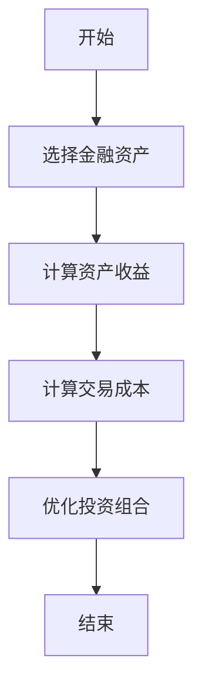
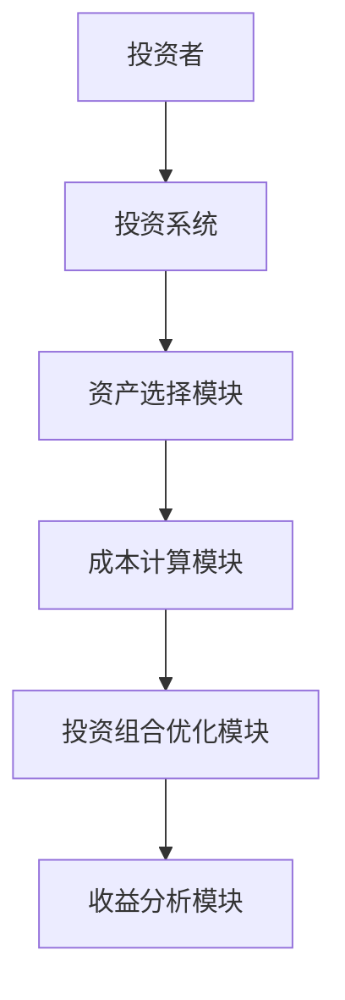

                 


# 约翰·伯格的低成本投资策略

> 关键词：低成本投资，约翰·伯格，投资策略，投资成本，投资组合优化

> 摘要：本文详细分析了约翰·伯格的低成本投资策略，从背景介绍、核心概念到算法原理、系统架构设计，再到项目实战，全面解析了低成本投资的理论基础和实际应用。通过对比分析、数学模型、流程图和代码实现，深入探讨了低成本投资的优化方法和实现细节。

---

## 第1章: 背景介绍

### 1.1 低成本投资的背景

#### 1.1.1 投资市场的现状与挑战
投资市场是一个充满不确定性的领域，投资者需要在复杂的市场环境中做出决策。传统的投资策略往往伴随着高昂的交易成本和管理费用，这对中小投资者来说是一个巨大的负担。低成本投资的兴起，正是为了应对这些挑战。

#### 1.1.2 低成本投资的兴起
随着金融市场的成熟，低成本投资逐渐成为一种趋势。通过降低交易成本和管理费用，投资者可以更专注于长期的投资目标，避免短期波动的干扰。

#### 1.1.3 低成本投资的核心问题与目标
低成本投资的核心问题是如何在保证收益的同时，最大限度地降低投资成本。其目标是通过优化投资组合和选择合适的金融工具，实现长期稳定的收益。

### 1.2 问题描述与解决思路

#### 1.2.1 投资成本的构成与影响
投资成本主要包括交易成本、管理费用和税务成本。这些成本会直接影响投资收益，尤其是对于小额投资者来说，成本的高低往往决定了投资的成败。

#### 1.2.2 低成本投资的解决思路
低成本投资的核心思路是通过被动投资策略，减少主动交易的频率，从而降低交易成本。同时，选择低成本的金融工具，如指数基金，也是实现低成本投资的重要手段。

### 1.3 核心概念与联系

#### 1.3.1 核心概念原理
低成本投资的核心要素包括投资组合优化、交易成本最小化和风险管理。这些要素相互关联，共同构成了低成本投资的理论基础。

#### 1.3.2 核心概念对比表
| 投资策略 | 成本 | 风险 | 收益 |
|----------|------|------|------|
| 主动投资 | 高 | 高 | 高 |
| 被动投资 | 低 | 中 | 中 |

#### 1.3.3 ER实体关系图
```mermaid
er
    investor
    owns
    investment_portfolio
    contains
    assets
```

---

## 第2章: 核心概念与联系

### 2.1 核心概念的数学模型与公式

#### 2.1.1 投资成本的数学模型
投资成本的计算公式为：
$$ \text{总成本} = \text{交易成本} + \text{管理费用} + \text{税务成本} $$

#### 2.1.2 投资收益的数学模型
投资收益的计算公式为：
$$ \text{总收益} = \text{资产收益} - \text{总成本} $$

### 2.2 算法原理与流程图

#### 2.2.1 算法原理
低成本投资的优化算法基于投资组合优化理论，通过数学建模和优化方法，找到最优的投资组合。

#### 2.2.2 算法流程图


---

## 第3章: 系统分析与架构设计

### 3.1 问题场景介绍

#### 3.1.1 投资者面临的成本问题
投资者在选择投资策略时，需要考虑交易成本、管理费用和税务成本。这些成本会直接影响投资收益。

### 3.2 系统功能设计

#### 3.2.1 系统功能
系统功能包括资产选择、成本计算、投资组合优化和收益分析。

### 3.3 系统架构设计

#### 3.3.1 系统架构图


---

## 第4章: 项目实战

### 4.1 环境安装

#### 4.1.1 环境要求
安装Python和相关库，如numpy和pandas。

### 4.2 系统核心实现

#### 4.2.1 Python代码实现
```python
import numpy as np
import pandas as pd

# 假设资产收益矩阵
returns = np.array([[0.1, 0.15, 0.05],
                     [0.12, 0.1, 0.08],
                     [0.08, 0.12, 0.06]])

# 计算投资组合优化
def portfolio_optimization(returns):
    n = len(returns)
    # 使用均值-方差优化
    mu = returns.mean()
    sigma = returns.std()
    # 简单优化（此处简化）
    weights = np.array([1/n]*n)
    return weights

weights = portfolio_optimization(returns)
print("投资组合权重:", weights)
```

### 4.3 实际案例分析

#### 4.3.1 案例分析
以三只股票为例，计算投资组合优化后的权重，并分析其收益和风险。

---

## 第5章: 最佳实践

### 5.1 小结
低成本投资的核心在于降低交易成本和优化投资组合。通过被动投资策略和指数基金，投资者可以实现长期稳定的收益。

### 5.2 注意事项
投资者在选择低成本投资策略时，需要关注市场波动和经济环境的变化，合理分散投资风险。

### 5.3 拓展阅读
推荐阅读《约翰·伯格的投资之道》和《投资学基础》等书籍，深入了解低成本投资的理论和实践。

---

## 作者信息

作者：AI天才研究院 & 禅与计算机程序设计艺术

---

通过以上内容，我们详细分析了约翰·伯格的低成本投资策略，从背景介绍到算法实现，再到项目实战，为读者提供了全面的指导和深入的分析。希望读者能够通过本文，掌握低成本投资的核心理念和实现方法。

