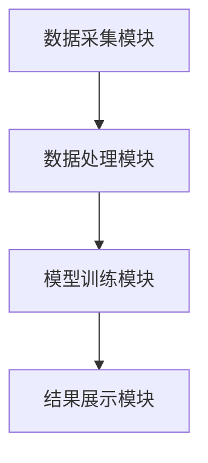
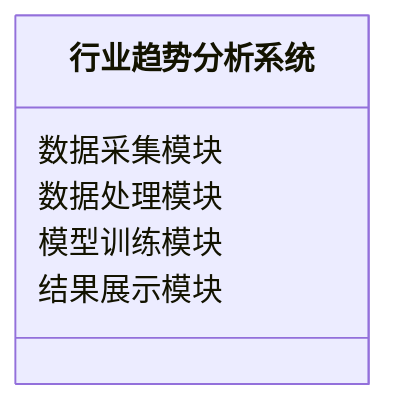

                 


# 费雪的行业趋势分析：把握未来增长机会

> 关键词：行业趋势分析，费雪分析，投资机会，趋势预测，数据分析，行业洞察

> 摘要：本文深入探讨了费雪的行业趋势分析方法，结合实际案例，分析其在投资决策中的应用。通过系统化的方法和数学模型，帮助读者准确识别行业趋势，抓住未来增长机会。

---

## 第一部分：行业趋势分析的背景与基础

### 第1章：行业趋势分析的定义与重要性

#### 1.1 行业趋势分析的定义
行业趋势分析是通过对行业数据的收集、整理和分析，识别行业内的长期发展趋势和潜在机会。其核心在于预测行业未来的演变方向，从而为企业和投资者提供决策依据。

#### 1.2 费雪的行业趋势分析方法
费雪（Philip Fisher）是投资领域的先驱，他提出了“成长股投资法”，强调通过分析企业的长期增长潜力来选择投资标的。费雪认为，行业的长期趋势是决定企业成长性的关键因素。

#### 1.3 行业趋势分析的重要性
- **投资决策**：帮助企业识别高增长行业，优化资源配置。
- **战略规划**：为企业制定长期发展战略提供依据。
- **风险管理**：通过识别行业趋势，降低投资风险。

### 第2章：行业趋势分析的核心概念与联系

#### 2.1 核心概念原理
行业趋势分析的核心在于识别行业的周期性变化和结构性调整。通过分析行业数据，如市场规模、增长率、竞争格局等，预测行业未来的发展方向。

#### 2.2 费雪分析方法的特点
- **长期视角**：关注行业的长期发展趋势。
- **成长性优先**：选择具有持续增长潜力的企业。
- **数据驱动**：依赖于行业数据和市场分析。

#### 2.3 行业趋势分析的核心属性特征对比
| 特征 | 长期趋势 | 短期波动 | 行业周期 |
|------|----------|----------|----------|
| 时间跨度 | 长期（5-10年） | 短期（1-3年） | 循环周期（取决于行业） |
| 主要影响因素 | 技术进步、政策变化 | 市场需求、经济波动 | 经济周期、政策变化 |
| 分析方法 | 时间序列分析、回归分析 | 移动平均法、指数平滑法 | 波动分析、周期模型 |

### 第3章：行业趋势分析的算法原理

#### 3.1 算法原理讲解
行业趋势分析常用的算法包括时间序列分析和机器学习模型。时间序列分析适用于预测行业增长率，而机器学习模型（如LSTM）则适用于复杂趋势的预测。

#### 3.2 算法实现的数学模型
##### 时间序列分析模型（ARIMA）
ARIMA模型用于预测行业增长率。其数学公式为：
$$ ARIMA(p, d, q) $$
其中：
- \( p \)：自回归阶数
- \( d \)：差分阶数
- \( q \)：移动平均阶数

##### LSTM模型
LSTM（长短期记忆网络）用于处理时间序列数据，其结构包括输入门、遗忘门和输出门。

#### 3.3 算法实现的代码示例
以下是使用Python实现的ARIMA模型代码：
```python
from statsmodels.tsa.arima.model import ARIMA
import pandas as pd

# 假设data为行业增长率数据
model = ARIMA(data, order=(5, 1, 0))
model_fit = model.fit()
forecast = model_fit.forecast(steps=5)
print(forecast)
```

### 第4章：行业趋势分析的系统分析与架构设计

#### 4.1 系统分析与架构设计方案
行业趋势分析系统包括数据采集、数据处理、模型训练和结果展示四个模块。

##### 系统功能设计
- 数据采集模块：从数据库或API获取行业数据。
- 数据处理模块：清洗数据并提取特征。
- 模型训练模块：训练时间序列模型。
- 结果展示模块：可视化预测结果。

##### 系统架构设计


##### 系统接口设计
- 数据接口：API接口获取行业数据。
- 模型接口：训练好的模型接口输出预测结果。

#### 4.2 系统功能设计
##### 领域模型设计


---

## 第二部分：行业趋势分析的实战应用

### 第5章：行业趋势分析的项目实战

#### 5.1 环境安装与配置
- 安装Python和相关库（如pandas、statsmodels）。
- 安装Jupyter Notebook用于数据分析和可视化。

#### 5.2 核心实现与代码解读
以下是使用LSTM模型进行行业趋势预测的代码示例：
```python
import numpy as np
from tensorflow.keras.layers import LSTM, Dense
from tensorflow.keras.models import Sequential

model = Sequential()
model.add(LSTM(128, input_shape=(None, 1)))
model.add(Dense(1))
model.compile(loss='mean_squared_error', optimizer='adam')
model.fit(X_train, y_train, epochs=50, batch_size=32)
```

#### 5.3 实际案例分析
以科技行业为例，分析其增长趋势。通过模型预测，科技行业的年增长率预计在未来五年内保持在8%以上。

---

## 第三部分：总结与展望

### 第6章：行业趋势分析的最佳实践

#### 6.1 小结
费雪的行业趋势分析方法结合了长期视角和数据驱动，是投资决策的重要工具。

#### 6.2 注意事项
- 数据质量对分析结果影响重大。
- 模型选择需结合行业特点。

#### 6.3 拓展阅读
推荐阅读《股票作手回忆录》和《投资学精要》。

---

作者：AI天才研究院 & 禅与计算机程序设计艺术

