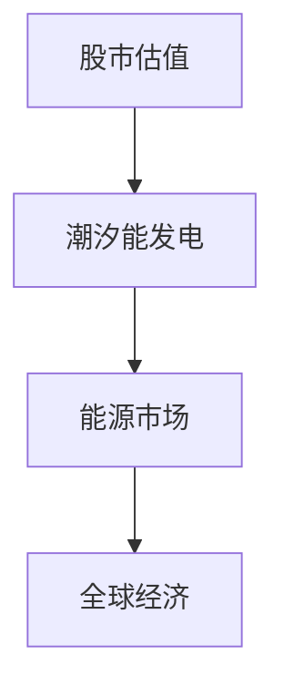
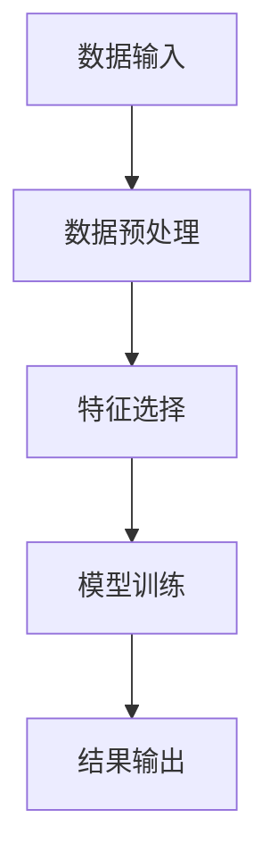
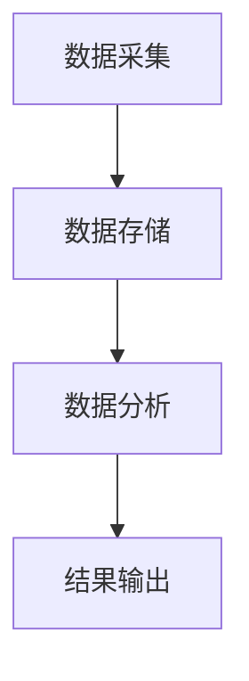

                 


# 全球股市估值与海洋潮汐能发电技术的关系

> 关键词：全球股市估值，海洋潮汐能发电，技术关系分析，能源市场，股市预测，可持续能源，数据模型

> 摘要：本文探讨了全球股市估值与海洋潮汐能发电技术之间的关系。通过分析股市估值的核心概念与潮汐能发电技术的特点，结合数据模型与算法原理，揭示两者在能源市场中的相互影响。文章从背景介绍、核心概念、算法原理、系统架构到项目实战，全面分析了如何通过技术手段将股市估值与潮汐能发电技术相结合，为能源市场的可持续发展提供新思路。

---

# 第一部分: 全球股市估值与海洋潮汐能发电技术的背景与概念

## 第1章: 全球股市估值的背景与现状

### 1.1 股市估值的基本概念

#### 1.1.1 股市估值的定义
股市估值是指对股票市场价格进行评估的过程，通常通过市盈率、市净率等指标衡量企业的内在价值。$$\text{市盈率} = \frac{\text{股价}}{\text{每股收益}}$$

#### 1.1.2 股市估值的核心要素
- 股票价格
- 每股收益（EPS）
- 股东权益
- 市场供需

#### 1.1.3 股市估值的计算方法
$$\text{市净率} = \frac{\text{股价}}{\text{每股净资产}}$$

### 1.2 全球股市估值的现状

#### 1.2.1 全球主要股市的分布与特点
- 纽约证券交易所（NYSE）
- 纳斯达克（NASDAQ）
- 伦敦金融城（City of London）
- 东京证券交易所（Tokyo Stock Exchange）

#### 1.2.2 近年来股市估值的变化趋势
- 疾风暴雨的2008年金融危机
- 疫情对股市的影响
- 数字经济对股市估值的推动

#### 1.2.3 影响股市估值的主要因素
- 经济指标
- 政治因素
- 企业盈利状况
- 市场情绪

## 第2章: 海洋潮汐能发电技术的背景与现状

### 2.1 潮汐能发电的基本概念

#### 2.1.1 潮汐能的定义与特点
- 潮汐能是海洋中由于月球和太阳的引力作用产生的能量
- 潮汐能发电具有间歇性、周期性的特点

#### 2.1.2 潮汐能发电的基本原理
$$\text{潮汐能} = \frac{1}{2} \rho g h^2$$
其中，$\rho$是海水密度，$g$是重力加速度，$h$是潮汐高度。

#### 2.1.3 潮汐能发电的技术优势
- 可再生
- 稳定性高
- 环境影响小

### 2.2 海洋潮汐能发电技术的现状

#### 2.2.1 全球潮汐能发电的主要区域
- 英国
- 法国
- 加拿大

#### 2.2.2 潮汐能发电技术的发展历程
- 早期探索阶段
- 技术研发阶段
- 工业化应用阶段

#### 2.2.3 当前潮汐能发电技术的主要挑战
- 技术成本高
- 海洋环境复杂
- 能源转换效率低

## 第3章: 全球股市估值与海洋潮汐能发电技术的关系概述

### 3.1 问题背景与问题描述

#### 3.1.1 问题背景介绍
随着全球能源需求的增长，可再生能源的重要性日益凸显。潮汐能作为一种清洁的可再生能源，其发展受到资本市场广泛关注。

#### 3.1.2 问题的核心描述
如何通过股市估值模型，预测潮汐能发电企业的市场表现，优化能源投资决策。

#### 3.1.3 问题的解决思路
- 建立股市估值模型
- 分析潮汐能发电企业的财务数据
- 结合市场环境进行预测

### 3.2 核心概念与关系分析

#### 3.2.1 核心概念的定义与属性对比
| 核心概念   | 定义与特点                             |
|------------|--------------------------------------|
| 股市估值   | 对企业价值的评估，影响投资者决策     |
| 潮汐能发电 | 利用潮汐能转化为电能的技术             |

#### 3.2.2 核心概念的ER实体关系图


---

# 第二部分: 全球股市估值与海洋潮汐能发电技术的关系分析

## 第4章: 全球股市估值与潮汐能发电技术的核心概念与联系

### 4.1 核心概念的原理分析

#### 4.1.1 股市估值的核心原理
- 通过财务指标评估企业价值
- 市场情绪影响股票价格

#### 4.1.2 潮汐能发电技术的核心原理
- 潮汐能转化为电能的技术实现
- 系统效率与环境影响的平衡

#### 4.1.3 两者关系的理论基础
- 经济与能源的相互依存关系
- 资本市场对技术创新的支持

### 4.2 核心概念的属性特征对比

| 核心概念   | 属性特征                             |
|------------|--------------------------------------|
| 股市估值   | 数据驱动，动态变化                   |
| 潮汐能发电 | 技术驱动，环境依赖                   |

---

## 第5章: 全球股市估值与海洋潮汐能发电技术的关系模型

### 5.1 数据模型与算法原理

#### 5.1.1 数据模型设计
- 股市估值数据：市盈率、市净率
- 潮汐能发电数据：发电量、成本

#### 5.1.2 算法原理
$$\text{预测股价} = \beta \cdot \text{市盈率} + \epsilon$$
其中，$\beta$为回归系数，$\epsilon$为误差项。

### 5.2 算法实现

#### 5.2.1 算法流程图


#### 5.2.2 Python实现代码
```python
import pandas as pd
import numpy as np
from sklearn.linear_model import LinearRegression

# 数据预处理
data = pd.read_csv('data.csv')
X = data[['市盈率', '市净率']]
y = data['股价']

# 模型训练
model = LinearRegression()
model.fit(X, y)

# 预测结果
predictions = model.predict(X)
print('预测股价:', predictions)
```

---

## 第6章: 系统架构设计与实现

### 6.1 系统功能设计

#### 6.1.1 数据采集模块
- 采集股市估值数据
- 采集潮汐能发电数据

#### 6.1.2 数据分析模块
- 数据清洗
- 特征提取
- 模型训练

#### 6.1.3 可视化模块
- 数据可视化
- 结果展示

### 6.2 系统架构设计

#### 6.2.1 系统架构图


---

## 第7章: 项目实战与案例分析

### 7.1 环境搭建与数据准备

#### 7.1.1 环境安装
- 安装Python
- 安装相关库（pandas, numpy, scikit-learn）

#### 7.1.2 数据准备
- 下载股市估值数据
- 下载潮汐能发电数据

### 7.2 代码实现与解读

#### 7.2.1 核心代码实现
```python
import pandas as pd
from sklearn.model_selection import train_test_split
from sklearn.metrics import mean_squared_error

# 数据分割
X_train, X_test, y_train, y_test = train_test_split(X, y, test_size=0.2)

# 模型训练
model.fit(X_train, y_train)

# 模型评估
print('均方误差:', mean_squared_error(y_test, model.predict(X_test)))
```

#### 7.2.2 代码解读
- 数据分割：将数据分为训练集和测试集
- 模型训练：使用训练数据拟合模型
- 模型评估：使用测试数据评估模型性能

### 7.3 案例分析与结果解读

#### 7.3.1 案例分析
- 选取某潮汐能发电企业
- 分析其股市估值变化

#### 7.3.2 结果解读
- 模型预测与实际数据对比
- 模型误差分析

---

## 第8章: 项目总结与未来展望

### 8.1 项目小结
- 通过股市估值模型，分析潮汐能发电企业的市场表现
- 结合技术与经济因素，优化能源投资决策

### 8.2 注意事项
- 数据质量影响模型准确性
- 模型需结合实际情况进行调整

### 8.3 拓展阅读
- 《可再生能源与资本市场》
- 《大数据在金融领域的应用》

---

作者：AI天才研究院/AI Genius Institute & 禅与计算机程序设计艺术/Zen And The Art of Computer Programming

