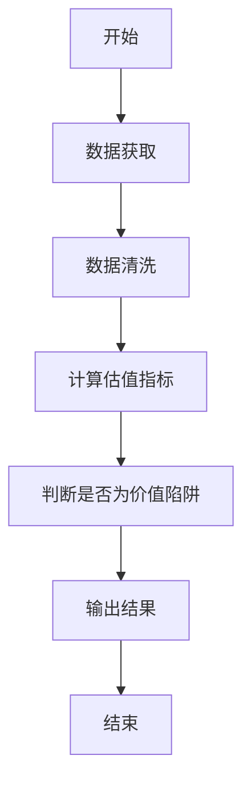
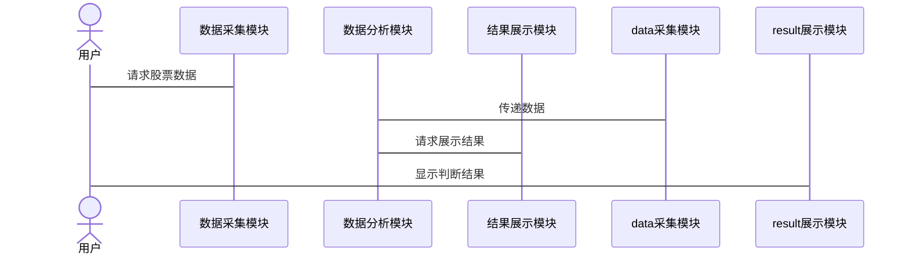

                 


# 如何利用特价股票策略进行价值陷阱规避

## 关键词：特价股票，价值陷阱，股票策略，风险管理，投资分析，技术指标，财务指标

## 摘要：  
在股票市场中，特价股票因其低价吸引投资者，但同时也可能成为价值陷阱。本文将深入探讨如何利用特价股票策略，结合技术分析和基本面分析，有效识别和规避价值陷阱，帮助投资者制定科学的投资决策。

---

# 目录大纲：如何利用特价股票策略进行价值陷阱规避

## 第一部分：特价股票与价值陷阱的背景介绍

### 第1章：特价股票的基本概念
#### 1.1 特价股票的定义与分类
- 1.1.1 什么是特价股票  
- 1.1.2 特价股票的分类  
- 1.1.3 特价股票的特点  

#### 1.2 价值陷阱的定义与特征  
- 1.2.1 什么是价值陷阱  
- 1.2.2 价值陷阱的表现形式  
- 1.2.3 价值陷阱的常见特征  

#### 1.3 特价股票与价值陷阱的关系  
- 1.3.1 特价股票为何可能成为价值陷阱  
- 1.3.2 价值陷阱的形成机制  
- 1.3.3 如何区分真正的特价股票和价值陷阱  

## 第二部分：特价股票策略的核心概念与联系

### 第2章：特价股票策略的核心原理
#### 2.1 特价股票的估值方法  
- 2.1.1 市盈率法  
- 2.1.2 市净率法  
- 2.1.3 股息率法  

#### 2.2 价值陷阱的识别指标  
- 2.2.1 财务指标分析  
- 2.2.2 行业周期分析  
- 2.2.3 公司基本面分析  

#### 2.3 特价股票与价值陷阱的对比分析  
- 2.3.1 特价股票与价值陷阱的异同点  
- 2.3.2 如何通过指标区分特价股票和价值陷阱  

## 第三部分：特价股票策略的算法原理

### 第3章：特价股票策略的算法设计
#### 3.1 算法流程图  


#### 3.2 算法实现代码  
```python
import pandas as pd

def is_value_trap(stock_data):
    # 计算市盈率
    pe = stock_data['市盈率']
    # 计算市净率
    pb = stock_data['市净率']
    # 判断是否为价值陷阱
    if pe < 15 and pb < 2:
        return True
    else:
        return False

# 示例数据
data = {
    '市盈率': [12, 20, 10],
    '市净率': [1.5, 3, 1.8]
}

stock_data = pd.DataFrame(data)
print(is_value_trap(stock_data))
```

#### 3.3 数学模型与公式  
- 评估模型公式：  
  $$ \text{评估得分} = 0.5 \times \text{市盈率} + 0.5 \times \text{市净率} $$  
  - 若评估得分 < 10，则可能为价值陷阱。  

## 第四部分：系统分析与架构设计方案

### 第4章：系统分析与架构设计
#### 4.1 项目背景介绍  
- 项目目标：识别价值陷阱，优化投资策略  
- 项目范围：基于特价股票的分析  

#### 4.2 系统功能设计  
- 数据采集模块：获取股票数据  
- 数据分析模块：计算估值指标  
- 结果展示模块：输出判断结果  

#### 4.3 系统架构设计  


#### 4.4 系统交互设计  


## 第五部分：项目实战

### 第5章：项目实战
#### 5.1 环境安装  
- 安装Python和相关库（如pandas、numpy）  

#### 5.2 核心代码实现  
```python
import pandas as pd

def analyze_stock(stocks):
    results = []
    for stock in stocks:
        pe = stock['市盈率']
        pb = stock['市净率']
        if pe < 15 and pb < 2:
            results.append(f"{stock['股票代码']} 可能是价值陷阱")
        else:
            results.append(f"{stock['股票代码']} 不是价值陷阱")
    return results

# 示例数据
stocks = [
    {'股票代码': 'AAPL', '市盈率': 12, '市净率': 1.5},
    {'股票代码': 'GOOGL', '市盈率': 20, '市净率': 3},
    {'股票代码': 'MSFT', '市盈率': 10, '市净率': 1.8}
]

results = analyze_stock(stocks)
for result in results:
    print(result)
```

#### 5.3 实际案例分析  
- 通过具体股票案例，展示如何应用上述算法进行判断  

## 第六部分：最佳实践

### 第6章：最佳实践
#### 6.1 小结  
- 总结全文内容，强调核心观点  

#### 6.2 注意事项  
- 提醒读者注意市场波动、数据质量等潜在问题  

#### 6.3 拓展阅读  
- 推荐相关书籍、文章和工具  

## 结语  
本文详细探讨了如何利用特价股票策略进行价值陷阱规避，结合技术分析和基本面分析，帮助投资者制定科学的投资决策。  

## 作者：AI天才研究院

