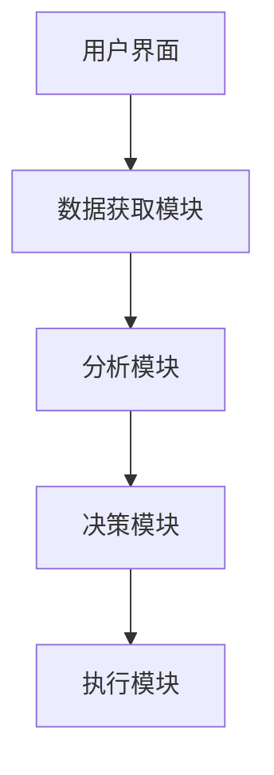

                 


# 如何利用特价股票策略进行逆向投资

> **关键词**：逆向投资、特价股票、股票策略、投资策略、风险管理、技术分析

> **摘要**：本文详细探讨了如何利用特价股票策略进行逆向投资，从背景介绍、核心概念、算法原理到系统分析、项目实战、最佳实践等方面进行了深入分析。文章结合实际案例，通过技术分析和系统设计，为读者提供了一套完整的逆向投资解决方案，并讨论了未来发展趋势和风险管理策略。

---

## # 第一部分：引言

### ## 1.1 逆向投资的基本概念

#### ### 1.1.1 逆向投资的定义

逆向投资是一种投资策略，强调在市场低迷或恐慌时买入，而在市场繁荣时卖出。这种策略与市场情绪相反，旨在通过低买高卖实现超额收益。

#### ### 1.1.2 特价股票策略的背景

特价股票策略是指在市场中寻找被低估的股票进行投资，通常在市场下跌时，许多优质股票的价格被压低，此时是买入的好时机。

#### ### 1.1.3 逆向投资的核心思想

逆向投资的核心思想是反向思考市场情绪，寻找市场的非理性波动，从而在低价时买入优质资产，高价时卖出。

### ## 1.2 特价股票策略的定义与特点

#### ### 1.2.1 特价股票的定义

特价股票是指市场价格低于其内在价值的股票，通常出现在市场恐慌或衰退时期。

#### ### 1.2.2 特价股票的特点

- **低估性**：市场价格低于内在价值。
- **周期性**：通常出现在市场周期的低谷期。
- **高波动性**：价格波动较大，容易出现短期大幅波动。

#### ### 1.2.3 特价股票与逆向投资的关系

逆向投资通过寻找特价股票，能够在市场底部布局，捕捉市场回升带来的收益。

### ## 1.3 本书的目的与结构

#### ### 1.3.1 本书的目的

本文旨在通过系统化的分析和实战案例，帮助读者掌握特价股票策略，实现逆向投资。

#### ### 1.3.2 本书的结构

- 引言：介绍逆向投资的基本概念和特价股票策略的背景。
- 特价股票策略的基础知识：分析特价股票的分类、选择和优劣势。
- 逆向投资的策略与技巧：探讨市场周期分析和价值评估。
- 风险管理：讨论逆向投资中的风险控制。
- 案例分析：通过实际案例说明策略的应用。
- 技术分析：结合技术指标进行股票筛选。
- 系统设计：构建投资决策系统。
- 项目实战：提供代码实现和策略测试。
- 心理与行为分析：克服情绪化投资。
- 未来趋势：探讨AI和大数据在投资中的应用。

---

## # 第二部分：特价股票策略的基础知识

### ## 2.1 特价股票的分类与选择

#### ### 2.1.1 特价股票的分类

- **按行业分类**：不同行业在市场周期中的表现不同，选择行业龙头股。
- **按估值指标分类**：如市盈率（P/E）、市净率（P/B）等。

#### ### 2.1.2 如何选择适合的特价股票

- **基本面分析**：关注企业的财务状况、盈利能力。
- **技术分析**：通过K线图和成交量分析判断股票的买卖信号。

### ## 2.2 特价股票策略的优势与劣势

#### ### 2.2.1 优势分析

- **低买高卖**：能够在市场低点买入，高点卖出。
- **风险可控**：通过价值评估降低投资风险。

#### ### 2.2.2 劣势分析

- **市场波动风险**：市场波动可能导致短期亏损。
- **选股难度高**：需要精准的选股能力。

### ## 2.3 特价股票策略的实施步骤

#### ### 2.3.1 确定投资目标

明确投资目标，如短期收益或长期价值投资。

#### ### 2.3.2 数据收集与分析

收集市场数据，进行基本面和技术面分析。

#### ### 2.3.3 制定投资计划

根据分析结果，制定买入和卖出计划。

#### ### 2.3.4 风险管理与调整

设置止损点，及时调整投资策略。

---

## # 第三部分：逆向投资的策略与技巧

### ## 3.1 市场周期分析

#### ### 3.1.1 市场周期的定义

市场周期分为上升周期和下降周期，逆向投资在下降周期寻找机会。

#### ### 3.1.2 不同周期下的投资策略

- **下降周期**：寻找特价股票，布局优质资产。
- **上升周期**：逐步卖出，锁定收益。

### ## 3.2 价值评估与低估股票的识别

#### ### 3.2.1 价值评估的方法

- **市盈率法**：比较P/E比行业平均水平。
- **市净率法**：比较P/B比行业平均水平。

#### ### 3.2.2 低估股票的识别标准

- **市盈率低于行业平均水平**。
- **市净率低于行业平均水平**。

### ## 3.3 逆向投资中的心理与行为分析

#### ### 3.3.1 投资者心理分析

- **贪婪与恐惧**：投资者在市场恐慌时容易做出非理性决策。

#### ### 3.3.2 如何克服情绪化投资

- **制定投资计划**：避免情绪化决策。
- **分散投资**：降低个股风险。

---

## # 第四部分：特价股票策略的风险管理

### ## 4.1 风险的定义与分类

#### ### 4.1.1 风险的定义

风险是指投资可能面临的损失或收益下降的可能性。

#### ### 4.1.2 风险的分类

- **市场风险**：市场波动导致的损失。
- **个股风险**：特定股票的波动风险。

### ## 4.2 风险管理的策略

#### ### 4.2.1 风险的量化

- **波动率分析**：通过历史波动率判断股票风险。
- **VaR分析**：计算投资组合的风险价值。

#### ### 4.2.2 风险控制的技巧

- **分散投资**：降低个股风险。
- **设置止损点**：控制最大亏损。

### ## 4.3 风险与收益的平衡

#### ### 4.3.1 风险与收益的关系

高风险不一定带来高收益，关键在于风险可控。

#### ### 4.3.2 平衡策略

- **适度分散**：避免过度集中。
- **动态调整**：根据市场变化及时调整。

---

## # 第五部分：案例分析与技术分析

### ## 5.1 案例分析

#### ### 5.1.1 历史上的大牛股案例

- **案例一**：某行业龙头股在市场低谷期被低估，后期股价大幅上涨。

#### ### 5.1.2 特价股票策略的成功应用

- **买入时机**：市场恐慌时买入。
- **卖出时机**：市场回暖时卖出。

### ## 5.2 技术分析

#### ### 5.2.1 K线图分析

- **支撑位**：股价下跌时的支撑点。
- **阻力位**：股价上涨时的阻力点。

#### ### 5.2.2 成交量分析

- **成交量配合**：股价上涨需成交量配合。

---

## # 第六部分：系统设计与架构方案

### ## 6.1 系统功能设计

#### ### 6.1.1 功能模块划分

- **数据获取模块**：获取市场数据。
- **分析模块**：进行基本面和技术面分析。
- **决策模块**：制定买入和卖出决策。

### ## 6.2 系统架构设计

#### ### 6.2.1 系统架构图



---

## # 第七部分：项目实战

### ## 7.1 环境安装

- **工具安装**：安装数据分析工具如Python、Pandas、Matplotlib。

### ## 7.2 核心实现

#### ### 7.2.1 数据获取与处理

```python
import pandas as pd
import requests

def get_data(ticker):
    url = f"https://api.example.com/stock/{ticker}"
    response = requests.get(url)
    data = response.json()
    df = pd.DataFrame(data)
    return df
```

#### ### 7.2.2 价值评估算法

```python
def calculate_pe_ratio(df):
    pe_ratio = df['price'] / df['earnings_per_share']
    return pe_ratio
```

---

## # 第八部分：心理与行为分析

### ## 8.1 投资者心理

- **贪婪与恐惧**：投资者在市场恐慌时容易做出非理性决策。

### ## 8.2 行为分析

- **过度交易**：避免频繁交易，减少交易成本。

---

## # 第九部分：风险管理

### ## 9.1 风险量化

- **VaR模型**：计算投资组合的风险价值。

### ## 9.2 风险控制

- **动态调整**：根据市场变化及时调整投资策略。

---

## # 第十部分：未来趋势与展望

### ## 10.1 AI与大数据在投资中的应用

- **机器学习**：利用算法分析市场数据，预测股票走势。

### ## 10.2 技术分析与量化投资

- **量化策略**：通过算法实现自动化交易。

---

## # 第十一部分：附录

### ## 11.1 术语表

- **VaR**：风险价值，衡量投资组合的最大潜在损失。

### ## 11.2 工具推荐

- **数据分析工具**：Python、Pandas、Matplotlib。
- **投资工具**：TradingView、Yahoo Finance。

### ## 11.3 数据来源

- **数据接口**：API.example.com。
- **数据来源**：Yahoo Finance、Google Finance。

### ## 11.4 法律法规

- **合规性**：遵守相关法律法规，避免非法操作。

### ## 11.5 参考文献

- 书籍推荐：《逆向投资的艺术》、《投资学基础》。

---

## 作者信息

**作者**：AI天才研究院/AI Genius Institute & 禅与计算机程序设计艺术/Zen And The Art of Computer Programming

---

**总结**：本文通过系统化的分析和实战案例，详细探讨了如何利用特价股票策略进行逆向投资。从背景介绍、核心概念、算法原理到系统分析、项目实战、最佳实践，为读者提供了一套完整的逆向投资解决方案，并展望了未来发展趋势和风险管理策略。

