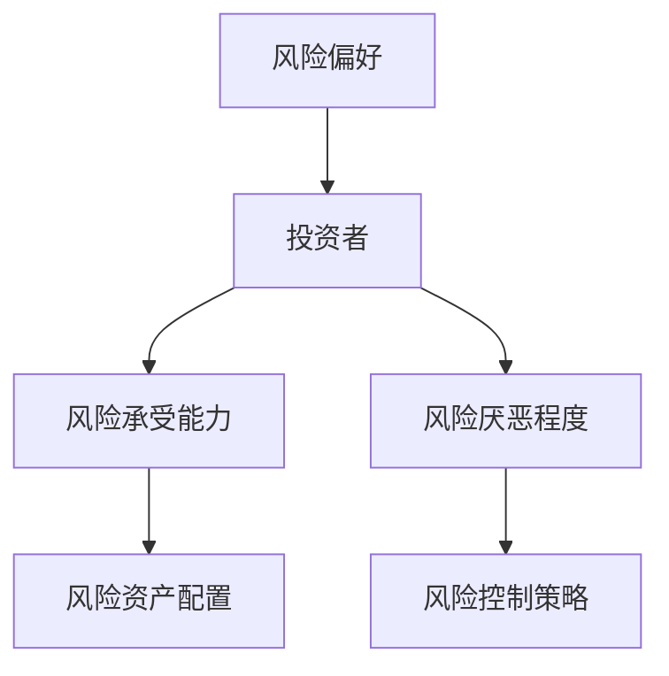
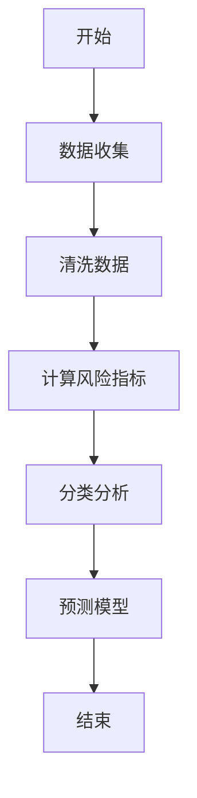
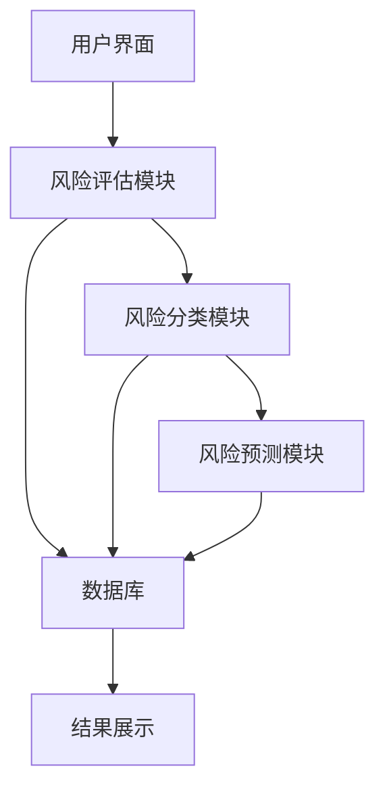

                 


# 彼得林奇如何看待公司的风险偏好变化

## 关键词：彼得林奇，公司风险偏好，投资决策，风险管理，资产配置

## 摘要：本文探讨了彼得·林奇对公司在风险偏好变化时的分析方法和投资策略。通过分析风险偏好的核心概念、算法原理、系统设计及项目实战，结合实例和图表，深入阐述了如何评估和管理公司风险偏好变化，为投资决策提供科学依据。

---

# 第一部分: 公司风险偏好变化的背景与概念

## 第1章: 公司风险偏好变化的背景介绍

### 1.1 风险偏好的基本概念

#### 1.1.1 风险偏好的定义
风险偏好是指公司在面对投资决策时，对风险的接受程度和态度。它反映了公司在追求收益和控制风险之间的平衡。

#### 1.1.2 风险偏好与投资决策的关系
公司的风险偏好直接影响其投资策略。高风险偏好的公司倾向于投资高风险高回报的项目，而低风险偏好的公司则更注重稳定性。

#### 1.1.3 风险偏好的核心要素
- **风险承受能力**：公司能够承担的最大风险水平。
- **风险厌恶程度**：公司对风险的敏感性和回避程度。
- **风险中性态度**：公司对风险和收益的均衡态度。

### 1.2 公司风险偏好变化的背景

#### 1.2.1 经济周期对风险偏好的影响
经济繁荣时期，公司风险偏好较高；经济衰退时期，风险偏好较低。

#### 1.2.2 市场环境变化与风险偏好调整
行业竞争加剧或市场需求变化可能导致公司调整风险偏好。

#### 1.2.3 公司战略目标与风险偏好的关联
公司战略目标的变化会影响其风险偏好，例如从扩张阶段转向防御阶段。

### 1.3 风险偏好变化的驱动因素

#### 1.3.1 宏观经济因素
整体经济环境、利率水平和通货膨胀率等宏观经济因素会影响公司的风险偏好。

#### 1.3.2 行业竞争格局
行业内的竞争程度和市场结构变化会影响公司的风险偏好。

#### 1.3.3 公司内部管理与决策
公司内部的管理风格和决策层的风险意识也会影响风险偏好。

### 1.4 本章小结
公司风险偏好的变化受经济周期、市场环境和内部战略目标等多种因素的影响，理解这些因素有助于更好地评估和管理风险偏好。

---

# 第二部分: 风险偏好变化的核心概念与联系

## 第2章: 风险偏好变化的核心概念

### 2.1 风险偏好的核心要素

#### 2.1.1 风险承受能力
公司能够承担的最大风险水平，决定了其投资组合的风险敞口。

#### 2.1.2 风险厌恶程度
公司对风险的敏感性和回避程度，影响其投资决策。

#### 2.1.3 风险中性态度
公司对风险和收益的均衡态度，追求风险和收益的最佳平衡。

### 2.2 风险偏好变化的属性特征对比

| 属性 | 高风险偏好 | 低风险偏好 |
|------|------------|------------|
| 风险承受能力 | 高        | 低        |
| 风险厌恶程度 | 低        | 高        |
| 投资风格   | 高风险高回报 | 低风险稳定收益 |

### 2.3 风险偏好变化的ER实体关系图


### 2.4 本章小结
通过对比和图表分析，我们明确了风险偏好的核心要素及其相互关系，为后续分析奠定了基础。

---

# 第三部分: 风险偏好变化的算法原理

## 第3章: 风险偏好变化的算法原理

### 3.1 风险偏好变化的评估算法

#### 3.1.1 风险偏好变化的指标计算
使用标准差、波动率等指标衡量投资组合的风险水平。

#### 3.1.2 风险偏好变化的分类算法
采用聚类分析将公司分为不同风险偏好的类别。

#### 3.1.3 风险偏好变化的预测模型
利用时间序列模型预测未来风险偏好的变化趋势。

### 3.2 风险偏好变化的算法流程图


### 3.3 风险偏好变化的数学模型和公式

#### CAPM模型
$$ E(R_i) = R_f + β_i (R_m - R_f) $$
其中，\( E(R_i) \) 是资产的预期收益，\( R_f \) 是无风险利率，\( β_i \) 是资产的贝塔系数，\( R_m \) 是市场预期收益。

### 3.4 本章小结
通过算法和数学模型，我们能够量化和预测公司风险偏好的变化，为投资决策提供科学依据。

---

# 第四部分: 风险偏好变化的系统设计

## 第4章: 风险偏好变化的系统设计

### 4.1 系统功能设计

#### 4.1.1 风险评估模块
用于计算公司投资组合的风险指标，如标准差和波动率。

#### 4.1.2 风险分类模块
基于聚类分析将公司分为不同风险偏好类别。

#### 4.1.3 风险预测模块
利用时间序列模型预测未来风险偏好变化趋势。

### 4.2 系统架构设计


### 4.3 系统接口设计
- 数据输入接口：接收公司财务数据和市场数据。
- 数据输出接口：显示风险评估结果和预测报告。

### 4.4 本章小结
通过系统设计，我们构建了一个完整的风险偏好变化评估系统，能够高效地支持投资决策。

---

# 第五部分: 风险偏好变化的项目实战

## 第5章: 风险偏好变化的项目实战

### 5.1 项目环境安装
安装必要的Python库，如Pandas、NumPy和Scikit-learn。

### 5.2 核心代码实现

```python
import pandas as pd
from sklearn.cluster import KMeans

# 数据加载
data = pd.read_csv('company_data.csv')

# 数据清洗
data.dropna()

# 风险指标计算
data['volatility'] = data['returns'].std()

# 风险分类
kmeans = KMeans(n_clusters=3)
clusters = kmeans.fit_predict(data[['volatility']])

# 风险预测
# 假设使用ARIMA模型进行时间序列预测
```

### 5.3 案例分析与结果解读
以实际公司数据为例，展示风险偏好变化的评估过程和结果。

### 5.4 本章小结
通过项目实战，我们验证了理论分析的有效性，并展示了实际应用中的具体操作步骤。

---

# 第六部分: 风险偏好变化的最佳实践

## 第6章: 风险偏好变化的最佳实践

### 6.1 最佳实践 tips
- 定期评估和调整风险偏好。
- 结合宏观经济指标进行风险预测。
- 使用多元化的投资策略分散风险。

### 6.2 小结
总结全文内容，强调理解和管理公司风险偏好变化的重要性。

### 6.3 注意事项
- 风险偏好变化具有动态性，需持续监测。
- 风险评估模型需结合实际情况进行调整。

### 6.4 拓展阅读
推荐相关书籍和文献，供读者进一步学习。

---

# 附录

## 附录A: 参考文献
- 林奇, 彼得. 《彼得·林奇的投资哲学》
- 葛兰碧, 威廉. 《股票投资策略》

## 附录B: 术语表
- 风险偏好：公司对风险的接受程度。
- 风险厌恶：公司对风险的回避程度。
- 贝塔系数：衡量资产的系统性风险。

---

# 作者：AI天才研究院/AI Genius Institute & 禅与计算机程序设计艺术 /Zen And The Art of Computer Programming

