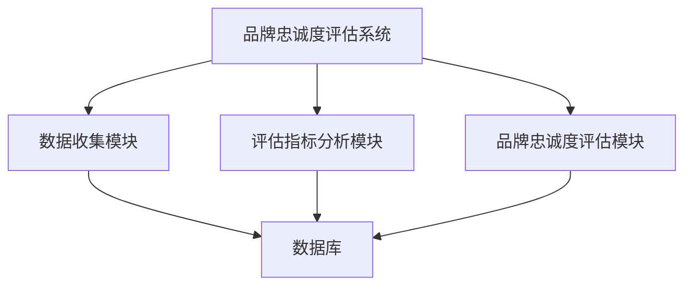
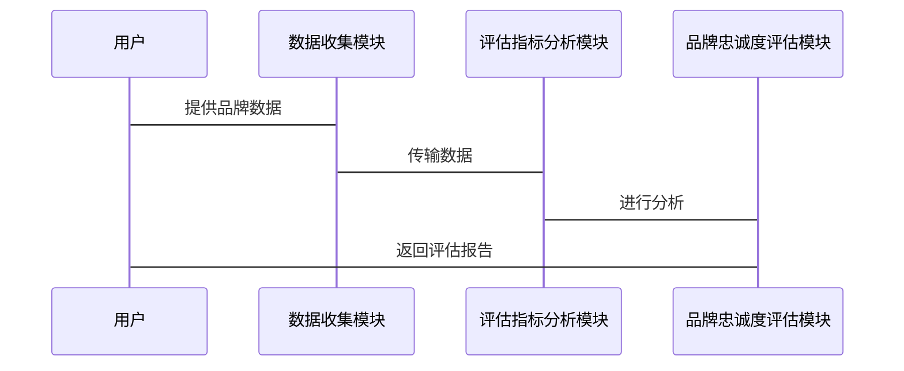

                 


# 彼得林奇如何评估公司的品牌忠诚度

## 关键词：品牌忠诚度，彼得·林奇，投资评估，层次分析法，净现值法

## 摘要：彼得·林奇是世界著名投资家，他在评估公司品牌忠诚度时，采用了一套独特的分析方法，结合品牌忠诚度的核心要素和数学模型，如层次分析法（AHP）和净现值法（NPV），来评估企业的长期价值和投资潜力。本文将详细分析彼得·林奇的品牌忠诚度评估方法，结合实际案例和系统架构设计，帮助读者理解和应用这些方法。

---

# 第1章：品牌忠诚度的重要性

## 1.1 品牌忠诚度的定义

品牌忠诚度是指消费者对某一品牌产品或服务的长期偏好和持续购买行为。它是品牌价值的重要组成部分，直接影响企业的市场表现和长期盈利能力。品牌忠诚度高的消费者不仅会重复购买同一品牌的产品，还会在品牌面临危机时给予更多的支持。

### 1.1.1 品牌忠诚度的内涵

- **消费者行为**：品牌忠诚度高的消费者更倾向于选择同一品牌，而非竞争品牌。
- **情感因素**：品牌忠诚度与消费者对品牌的信任和情感联系密切相关。
- **市场稳定性**：高品牌忠诚度意味着企业市场表现更为稳定，不易受市场竞争的影响。

## 1.2 彼得·林奇的投资哲学

彼得·林奇以其独特的投资哲学闻名，他注重长期投资和基本面分析。他认为，品牌忠诚度是衡量一个公司长期价值的重要指标。他偏好那些拥有强大品牌忠诚度和持续创新能力的公司，因为这些公司更有可能在长期市场中占据优势地位。

## 1.3 品牌忠诚度的评估维度

- **产品质量**：产品质量是品牌忠诚度的基础，消费者对产品的满意度直接影响品牌忠诚度。
- **客户满意度**：客户对产品或服务的满意度是品牌忠诚度的重要指标。
- **品牌认知度**：品牌在市场中的知名度和认知度也是品牌忠诚度的重要组成部分。

---

# 第2章：品牌忠诚度的核心要素

## 2.1 品牌忠诚度的核心要素分析

### 2.1.1 产品质量

产品质量是品牌忠诚度的核心要素之一。彼得·林奇认为，高质量的产品能够赢得消费者的信任和忠诚。企业需要通过不断创新和优化产品来提升品牌忠诚度。

### 2.1.2 客户服务

优质的服务是提升品牌忠诚度的关键。彼得·林奇强调，良好的客户体验能够增强消费者对品牌的忠诚度。企业需要通过高效的客服系统和客户关系管理来提升服务质量。

### 2.1.3 品牌形象

品牌形象是品牌忠诚度的重要组成部分。彼得·林奇认为，强大的品牌形象能够提升消费者对品牌的认同感和忠诚度。企业需要通过有效的品牌推广和营销策略来塑造积极的品牌形象。

## 2.2 品牌忠诚度的层次分析

### 2.2.1 品牌认知

品牌认知是指消费者对品牌的识别和记忆。高品牌认知度意味着品牌更容易被消费者记住和选择。

### 2.2.2 品牌态度

品牌态度是指消费者对品牌的情感和态度。积极的品牌态度会增强消费者的购买意愿和忠诚度。

### 2.2.3 品牌行为

品牌行为是指消费者实际购买和使用品牌的行动。高品牌忠诚度的消费者更倾向于重复购买同一品牌的产品或服务。

## 2.3 品牌忠诚度与企业绩效的关系

### 2.3.1 品牌忠诚度对企业利润的影响

高品牌忠诚度意味着消费者更倾向于选择同一品牌，从而为企业带来稳定的收入和更高的利润率。

### 2.3.2 品牌忠诚度与客户生命周期价值

客户生命周期价值是指客户在其生命周期内为企业带来的总收益。高品牌忠诚度的客户通常具有更高的生命周期价值。

### 2.3.3 品牌忠诚度与市场竞争力

高品牌忠诚度意味着企业具有更强的市场竞争力，能够在激烈的市场竞争中占据优势地位。

---

# 第3章：品牌忠诚度评估的数学模型

## 3.1 层次分析法（AHP）在品牌忠诚度评估中的应用

### 3.1.1 层次分析法的基本原理

层次分析法（AHP）是一种用于结构化决策问题的系统方法，适用于多准则决策问题。它将决策问题分解为多个层次，每个层次包含多个因素，并通过比较这些因素的重要性来确定权重。

### 3.1.2 品牌忠诚度评估的层次结构模型

- **目标层**：评估品牌忠诚度。
- **准则层**：包括产品质量、客户满意度、品牌形象等。
- **方案层**：具体品牌或公司。

### 3.1.3 权重计算与一致性检验

- **权重计算**：通过比较矩阵计算各准则的权重。
- **一致性检验**：确保比较矩阵的一致性，以保证结果的可靠性。

### 3.1.4 案例分析

假设我们有三个品牌A、B、C，我们需要评估它们的品牌忠诚度。首先，我们需要确定评估准则，例如产品质量、客户满意度、品牌形象。然后，构建比较矩阵，计算各准则的权重，并进行一致性检验。最后，根据权重计算各品牌的品牌忠诚度得分。

## 3.2 净现值法（NPV）在品牌忠诚度评估中的应用

### 3.2.1 净现值法的基本原理

净现值法（NPV）是一种用于评估投资项目经济可行性的方法。它通过计算投资项目的未来现金流按一定贴现率折现后的现值，与初始投资的差额来衡量项目的经济价值。

### 3.2.2 品牌忠诚度的长期价值评估

高品牌忠诚度的公司通常具有更高的未来现金流，因此可以用净现值法来评估品牌忠诚度的长期价值。

### 3.2.3 品牌忠诚度与投资回报的关系

高品牌忠诚度的公司通常具有更高的投资回报率，因为它们具有更强的市场竞争力和稳定的客户群体。

---

# 第4章：品牌忠诚度评估系统的架构设计

## 4.1 系统功能设计

### 4.1.1 数据收集模块

负责收集品牌忠诚度相关数据，包括产品质量、客户满意度、品牌形象等。

### 4.1.2 评估指标分析模块

根据收集的数据，使用层次分析法和净现值法进行评估指标分析。

### 4.1.3 品牌忠诚度评估模块

根据分析结果，计算品牌忠诚度得分，并生成评估报告。

## 4.2 系统架构设计

### 4.2.1 系统架构图



### 4.2.2 系统接口设计

- 数据收集模块接口：负责接收外部数据输入。
- 评估指标分析模块接口：负责接收数据并进行分析。
- 品牌忠诚度评估模块接口：负责生成评估报告。

### 4.2.3 系统交互设计



---

# 第5章：项目实战

## 5.1 环境安装

需要安装Python、Pandas、Numpy等库。

## 5.2 系统核心实现源代码

### 5.2.1 层次分析法实现

```python
import numpy as np

def calculate_weights(matrix):
    n = matrix.shape[0]
    total = np.sum(matrix, axis=1)
    weights = matrix / total[:, np.newaxis]
    return weights

def ahp_weights(criterion_matrix):
    n = criterion_matrix.shape[0]
    matrix = np.full((n, n), 1.0)
    for i in range(n):
        for j in range(n):
            if i != j:
                matrix[i][j] = criterion_matrix[i][j]
    return calculate_weights(matrix)
```

### 5.2.2 净现值法实现

```python
def npv(cash_flows, discount_rate):
    return sum(cash_flow / (1 + discount_rate) ** t for t, cash_flow in enumerate(cash_flows))
```

## 5.3 代码解读与分析

### 5.3.1 层次分析法代码解读

- 该代码定义了层次分析法的实现，包括比较矩阵的构建和权重的计算。

### 5.3.2 净现值法代码解读

- 该代码定义了净现值法的实现，包括未来现金流的贴现和现值的计算。

## 5.4 实际案例分析

假设我们有三个品牌A、B、C，我们需要评估它们的品牌忠诚度。首先，我们需要收集相关数据，包括产品质量、客户满意度、品牌形象等。然后，使用层次分析法和净现值法进行评估。

---

# 第6章：最佳实践

## 6.1 小结

彼得·林奇的品牌忠诚度评估方法结合了品牌忠诚度的核心要素和数学模型，能够有效地评估企业的长期价值和投资潜力。

## 6.2 注意事项

- 数据收集的准确性和完整性直接影响评估结果。
- 模型的选择和参数设置需要根据实际情况进行调整。
- 品牌忠诚度评估需要结合定性和定量分析，才能得出准确的结论。

## 6.3 拓展阅读

- 《彼得·林奇的投资哲学》
- 《层次分析法的应用与实现》
- 《净现值法在投资决策中的应用》

---

# 作者：AI天才研究院/AI Genius Institute & 禅与计算机程序设计艺术 /Zen And The Art of Computer Programming

