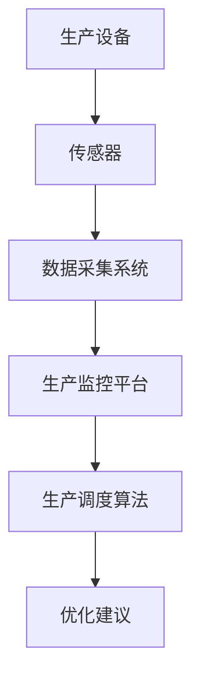
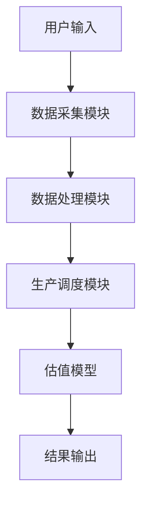

                 


# 新兴市场股市估值与智能制造柔性生产线的互动

> 关键词：新兴市场，股市估值，智能制造，柔性生产线，机器学习，数据共享

> 摘要：本文探讨新兴市场股市估值与智能制造柔性生产线之间的互动关系，分析股市估值方法、智能制造技术及其互动机制，通过案例分析和系统设计，揭示两者协同优化的潜力与应用。

---

# 第1章: 新兴市场股市估值与智能制造柔性生产线的互动背景

## 1.1 问题背景与意义
### 1.1.1 新兴市场的经济特点与发展现状
新兴市场具有高增长潜力，但股市波动性大，受经济、政策和技术因素影响显著。智能制造技术的引入为这些市场的企业提供了灵活性和效率提升的机会。

### 1.1.2 智能制造与柔性生产线的定义与特征
智能制造强调数字化、自动化和智能化，柔性生产线能够快速适应市场变化，支持多种产品生产，减少浪费，提高效率。

### 1.1.3 股市估值与智能制造互动的现实需求
企业技术升级影响其盈利能力和市场竞争力，进而影响股市估值。同时，股市资金支持智能制造发展，形成双向互动。

## 1.2 核心概念与问题描述
### 1.2.1 新兴市场股市估值的定义与方法
股市估值是对企业价值的评估，常用市盈率、市净率等指标。新兴市场估值受市场不成熟、信息不对称等因素影响。

### 1.2.2 柔性生产线的定义与技术特征
柔性生产线具备模块化、自动化和数据驱动的特点，能够快速调整生产计划，适应市场需求变化。

### 1.2.3 两者互动关系的初步探讨
智能制造技术提升企业效率，改善财务表现，间接提升股市估值。同时，股市资金支持智能制造投资，推动技术进步。

## 1.3 核心问题与解决思路
### 1.3.1 新兴市场股市估值的难点与挑战
数据不透明、市场波动大、行业特性复杂。

### 1.3.2 柔性生产线的技术瓶颈与解决方案
技术集成复杂，需整合物联网、自动化和数据分析技术。

### 1.3.3 互动关系的数学模型构建思路
建立动态模型，分析技术进步对估值的影响，以及资金流动对技术发展的促进。

---

# 第2章: 新兴市场股市估值方法论

## 2.1 股市估值的基本方法
### 2.1.1 市盈率与市净率的计算公式
$$市盈率 = \frac{股票价格}{每股收益}$$
$$市净率 = \frac{股票价格}{每股净资产}$$

### 2.1.2 机器学习在股市估值中的应用
#### 2.1.2.1 机器学习模型的输入特征
- 历史股价数据
- 财务指标（如收入、利润）
- 市场情绪指标

#### 2.1.2.2 模型训练与优化
使用回归算法，如线性回归、支持向量回归（SVR），通过特征工程和超参数优化提升模型性能。

#### 2.1.2.3 模型的可解释性与局限性
模型复杂性高，解释性差；新兴市场数据稀少，可能导致模型泛化能力不足。

---

# 第3章: 智能制造柔性生产线的技术与系统架构

## 3.1 柔性生产线的核心技术
### 3.1.1 物联网技术的应用
传感器实时监测生产数据，实现设备远程监控和维护。

### 3.1.2 自动化技术的实现
工业机器人和自动化设备减少人工干预，提高生产效率。

### 3.1.3 数据驱动的优化方法
通过数据分析优化生产计划，降低库存，提高资源利用率。

## 3.2 系统架构设计
### 3.2.1 系统功能设计
- 数据采集与监控
- 生产调度与优化
- 维护与故障管理

### 3.2.2 系统架构图


---

# 第4章: 股市估值与智能制造的互动关系分析

## 4.1 数据共享机制
### 4.1.1 数据共享的重要性
生产数据与股市数据的结合，为估值提供更全面的信息。

### 4.1.2 数据共享的安全性与隐私保护
采用区块链技术确保数据共享的安全性和隐私性。

## 4.2 技术融合与协同优化
### 4.2.1 技术融合的实现
将智能制造技术与金融模型结合，提升估值准确性。

### 4.2.2 协同优化的策略
通过数据共享，优化生产计划和资金分配，实现企业价值最大化。

---

# 第5章: 案例分析与互动关系验证

## 5.1 案例背景介绍
某新兴市场制造企业引入柔性生产线，提升生产效率，改善财务指标。

## 5.2 互动关系的验证
分析生产效率提升对企业利润和股价的影响，验证模型的有效性。

---

# 第6章: 系统架构设计与实现

## 6.1 系统功能设计
### 6.1.1 功能模块划分
- 数据采集与处理
- 生产调度与优化
- 估值模型与分析

### 6.1.2 系统架构图


---

# 第7章: 项目实战与总结

## 7.1 项目环境与安装
### 7.1.1 环境配置
- 数据库：MySQL
- 开发工具：PyCharm
- 机器学习库：scikit-learn、TensorFlow

## 7.2 核心代码实现
### 7.2.1 数据采集与处理
```python
import pandas as pd

# 读取数据
data = pd.read_csv('production_data.csv')

# 数据清洗
data.dropna(inplace=True)
```

### 7.2.2 估值模型实现
```python
from sklearn.linear_model import LinearRegression

# 训练模型
model = LinearRegression()
model.fit(X_train, y_train)

# 预测
y_pred = model.predict(X_test)
```

## 7.3 案例分析与总结
通过实际案例验证系统设计的有效性，总结经验教训，提出改进建议。

---

# 第8章: 总结与展望

## 8.1 核心观点回顾
股市估值与智能制造柔性生产线的互动关系对企业发展至关重要。

## 8.2 未来发展方向
- 数据共享机制的完善
- 人工智能技术的深入应用
- 多领域协同优化

## 8.3 最佳实践 tips
- 数据驱动决策
- 技术与业务深度融合
- 注重数据安全与隐私保护

---

作者：AI天才研究院/AI Genius Institute & 禅与计算机程序设计艺术 /Zen And The Art of Computer Programming

