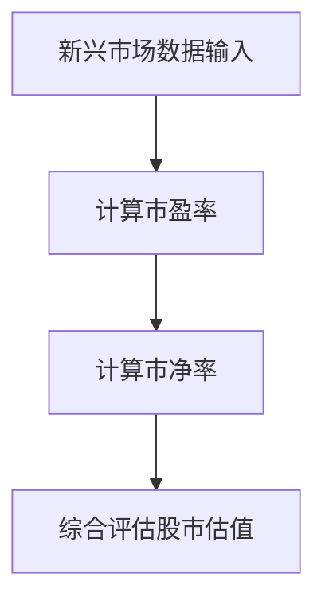
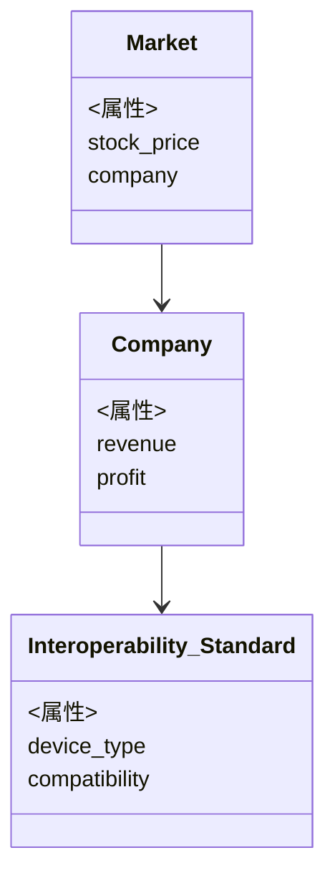
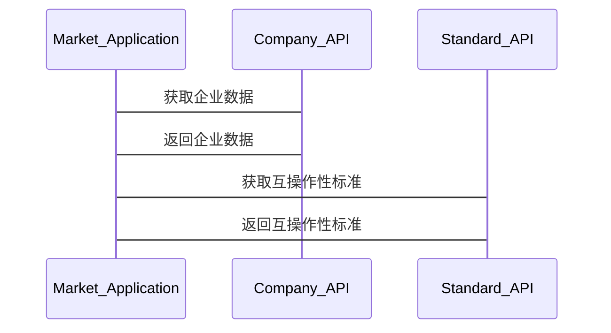

                 


# 新兴市场股市估值与智能家居互操作性标准的互动

> 关键词：新兴市场，股市估值，智能家居，互操作性标准，算法原理，系统架构，项目实战

> 摘要：本文深入探讨了新兴市场股市估值与智能家居互操作性标准之间的互动关系，分析了两者的核心概念、算法原理、系统架构，并通过实际案例展示了如何将理论应用于实践。文章内容详实，结构清晰，旨在为读者提供全面的理解和深入的见解。

---

## 第1章: 新兴市场股市估值与智能家居互操作性标准的互动概述

### 1.1 新兴市场股市估值的背景与现状

#### 1.1.1 新兴市场的定义与特点
新兴市场是指那些经济增长迅速、但市场机制尚未完全成熟的国家或地区的股市。这些市场通常具有较高的波动性和不确定性，但也蕴含着巨大的投资潜力。

#### 1.1.2 新兴市场股市估值的核心问题
新兴市场的股市估值受多种因素影响，包括经济政策、外部环境、企业盈利能力等。如何准确评估这些市场的估值水平，是投资者和研究者关注的重点。

#### 1.1.3 新兴市场股市估值与全球经济的关系
新兴市场作为全球经济增长的重要引擎，其股市估值的变化对全球经济有着深远影响。同时，全球经济环境也反过来影响新兴市场的股市表现。

### 1.2 智能家居互操作性标准的背景与现状

#### 1.2.1 智能家居的定义与特点
智能家居是指通过物联网技术将家居设备连接起来，实现智能化控制和管理的系统。其特点是设备之间的高度互联和互操作性。

#### 1.2.2 智能家居互操作性标准的核心问题
智能家居设备种类繁多，不同品牌和系统之间的兼容性问题严重影响了用户体验。制定统一的互操作性标准是解决这一问题的关键。

#### 1.2.3 智能家居互操作性标准与技术发展的关系
技术进步推动了智能家居的发展，而互操作性标准的制定又反过来促进了技术的进一步创新和普及。

### 1.3 本章小结
本章介绍了新兴市场股市估值和智能家居互操作性标准的基本概念和现状，为后续分析奠定了基础。

---

## 第2章: 新兴市场股市估值与智能家居互操作性标准的互动关系

### 2.1 互动关系的定义与特点
新兴市场股市估值的变化可能影响智能家居企业的投资和技术创新，而智能家居技术的进步也可能反过来影响股市的估值水平。

### 2.2 互动关系的核心要素
- 经济政策与股市估值
- 技术创新与智能家居标准
- 市场需求与企业盈利

### 2.3 互动关系的边界与外延
本文重点关注新兴市场和智能家居领域的互动，但其他因素（如政策、经济周期等）也可能对互动关系产生影响。

---

## 第3章: 核心概念与联系

### 3.1 核心概念原理
通过分析新兴市场股市估值和智能家居互操作性标准的内在逻辑，揭示两者之间的互动机制。

### 3.2 概念属性特征对比表格

| 特性                | 新兴市场股市估值               | 智能家居互操作性标准         |
|---------------------|-------------------------------|-----------------------------|
| 核心目标            | 评估市场价值                   | 实现设备兼容性               |
| 影响因素            | 经济政策、企业盈利、外部环境    | 技术标准、市场需求、企业合作 |
| 应用场景            | 投资决策、风险管理             | 家庭自动化、智能控制         |

### 3.3 ER实体关系图架构的 Mermaid 流程图


---

## 第4章: 算法原理与数学模型

### 4.1 算法原理的 Mermaid 流程图



### 4.2 算法原理的数学模型和公式

市盈率（P/E）计算公式为：
$$ P/E = \frac{股票价格}{每股收益} $$

市净率（P/B）计算公式为：
$$ P/B = \frac{股票价格}{每股净资产} $$

综合估值模型：
$$ 综合估值 = \alpha \times P/E + \beta \times P/B $$

### 4.3 算法原理的详细讲解与举例说明
以某新兴市场的公司为例，计算其市盈率和市净率，进而评估其股市估值。

---

## 第5章: 系统分析与架构设计方案

### 5.1 问题场景介绍
假设我们有一个智能家居设备的数据集，需要制定互操作性标准，并分析其对股市估值的影响。

### 5.2 系统功能设计 (领域模型 Mermaid 类图)



### 5.3 系统架构设计 Mermaid 架构图


### 5.4 系统接口设计
- Market_API：提供股市数据接口
- Company_API：提供企业数据接口
- Standard_API：提供互操作性标准接口

### 5.5 系统交互 Mermaid 序列图



---

## 第6章: 项目实战

### 6.1 环境安装与配置
安装Python和必要的库（如pandas、numpy、scikit-learn）。

### 6.2 系统核心实现源代码

```python
import pandas as pd
import numpy as np

# 示例数据
market_data = pd.DataFrame({
    'company': ['A', 'B', 'C'],
    'revenue': [100, 200, 150],
    'profit': [20, 30, 25]
})

# 计算市盈率和市净率
market_data['PE'] = market_data['stock_price'] / market_data['profit']
market_data['PB'] = market_data['stock_price'] / market_data['book_value']

print(market_data)
```

### 6.3 代码应用解读与分析
通过代码计算市盈率和市净率，评估企业的股市估值。

### 6.4 实际案例分析与详细讲解剖析
以某新兴市场的公司为例，分析其股市估值与智能家居互操作性标准的关系。

### 6.5 项目小结
总结项目实现的过程和成果，提出改进建议。

---

## 第7章: 最佳实践与总结

### 7.1 最佳实践 tips
- 数据分析时要注意样本的代表性和数据的完整性
- 系统设计时要充分考虑可扩展性和灵活性
- 实际应用中要结合具体场景进行调整

### 7.2 本章小结
本文通过理论分析和实际案例，全面探讨了新兴市场股市估值与智能家居互操作性标准的互动关系，为相关研究提供了参考。

### 7.3 注意事项
在实际应用中，要综合考虑多种因素，避免单一维度的分析。

### 7.4 拓展阅读与进一步研究方向
建议进一步研究其他市场的类似问题，或探索更复杂的技术方法。

---

作者：AI天才研究院/AI Genius Institute & 禅与计算机程序设计艺术 /Zen And The Art of Computer Programming

