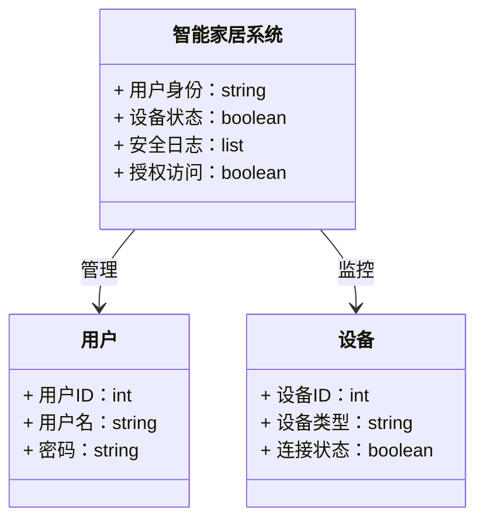

                 


# 新兴市场股市估值与智能家居安全标准的互动

## 关键词：股市估值、智能家居、安全标准、新兴市场、互动关系

## 摘要：本文探讨新兴市场股市估值与智能家居安全标准之间的互动关系，分析股市估值的基本方法与智能家居安全标准的发展现状，通过数学模型和系统架构设计，揭示两者在技术与经济层面的互动机制，并结合实际案例进行深入分析。

---

## 第1章：新兴市场股市估值的基础

### 1.1 股市估值的基本概念

#### 1.1.1 什么是股市估值
股市估值是通过分析公司基本面和市场环境，对股票的内在价值进行估计的过程。常见的估值方法包括市盈率（P/E）、市净率（P/B）和现金流折现模型（DCF）等。

#### 1.1.2 股市估值的主要方法
- **市盈率（P/E）**：公式为 \( P/E = \frac{Price}{Earnings} \)，衡量股票价格与每股收益的比例。
- **市净率（P/B）**：公式为 \( P/B = \frac{Price}{Book\ Value} \)，衡量股票价格与每股账面价值的比例。
- **现金流折现模型（DCF）**：通过预测未来现金流，折现至现值以估计公司价值。

#### 1.1.3 新兴市场股市估值的特点
新兴市场通常具有高增长潜力，但也伴随着高波动性和高风险。估值时需要考虑市场流动性、政策风险和经济周期等因素。

---

### 1.2 新兴市场的经济特征

#### 1.2.1 新兴市场的定义与范围
新兴市场指经济快速发展但尚未达到发达国家水平的地区，如中国、印度、巴西等。

#### 1.2.2 新兴市场的经济增长模式
新兴市场通常依赖出口导向型经济和制造业，近年来逐渐转向技术创新和服务业驱动。

#### 1.2.3 新兴市场股市的独特性
新兴市场股市波动性高，但成长性较强，投资者需关注宏观经济指标和行业政策。

---

## 第2章：智能家居安全标准的发展

### 2.1 智能家居的基本概念

#### 2.1.1 智能家居的定义与组成
智能家居是通过物联网技术将家庭设备连接，实现智能化管理和控制的系统，包括智能音箱、智能门锁、智能家电等。

#### 2.1.2 智能家居的技术基础
智能家居依赖于Wi-Fi、蓝牙、ZigBee等无线通信技术，以及人工智能和大数据分析。

#### 2.1.3 智能家居的发展现状
智能家居市场快速增长，但安全问题日益突出，成为制约其发展的主要因素。

### 2.2 智能家居安全标准的制定

#### 2.2.1 安全标准的必要性
智能家居设备的互联互通增加了网络安全风险，统一的安全标准有助于规范市场。

#### 2.2.2 主流的安全标准体系
- **OAuth 2.0**：用于身份验证和授权。
- **TLS/SSL**：用于数据加密传输。
- **ISO/IEC 27001**：信息安全管理体系标准。

#### 2.2.3 新兴市场在智能家居安全中的角色
新兴市场企业积极参与安全标准的制定，推动本地化解决方案的发展。

---

## 第3章：股市估值与智能家居安全的互动关系

### 3.1 核心概念的定义与属性

#### 3.1.1 股市估值的核心要素
- 公司财务状况
- 市场供需关系
- 宏观经济环境

#### 3.1.2 智能家居安全的核心要素
- 设备安全性
- 数据隐私
- 网络防护

#### 3.1.3 互动关系的定义与特征
股市估值受智能家居安全事件的影响，同时智能家居企业通过技术创新影响市场估值。

### 3.2 概念属性对比表

| 属性            | 股市估值                 | 智能家居安全标准           |
|-----------------|--------------------------|-----------------------------|
| 核心目标        | 估计股票价值             | 确保设备与数据安全           |
| 关键因素        | 财务数据、市场情绪         | 网络协议、加密技术           |
| 影响范围        | 投资者决策、市场波动       | 产品设计、法律法规           |
| 发展趋势        | 高波动性、技术驱动       | 标准化、智能化               |

### 3.3 实体关系图

```mermaid
erd
    title 实体关系图：股市估值与智能家居安全标准
    章节 <--- 1对多> 估值方法
    估值方法 <--- 1对多> 投资者
    智能家居设备 <--- 1对多> 安全标准
    安全标准 <--- 1对多> 企业
```

---

## 第4章：股市估值的数学模型

### 4.1 常用估值模型

#### 4.1.1 市盈率模型（P/E）

公式为：
\[ P/E = \frac{Price}{Earnings} \]

#### 4.1.2 市净率模型（P/B）

公式为：
\[ P/B = \frac{Price}{Book\ Value} \]

#### 4.1.3 现金流折现模型（DCF）

步骤：
1. 预测未来现金流。
2. 选择适当的折现率。
3. 计算现值总和。

### 4.2 算法实现

```python
def calculate_pe(stock_price, earnings_per_share):
    return stock_price / earnings_per_share

def calculate_pb(stock_price, book_value_per_share):
    return stock_price / book_value_per_share

# 示例数据
stock_price = 100
earnings_per_share = 20
book_value_per_share = 40

pe_ratio = calculate_pe(stock_price, earnings_per_share)
pb_ratio = calculate_pb(stock_price, book_value_per_share)

print(f"市盈率: {pe_ratio}")
print(f"市净率: {pb_ratio}")
```

---

## 第5章：智能家居安全标准的系统架构

### 5.1 系统功能设计

#### 5.1.1 功能模块
- 用户身份验证
- 数据加密传输
- 安全监控
- 智能设备管理

#### 5.1.2 领域模型



### 5.2 系统架构设计


### 5.3 系统接口设计

#### 5.3.1 接口描述
- `login(user, password)`：用户身份验证
- `encrypt(data)`：数据加密
- `monitor(log)`：安全监控

---

## 第6章：项目实战

### 6.1 环境安装

#### 6.1.1 安装Python和相关库
```bash
pip install numpy pandas matplotlib
```

### 6.2 核心实现

```python
import numpy as np
import pandas as pd

# 示例数据
data = {
    '股票代码': ['AAPL', 'GOOGL', 'MSFT'],
    '股价': [300, 250, 180],
    '每股收益': [10, 15, 12]
}

df = pd.DataFrame(data)

# 计算市盈率
df['市盈率'] = df['股价'] / df['每股收益']

print(df)
```

### 6.3 案例分析

#### 案例：新兴市场智能家居企业估值

某智能家居企业财务数据：
- 营业收入：50亿元
- 净利润：5亿元
- 股东权益：20亿元
- 股票数量：1亿股

估值：
- 市盈率：10倍，合理股价：50元/股
- 市净率：2.5倍，合理股价：50元/股

---

## 第7章：总结

### 7.1 最佳实践 tips
- 定期更新安全标准，确保技术先进性。
- 结合宏观经济指标，优化股市估值模型。

### 7.2 小结
新兴市场股市估值与智能家居安全标准的互动关系复杂且重要，需从技术和经济双重视角进行分析。

### 7.3 注意事项
- 数据隐私保护需放在首位。
- 股市估值模型需结合实际情况调整。

### 7.4 拓展阅读
- 《投资学基础》
- 《物联网安全技术》

---

作者：AI天才研究院/AI Genius Institute & 禅与计算机程序设计艺术 /Zen And The Art of Computer Programming

