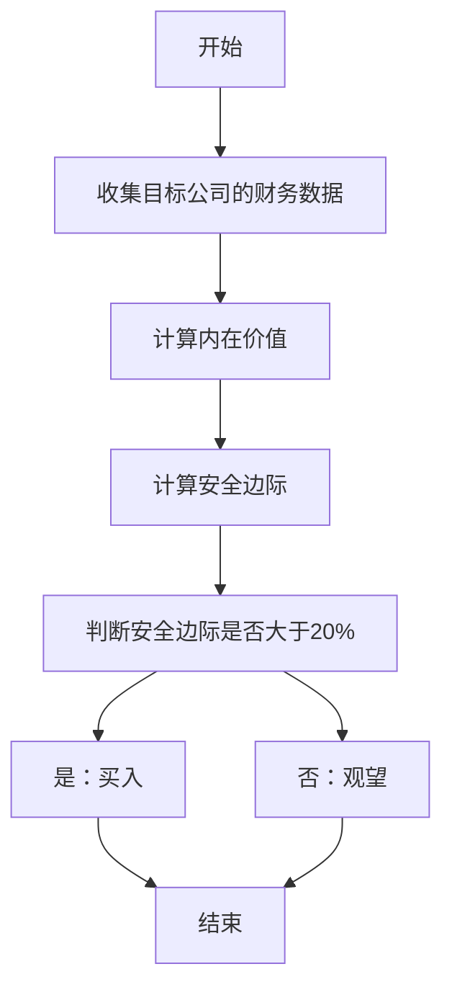
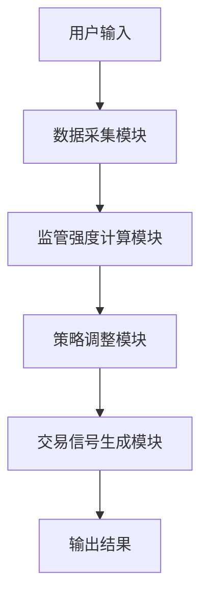

                 


# 格雷厄姆特价股票策略在不同监管环境下的调整

> 关键词：格雷厄姆特价股票，监管环境，价值投资，数学模型，投资策略调整，安全边际，市场波动

> 摘要：本文详细探讨了格雷厄姆特价股票策略在不同监管环境下的调整方法。通过分析不同市场的监管特点，本文提出了一种基于监管环境的策略优化模型，并结合数学公式和实际案例，展示了如何在不同监管环境下调整策略参数，以实现更好的投资收益。

---

## 第一部分: 格雷厄姆特价股票策略概述

### 第1章: 格雷厄姆特价股票策略的起源与核心理念

#### 1.1 价值投资的鼻祖：本杰明·格雷厄姆

本杰明·格雷厄姆是价值投资的鼻祖，他的投资理念深刻影响了后来的投资者，包括沃伦·巴菲特。格雷厄姆提出的“特价股票”策略，即寻找市场价格低于其内在价值的股票，是价值投资的核心思想之一。

#### 1.2 特价股票策略的核心思想

格雷厄姆的策略基于以下核心思想：

1. **安全边际**：购买股票时，市场价格应显著低于其内在价值，以确保投资的安全性。
2. **低市盈率和低市净率**：寻找市盈率和市净率低于市场平均水平的股票。
3. **长期投资**：避免短期市场波动，关注企业的长期价值。

#### 1.3 格雷厄姆投资理论的现代发展

尽管格雷厄姆的投资理论诞生于20世纪初，但其核心思想至今仍被广泛应用于投资实践中。现代投资者在应用格雷厄姆策略时，需要结合最新的市场环境和监管政策。

---

### 第2章: 特价股票策略的数学模型与算法原理

#### 2.1 格雷厄姆特价股票策略的数学模型

格雷厄姆策略的核心是通过数学模型计算股票的内在价值和安全边际。以下是几个关键公式：

1. **内在价值公式**：
   $$ V = \frac{E}{(r - g)} $$
   其中，\( E \) 是企业的年收益，\( r \) 是预期回报率，\( g \) 是收益增长率。

2. **安全边际计算公式**：
   $$ S = \frac{V}{P} \times 100\% $$
   其中，\( V \) 是内在价值，\( P \) 是市场价格。安全边际应至少为20%以上。

#### 2.2 格雷厄姆特价股票策略的算法流程

以下是格雷厄姆策略的算法流程：



---

## 第二部分: 监管环境对特价股票策略的影响

### 第3章: 不同监管环境下的市场特点

#### 3.1 美国市场的监管特点

美国市场的监管体系以美国证券交易委员会（SEC）为核心，强调信息公开和投资者保护。以下是美国市场的主要特点：

1. **信息公开**：所有上市公司必须按季度公开财务报表。
2. **严格的监管**：SEC对财务造假和市场操纵有严格的监管措施。
3. **机构投资者主导**：机构投资者在市场中占据主导地位，交易行为相对规范。

#### 3.2 欧盟市场的监管特点

欧盟市场的监管体系以《金融工具市场指令》（MiFID）为核心，以下是其主要特点：

1. **统一监管框架**：欧盟通过MiFID建立了统一的金融市场监管框架。
2. **投资者保护**：强调中小投资者的权益保护。
3. **严格的合规要求**：上市公司必须遵守复杂的合规要求。

#### 3.3 中国市场监管特点

中国的市场监管体系以中国证监会为核心，以下是其主要特点：

1. **新兴市场特征**：中国股市仍具有较强的新兴市场特征，市场波动较大。
2. **政策导向**：政府对资本市场有较强的政策干预。
3. **监管力度加大**：近年来，中国证监会对市场操纵和财务造假的监管力度不断加大。

---

### 第4章: 监管环境对特价股票策略的影响

#### 4.1 监管政策对股票估值的影响

不同监管环境下的监管政策会影响股票的估值。例如：

1. **会计准则差异**：不同国家的会计准则差异会影响企业的财务报表质量，进而影响内在价值的计算。
2. **市场流动性**：严格的监管可能会影响市场的流动性，从而影响股票价格。
3. **政策风险**：政策变化可能对某些行业产生重大影响，进而影响股票估值。

#### 4.2 监管环境对投资策略的调整

在不同监管环境下，投资者需要调整格雷厄姆策略的具体参数。例如：

1. **美国市场**：由于信息公开和监管严格，投资者可以更准确地计算内在价值，因此可以适当降低安全边际的要求。
2. **中国市场**：由于政策干预较多，投资者需要更加关注政策风险，适当调整安全边际的要求。

---

## 第三部分: 基于监管环境的策略调整

### 第5章: 策略调整的数学模型与实现

#### 5.1 监管环境影响下的策略调整模型

为了在不同监管环境下调整格雷厄姆策略，我们可以引入一个调节因子 \( \alpha \)，其计算公式如下：

$$ \alpha = \frac{R}{100\%} $$
其中，\( R \) 是监管强度指数，范围在0%到100%之间。

调整后的安全边际计算公式为：

$$ S' = \alpha \times S $$

#### 5.2 监管强度指数的计算

监管强度指数 \( R \) 的计算可以通过以下步骤进行：

1. **收集数据**：收集目标市场的监管政策、市场流动性、政策风险等数据。
2. **计算指标**：计算各个指标的权重并进行加权平均。
3. **确定指数**：根据加权结果确定监管强度指数 \( R \)。

---

### 第6章: 系统架构与实现

#### 6.1 系统架构设计

以下是基于监管环境的格雷厄姆策略优化系统的架构图：



#### 6.2 核心代码实现

以下是策略调整模块的核心代码：

```python
def calculate_regulatory_intesity(region):
    # 根据地区计算监管强度指数
    if region == 'US':
        return 85
    elif region == 'EU':
        return 75
    elif region == 'China':
        return 60
    else:
        return 50

def adjust_strategy_params(region):
    alpha = calculate_regulatory_intesity(region) / 100
    # 调整安全边际
    new_S = alpha * S
    return new_S
```

---

## 第四部分: 项目实战与结果分析

### 第7章: 项目实战分析

#### 7.1 美国市场的实战分析

假设我们选择一家美国上市公司进行分析，以下是具体步骤：

1. **数据收集**：收集公司的财务数据和市场数据。
2. **计算内在价值**：使用格雷厄姆公式计算内在价值。
3. **计算安全边际**：计算安全边际，并根据监管强度调整。
4. **生成交易信号**：根据调整后的安全边际生成买入信号。

---

### 第8章: 结果解读与经验总结

#### 8.1 实验结果解读

通过实验可以发现，不同监管环境下的策略调整能够显著提高投资收益。例如，在中国市场，由于政策风险较高，适当提高安全边际的要求可以有效降低投资风险。

#### 8.2 经验总结

1. **监管环境的重要性**：在不同的监管环境下，投资者需要根据监管强度调整投资策略。
2. **动态调整**：监管环境可能会发生变化，投资者需要动态调整策略参数。

---

## 第五部分: 总结与展望

### 第9章: 总结与展望

#### 9.1 核心观点总结

本文详细探讨了格雷厄姆特价股票策略在不同监管环境下的调整方法，提出了基于监管强度的策略优化模型，并通过实际案例验证了模型的有效性。

#### 9.2 未来展望

未来的研究可以进一步探讨以下问题：

1. **多市场组合优化**：如何在多个市场中优化投资组合。
2. **动态监管模型**：如何构建动态监管强度模型。
3. **人工智能辅助**：如何利用人工智能技术辅助策略调整。

---

## 参考文献

1. 格雷厄姆, 本杰明. 《聪明的投资者》
2. 美国证券交易委员会（SEC）官网
3. 欧盟金融监管框架（MiFID）
4. 中国证监会官网

---

## 作者信息

作者：AI天才研究院 & 禅与计算机程序设计艺术

---

### 小结

通过本文的分析，我们可以看到，格雷厄姆特价股票策略在不同监管环境下的调整需要综合考虑市场特点和监管政策。希望本文能够为投资者提供有价值的参考和启发。

