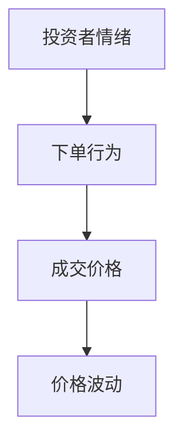
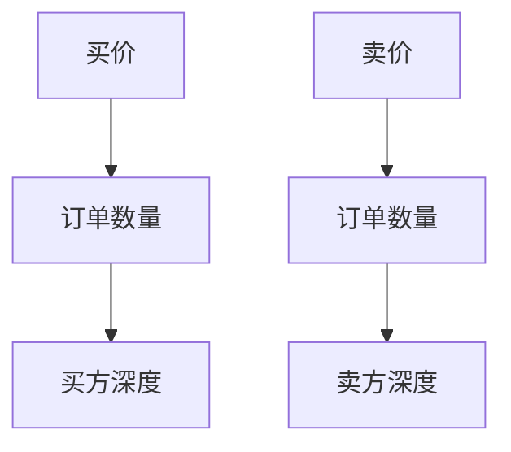
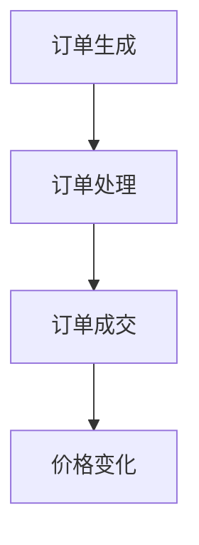
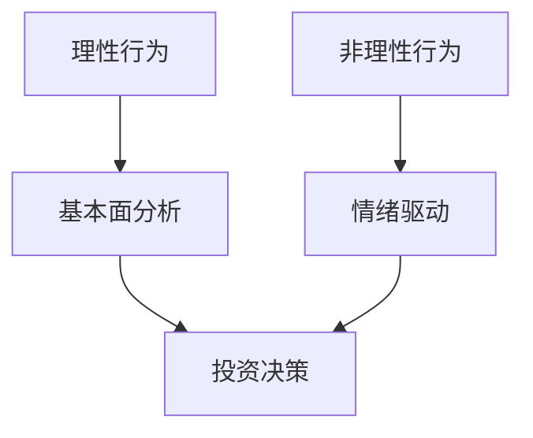

                 


# 特价股票投资中的市场微观结构分析

> 关键词：特价股票、市场微观结构、订单簿分析、流动性风险、交易行为分析

> 摘要：本文深入探讨了特价股票投资中的市场微观结构分析，从订单簿、交易行为、流动性风险等多个维度展开，结合实际案例和算法原理，为投资者提供了系统的分析框架和实用的策略建议。通过本文的学习，读者将能够更好地理解市场微观结构对股票价格的影响，并掌握如何利用这些信息做出更明智的投资决策。

---

## 第1章: 特价股票投资的背景与概念

### 1.1 特价股票的定义与特征
特价股票通常指那些市场价格显著低于其内在价值的股票。这种折扣可能源于市场波动、投资者情绪或公司基本面的变化。特价股票的特征包括低估值、高潜在回报和较高的市场波动性。

### 1.2 投资特价股票的背景与意义
随着市场波动的加剧，投资者越来越关注如何在市场低谷期发现被低估的股票。特价股票的投资机会往往出现在市场恐慌或公司特定事件（如重组、收购）之后。通过分析市场微观结构，投资者可以更准确地识别这些机会。

### 1.3 市场微观结构分析的重要性
市场微观结构是指市场中订单簿、交易行为和参与者之间的互动关系。理解这些结构有助于投资者预测价格波动、识别市场信号并制定更有效的交易策略。

---

## 第2章: 市场微观结构的核心概念

### 2.1 订单簿的结构与功能
订单簿记录了市场参与者当前的买卖订单。它包括买价、卖价、订单数量和订单类型（如限价单和市价单）。订单簿的变化反映了市场的供需关系。

#### 表2-1: 订单簿的组成部分

| 组成部分 | 描述 |
|----------|------|
| 买价     | 投资者愿意购买股票的价格 |
| 卖价     | 投资者愿意出售股票的价格 |
| 数量     | 每个价格点的订单数量 |
| 类型     | 限价单、市价单等 |

### 2.2 交易行为分析
交易行为包括投资者的下单、成交和撤单行为。分析这些行为可以帮助识别市场情绪和潜在的价格驱动因素。

#### 图2-1: 交易行为与价格波动的关联（Mermaid图）



### 2.3 信息不对称与市场效率
信息不对称指市场参与者掌握的信息不一致，可能导致价格偏离实际价值。理解信息不对称有助于投资者识别市场机会和风险。

---

## 第3章: 订单簿分析在特价股票投资中的应用

### 3.1 订单簿深度分析
订单簿深度反映了市场的流动性。深度越高，市场的稳定性越强，投资者更容易以合理价格成交。

#### 图3-1: 订单簿深度的计算（Mermaid图）



### 3.2 订单流分析
订单流分析研究订单的生成和成交速度。快速的订单流可能预示着市场情绪的变化或潜在的价格波动。

#### 图3-2: 订单流分析流程（Mermaid图）



### 3.3 限价单与市价单的策略应用
限价单和市价单在订单簿中的分布反映了市场参与者的行为。例如，大量限价单可能预示着买方的需求，而市价单的增加可能表明市场情绪的转变。

---

## 第4章: 流动性分析与市场微观结构

### 4.1 流动性的定义与测量
流动性指资产在市场中迅速买卖而不影响价格的能力。流动性好的资产通常具有较高的订单簿深度和稳定的交易量。

#### 表4-1: 流动性测量指标

| 指标         | 描述                 |
|--------------|----------------------|
| 成交额       | 一定时间段内的交易总额 |
| 买卖价差     | 最新买价与卖价的差值   |
| 深度         | 每个价格点的订单数量   |

### 4.2 流动性风险与投资策略
流动性风险指因市场流动性不足导致的价格波动或无法以预期价格成交的风险。在特价股票投资中，需警惕流动性风险对投资回报的影响。

### 4.3 流动性与订单簿分析的结合
通过分析订单簿的流动性指标，投资者可以更好地评估市场稳定性，并制定相应的交易策略。

---

## 第5章: 交易行为分析与投资策略

### 5.1 投资者的交易行为分类
投资者的交易行为可分为理性行为和非理性行为。理性行为基于基本面分析，而非理性行为受情绪驱动。

#### 图5-1: 投资者行为分类（Mermaid图）



### 5.2 交易行为对市场微观结构的影响
交易行为通过影响订单簿和价格波动，进而影响市场的整体结构。例如，高频交易可能加剧价格波动。

### 5.3 基于交易行为的策略优化
通过分析交易行为，投资者可以识别市场信号并优化投资策略。例如，发现卖方压力增加时，及时调整持仓。

---

## 第6章: 市场微观结构分析的算法实现

### 6.1 订单簿分析算法
订单簿分析算法通过处理订单数据，计算市场深度和买卖价差。以下是Python实现示例：

```python
# 示例：计算订单簿深度
def calculate_depth(bid_prices, ask_prices, bid_volumes, ask_volumes):
    bid_depth = sum(bid_volumes)
    ask_depth = sum(ask_volumes)
    return bid_depth, ask_depth
```

### 6.2 流动性风险评估模型
流动性风险评估模型基于订单簿数据和交易量预测价格波动。数学模型如下：

$$
\text{流动性风险} = \frac{\text{买卖价差}}{\text{订单簿深度}}
$$

### 6.3 交易行为分析的机器学习应用
使用机器学习算法分析交易行为，识别市场情绪和潜在的价格驱动因素。例如，使用LSTM模型预测价格波动。

---

## 第7章: 总结与最佳实践

### 7.1 总结
市场微观结构分析为特价股票投资提供了重要的工具和方法。通过深入理解订单簿、流动性风险和交易行为，投资者可以制定更有效的投资策略。

### 7.2 最佳实践 tips
1. **持续学习**：关注市场动态和新的分析工具。
2. **风险管理**：在投资前评估流动性风险。
3. **结合技术与基本面分析**：综合考虑技术指标和公司基本面。

### 7.3 拓展阅读
- 《市场微观结构理论》
- 《算法交易：获胜者的新投资方法》

---

作者：AI天才研究院/AI Genius Institute & 禅与计算机程序设计艺术 /Zen And The Art of Computer Programming

