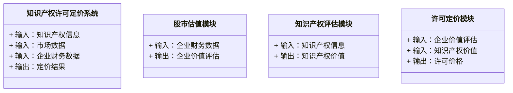
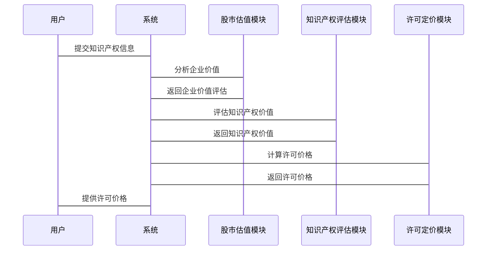

                 


# 股市估值在跨境知识产权许可定价中的应用

## 关键词：股市估值，知识产权许可定价，期权定价模型，系统架构，跨境知识产权

## 摘要：本文探讨了股市估值在跨境知识产权许可定价中的应用，分析了相关的核心概念、数学模型和系统架构，结合实际案例展示了如何通过算法优化定价策略，提供了详细的实现方法和最佳实践建议。

---

# 第一部分: 股市估值与知识产权许可定价的背景与基础

## 第1章: 股市估值与知识产权许可定价概述

### 1.1 股市估值的基本概念
#### 1.1.1 股市估值的定义与作用
股市估值是通过对公司财务数据和市场表现的分析，估算其市值的过程。它帮助投资者评估公司的价值，指导投资决策。在知识产权许可定价中，股市估值提供了企业整体价值的评估方法，为知识产权的价值评估提供了参考。

#### 1.1.2 股市估值的核心指标与方法
常用的股市估值指标包括市盈率（PE）、市净率（PB）、股息率等。这些指标帮助投资者评估股票的合理价格。

#### 1.1.3 股市估值在企业价值评估中的应用
企业价值评估是股市估值的重要应用，通过现金流折现法等模型，估算企业的整体价值，进而指导股票定价。

### 1.2 知识产权许可定价的基本概念
#### 1.2.1 知识产权的定义与分类
知识产权包括专利、商标、版权等，其价值取决于创新性、市场应用和法律保护等因素。

#### 1.2.2 知识产权许可的定义与特点
知识产权许可是指权利人将其知识产权授权他人使用，获得许可费的过程。其特点是灵活性高、风险分担、收益共享。

#### 1.2.3 知识产权许可定价的核心要素
定价需考虑市场需求、技术复杂度、法律风险和经济周期等因素，确保定价合理且可持续。

### 1.3 股市估值与知识产权许可定价的关联性
#### 1.3.1 股市估值在知识产权定价中的潜在作用
股市估值提供了企业整体价值的评估方法，为知识产权的定价提供了参考。

#### 1.3.2 跨界应用的背景与驱动因素
全球化和数字化推动了知识产权的跨境交易，股市估值的方法为定价提供了新的思路。

#### 1.3.3 股市估值与知识产权许可定价的协同效应
通过结合股市估值和知识产权定价，企业可以更准确地评估知识产权价值，优化许可策略。

## 第2章: 股市估值与知识产权许可定价的核心概念

### 2.1 股市估值的核心模型
#### 2.1.1 市盈率模型
市盈率模型通过比较公司的市盈率和行业平均值，估算股票的合理价格。

#### 2.1.2 市净率模型
市净率模型通过比较公司的市净率和行业平均值，估算股票的合理价格。

#### 2.1.3 现金流折现模型
现金流折现模型通过将未来现金流折现，估算企业的整体价值。

### 2.2 知识产权许可定价的核心模型
#### 2.2.1 基于收益的定价模型
基于预期收益，确定合理的分成比例，计算许可价格。

#### 2.2.2 基于成本的定价模型
根据开发和维护成本，确定许可价格，确保覆盖成本并获得合理利润。

#### 2.2.3 基于市场比较的定价模型
通过比较类似交易的定价，确定合理的许可价格。

#### 2.2.4 基于期权的定价模型
期权定价模型将知识产权视为一种期权，考虑时间价值和执行价格，确定合理价格。

### 2.3 股市估值与知识产权许可定价的关联模型
#### 2.3.1 股市估值在知识产权定价中的应用
通过分析企业的整体价值，评估知识产权的价值贡献，确定许可价格。

#### 2.3.2 知识产权许可定价对股市估值的反向影响
知识产权的价值影响企业的整体估值，进而影响股市定价。

#### 2.3.3 两者的协同优化模型
通过结合股市估值和知识产权定价，优化企业价值评估，提升定价准确性。

---

# 第二部分: 股市估值在知识产权许可定价中的数学模型与算法原理

## 第3章: 股市估值与知识产权许可定价的数学模型

### 3.1 股市估值的核心数学模型
#### 3.1.1 市盈率模型的数学表达
$$ P = E \times PE $$
其中，P为股票价格，E为每股收益，PE为市盈率倍数。

#### 3.1.2 现金流折现模型的数学表达
$$ V = \sum_{t=1}^{n} \frac{CF_t}{(1+r)^t} $$
其中，V为公司价值，CF_t为第t年的现金流，r为折现率。

### 3.2 知识产权许可定价的数学模型
#### 3.2.1 基于收益的定价模型
$$ P = R \times \alpha $$
其中，P为许可价格，R为预期收益，α为分成比例。

#### 3.2.2 基于期权的定价模型
$$ C = S_0 \times N(d_1) - K \times e^{-rT} \times N(d_2) $$
其中，C为期权价值，S_0为标的资产价格，K为行权价，r为无风险利率，T为时间，N()为标准正态分布函数。

### 3.3 股市估值与知识产权许可定价的联合模型
#### 3.3.1 组合模型的构建
$$ V = \alpha \times P + \beta \times Q $$
其中，V为综合价值，α和β为权重系数，P和Q分别为股市估值和知识产权价值。

---

# 第三部分: 系统架构与项目实战

## 第4章: 系统架构与项目实现

### 4.1 系统功能设计
#### 4.1.1 领域模型设计


### 4.2 系统架构设计


### 4.3 系统交互设计


---

# 第四部分: 项目实战与最佳实践

## 第5章: 项目实战

### 5.1 环境安装
需要安装Python、Pandas、NumPy、Matplotlib和Scipy等库。

### 5.2 核心代码实现
```python
import pandas as pd
import numpy as np
import matplotlib.pyplot as plt
from scipy.stats import norm

def calculate_option_value(S, K, r, T, sigma):
    d1 = (np.log(S/K) + (r + sigma**2/2)*T) / (sigma*np.sqrt(T))
    d2 = d1 - sigma*np.sqrt(T)
    C = S * norm.cdf(d1) - K * np.exp(-r*T) * norm.cdf(d2)
    return C

S = 100
K = 105
r = 0.05
T = 1
sigma = 0.3
option_value = calculate_option_value(S, K, r, T, sigma)
print("期权价值为:", option_value)
```

### 5.3 代码应用解读与分析
该代码实现了Black-Scholes模型，用于计算期权价值。在知识产权许可定价中，可以将知识产权视为一种期权，考虑其时间价值和执行价格。

### 5.4 案例分析与详细讲解
通过具体案例分析，展示如何使用上述模型进行定价，确保定价策略的合理性和可持续性。

---

# 第五部分: 最佳实践、小结与拓展阅读

## 第6章: 最佳实践与总结

### 6.1 最佳实践 tips
- 定期更新市场数据和模型参数，确保定价的准确性。
- 结合实际情况调整模型参数，避免过度依赖单一指标。

### 6.2 小结
本文详细探讨了股市估值在跨境知识产权许可定价中的应用，结合数学模型和系统架构，提供了实现方法和最佳实践建议。

### 6.3 注意事项
- 注意法律风险和市场变化，及时调整定价策略。
- 加强团队协作，确保数据准确性和模型有效性。

### 6.4 拓展阅读
推荐阅读《金融工程》、《知识产权法》等相关书籍，深入理解股市估值和知识产权许可定价的理论与实践。

---

# 作者：AI天才研究院/AI Genius Institute & 禅与计算机程序设计艺术 /Zen And The Art of Computer Programming

