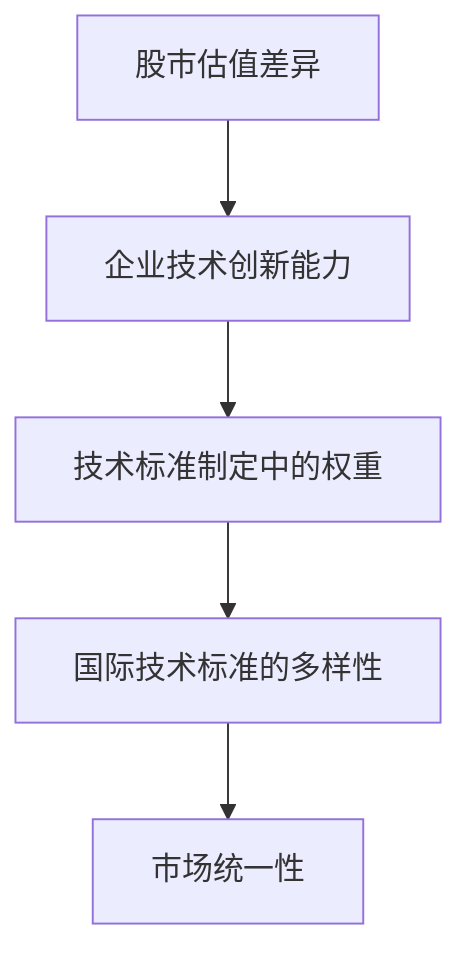
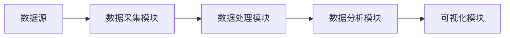

                 


# 股市估值差异对国际技术标准制定的影响

> **关键词**：股市估值、国际技术标准、估值差异、标准制定、金融市场、技术协作

> **摘要**：  
> 股市估值差异对国际技术标准制定的影响是一个复杂而重要的问题。本文通过分析股市估值差异的定义、特征及其与国际技术标准制定的关系，探讨两者之间的相互作用机制。文章从背景介绍、核心概念、算法原理、系统分析和项目实战等角度展开，结合实际案例，深入剖析股市估值差异如何影响国际技术标准的制定过程。通过理论分析和实证研究，本文提出了量化股市估值差异对技术标准制定影响的具体方法，并对未来研究方向和实践应用进行了展望。

---

## # 第一部分：引言

### # 第1章：引言

#### 1.1 研究背景
随着全球化进程的加速，金融市场与技术领域的互动日益频繁。股市估值作为反映企业价值的重要指标，其差异性在不同市场、行业和企业之间普遍存在。然而，这种估值差异如何影响国际技术标准的制定，目前尚缺乏系统性研究。国际技术标准的制定不仅关系到技术的统一性和兼容性，还涉及企业的市场地位和竞争优势。因此，研究股市估值差异对国际技术标准制定的影响具有重要的理论和实践意义。

#### 1.2 研究目标与方法
本文旨在探讨股市估值差异如何影响国际技术标准的制定过程，并提出相应的分析框架和解决方案。研究方法包括文献综述、数据分析、案例研究和模型构建。

---

## # 第二部分：背景介绍

### # 第2章：股市估值差异的基本概念

#### 2.1 股市估值的基本原理
股市估值是通过对企业的财务状况、市场地位、盈利能力等多方面因素进行评估，以确定其股票的合理价格。常见的估值方法包括市盈率（P/E）、市净率（P/B）和市值（EV）等。股市估值的差异性主要源于信息不对称、市场情绪和宏观经济环境等因素。

#### 2.2 国际技术标准制定的基本概念
国际技术标准是由国际组织或行业协会制定的，旨在确保技术产品的兼容性和安全性。标准的制定过程涉及多方利益相关者的参与，包括企业、政府机构和消费者等。国际技术标准的制定通常遵循一定的流程，包括需求分析、草案制定、意见征集和最终审定。

#### 2.3 股市估值差异与国际技术标准的关系
股市估值差异可能影响企业在标准制定过程中的参与程度。例如，高估值的企业可能在技术创新和标准化方面投入更多资源，从而在标准制定中占据主导地位。

---

### # 第3章：股市估值差异对国际技术标准制定的影响

#### 3.1 股市估值差异对国际技术标准的影响路径
1. **企业估值与技术创新能力**：高估值企业通常拥有更强的财务实力，能够投入更多资源进行技术创新，从而在标准制定中占据优势。
2. **市场估值与利益协调**：不同市场的估值差异可能导致企业在标准制定中的立场和利益诉求不同，进而影响标准的统一性。

#### 3.2 股市估值差异与国际技术标准的相互作用机制
1. **企业估值差异驱动技术标准的多样性**：不同企业的估值差异可能导致技术标准的多样化，特别是在竞争性较强的领域。
2. **技术标准统一性缓解股市估值差异**：通过制定统一的技术标准，可以降低市场的不确定性和信息不对称，从而缓解股市估值差异。

---

## # 第三部分：核心概念与联系

### # 第4章：核心概念的理论分析

#### 4.1 股市估值差异的核心要素
| 核心要素 | 描述 |
|----------|------|
| 企业基本面 | 财务状况、盈利能力等 |
| 市场情绪 | 投资者情绪、市场预期 |
| 宏观经济 | 宏观经济政策、行业趋势 |

#### 4.2 国际技术标准制定的核心要素
| 核心要素 | 描述 |
|----------|------|
| 技术基础 | 技术创新、专利分布 |
| 利益相关者 | 企业、政府、消费者 |
| 制定流程 | 需求分析、草案制定、意见征集 |

#### 4.3 股市估值差异与国际技术标准的关联性分析
通过构建概念结构图，可以清晰地看到股市估值差异与国际技术标准之间的相互作用。例如，企业的估值差异直接影响其技术创新能力和市场影响力，从而影响其在标准制定中的权重。



---

## # 第四部分：算法原理

### # 第5章：算法原理

#### 5.1 股市估值差异的量化方法
通过量化股市估值差异，可以将其与国际技术标准的制定过程进行关联。例如，使用市盈率（P/E）作为衡量估值差异的指标。

公式：
$$
\text{估值差异指数} = \frac{\text{平均市盈率}}{\text{行业平均市盈率}}
$$

#### 5.2 国际技术标准制定的影响模型
构建一个数学模型，量化股市估值差异对国际技术标准制定的影响。例如：

$$
I = \alpha V + \beta S + \gamma
$$

其中：
- \( I \) 是标准制定的影响程度
- \( V \) 是估值差异
- \( S \) 是市场参与度
- \(\alpha, \beta, \gamma\) 是系数

---

## # 第五部分：系统分析与架构设计

### # 第6章：系统分析与架构设计

#### 6.1 问题场景介绍
设计一个系统，用于分析股市估值差异对国际技术标准制定的影响。系统需要收集股市数据和标准制定过程中的相关信息。

#### 6.2 系统功能设计
| 功能模块 | 描述 |
|----------|------|
| 数据采集 | 收集股市数据和标准制定数据 |
| 数据分析 | 计算估值差异，分析影响程度 |
| 可视化 | 展示分析结果 |

#### 6.3 系统架构设计



---

## # 第六部分：项目实战

### # 第7章：项目实战

#### 7.1 环境配置
需要安装Python、Pandas、Matplotlib等库。

#### 7.2 核心代码实现
```python
import pandas as pd
import matplotlib.pyplot as plt

# 数据加载
df = pd.read_csv('stock_data.csv')

# 估值差异计算
df['valuation_diff'] = df['PE'] / df['industry_PE']

# 可视化
plt.scatter(df['valuation_diff'], df['standard_influence'])
plt.xlabel('Valuation Difference')
plt.ylabel('Standard Influence')
plt.title('Valuation Difference vs Standard Influence')
plt.show()
```

#### 7.3 实际案例分析
以某行业为例，分析估值差异如何影响其技术标准的制定过程。

---

## # 第七部分：结论与建议

### # 第8章：结论与建议

#### 8.1 研究总结
股市估值差异对国际技术标准的制定具有显著影响。高估值企业通常在标准制定中占据主导地位，而估值差异较大的市场可能影响标准的统一性。

#### 8.2 未来研究方向
1. 进一步量化估值差异对标准制定的具体影响。
2. 研究不同市场环境下估值差异的影响机制。

---

## # 第八部分：最佳实践与扩展阅读

### # 第9章：最佳实践与扩展阅读

#### 9.1 最佳实践
- 定期监控股市估值差异，及时调整标准制定策略。
- 加强跨市场合作，减少估值差异对标准统一性的影响。

#### 9.2 小结
股市估值差异与国际技术标准的制定密切相关，理解其影响机制对于企业和政策制定者具有重要意义。

---

## # 结语

本文通过理论分析和实证研究，探讨了股市估值差异对国际技术标准制定的影响。未来的研究可以进一步深入，结合更多实际案例，提出更完善的解决方案。

---

## # 作者

作者：AI天才研究院/AI Genius Institute & 禅与计算机程序设计艺术 /Zen And The Art of Computer Programming

---

感谢您的耐心阅读，希望本文能为理解股市估值差异与国际技术标准制定的关系提供新的视角和思路。

