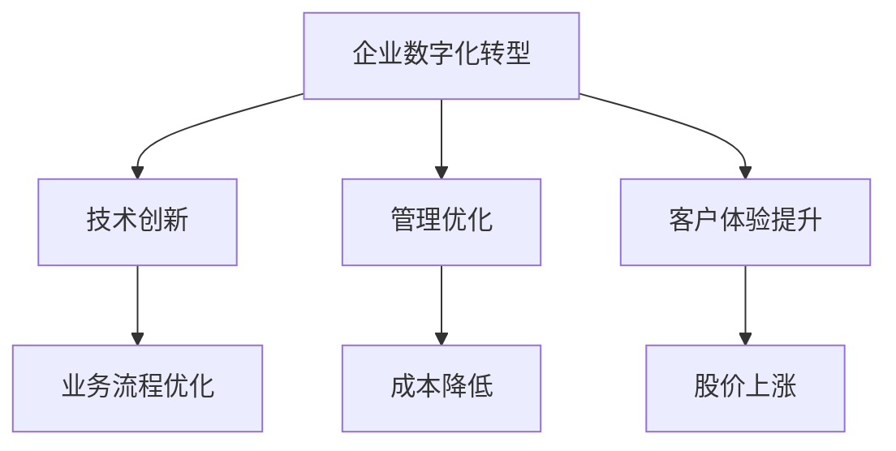
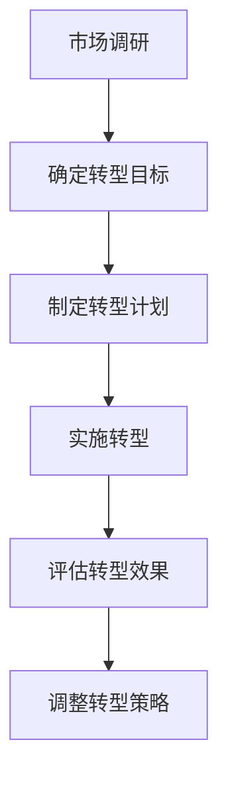

                 


# 股市估值高低对企业数字化转型的影响

> 关键词：股市估值、数字化转型、企业创新、市场价值、投资策略、系统架构、算法模型

> 摘要：本文深入探讨了股市估值的高低对企业数字化转型的影响，分析了高估值和低估值对企业创新、资本运作、管理优化等方面的作用，结合实际案例和系统架构设计，为企业制定数字化转型战略提供参考。

---

## 第1章 数字化转型的背景与核心概念

### 1.1 数字化转型的定义与背景

#### 1.1.1 数字化转型的定义
数字化转型是指企业通过信息技术的深度应用，重构业务模式、组织架构和文化基因，以实现业务创新和效率提升的过程。

#### 1.1.2 数字化转型的背景与驱动因素
- 技术驱动：云计算、大数据、人工智能等技术的快速发展。
- 市场驱动：客户需求变化和市场竞争加剧。
- 管理驱动：企业追求更高的运营效率和创新能力。

#### 1.1.3 数字化转型对企业的影响
- 提高业务效率和客户体验。
- 优化资源配置和降低成本。
- 创新商业模式和竞争优势。

### 1.2 股市估值的核心概念

#### 1.2.1 股市估值的定义
股市估值是指市场对企业未来盈利能力的预期，通常通过市盈率（P/E）、市净率（P/B）等指标衡量。

#### 1.2.2 股市估值的主要指标
- 市盈率（P/E）：市价与每股收益的比值。
- 市净率（P/B）：市价与每股净资产的比值。
- 市销率（P/S）：市价与营业收入的比值。

#### 1.2.3 股市估值对企业的影响
- 高估值：市场对企业的未来增长有信心，吸引更多的资金和人才。
- 低估值：企业可能面临融资困难，但也有机会通过转型提升价值。

---

## 第2章 股市估值对企业数字化转型的影响

### 2.1 高估值对数字化转型的推动作用

#### 2.1.1 高估值带来的资金支持
高估值企业更容易吸引投资者，获得更多的资金支持，用于数字化转型的投入。

#### 2.1.2 高估值推动技术创新
高估值企业有更多的资源进行技术创新，提升核心竞争力。

#### 2.1.3 高估值促进管理优化
高估值企业注重管理效率，推动数字化转型在管理层面的优化。

### 2.2 低估值对数字化转型的挑战

#### 2.2.1 低估值带来的转型压力
低估值企业面临市场竞争压力，必须加快数字化转型以提升竞争力。

#### 2.2.2 低估值限制企业转型投入
低估值企业可能难以获得足够的资金支持，限制数字化转型的推进。

#### 2.2.3 低估值影响企业转型动力
低估值可能削弱企业高层和员工的转型动力，影响整体推进效果。

---

## 第3章 数字化转型对股市估值的影响机制

### 3.1 数字化转型通过提升企业竞争力影响股市估值

#### 3.1.1 提升企业市场地位
数字化转型帮助企业进入高增长市场，提升市场地位，从而提高估值。

#### 3.1.2 提升企业盈利能力
通过数字化转型优化成本结构，提高盈利能力，吸引投资者。

#### 3.1.3 提升企业成长潜力
数字化转型推动企业创新，增强未来增长潜力，提升估值预期。

### 3.2 数字化转型通过优化企业运营效率影响股市估值

#### 3.2.1 提高运营效率
数字化转型减少人工成本和时间成本，提高运营效率，增强企业的市场竞争力。

#### 3.2.2 降低运营成本
通过自动化和智能化技术降低运营成本，提升企业盈利能力和估值。

#### 3.2.3 提升客户满意度
数字化转型提升客户体验，增强客户忠诚度，间接提升企业估值。

### 3.3 数字化转型通过创新商业模式影响股市估值

#### 3.3.1 创新收入来源
数字化转型帮助企业开拓新的收入来源，如订阅制、数据变现等，提升估值。

#### 3.3.2 创新业务模式
通过数字化转型创新业务模式，如共享经济、平台经济等，提升企业的市场价值。

#### 3.3.3 创新价值主张
数字化转型帮助企业重新定义价值主张，提供更优质的产品和服务，提升市场地位和估值。

---

## 第4章 股市估值与企业数字化转型的典型案例分析

### 4.1 高估值企业数字化转型的案例

#### 4.1.1 科技型企业的数字化转型
某高科技企业通过AI技术的应用，提升了产品竞争力，推动股价上涨，市盈率显著提高。

#### 4.1.2 互联网企业的数字化转型
某互联网公司通过大数据分析优化用户体验，推动股价增长，市净率提升。

### 4.2 低估值企业数字化转型的案例

#### 4.2.1 制造业的数字化转型
某制造企业通过工业互联网实现智能化生产，成本降低，利润增长，股价逐步回升。

#### 4.2.2 零售业的数字化转型
某零售企业通过数字化营销和客户关系管理，提升销售额和客户忠诚度，股价稳步上涨。

---

## 第5章 数字化转型与股市估值的系统架构设计

### 5.1 系统功能设计

#### 5.1.1 企业数字化转型的功能模块
- 数据采集与分析模块：实时采集企业运营数据，进行分析和预测。
- 技术创新模块：推动技术创新，优化业务流程。
- 管理优化模块：提升管理效率，降低运营成本。

#### 5.1.2 股市估值的指标体系
- 财务指标：净利润、营业收入增长率等。
- 市场指标：市盈率、市净率等。
- 管理指标：管理效率、创新能力等。

### 5.2 系统架构设计

#### 5.2.1 系统架构图


#### 5.2.2 业务流程图


---

## 第6章 数字化转型对股市估值的算法模型与实战分析

### 6.1 数学模型与算法原理

#### 6.1.1 数值分析模型
通过回归分析，建立企业数字化转型与股市估值的关系模型：

$$ \text{股价} = \beta_0 + \beta_1 \times \text{数字化投入} + \beta_2 \times \text{技术创新} + \epsilon $$

#### 6.1.2 机器学习模型
使用随机森林算法预测企业数字化转型对股市估值的影响：

```python
import pandas as pd
from sklearn.ensemble import RandomForestRegressor
from sklearn.metrics import mean_squared_error

# 数据加载与预处理
data = pd.read_csv('digital_transformation.csv')
X = data[['R&D投入', '技术创新', '管理优化']]
y = data['股价']

# 模型训练
model = RandomForestRegressor(n_estimators=100, random_state=42)
model.fit(X, y)

# 模型预测
y_pred = model.predict(X)
print(mean_squared_error(y, y_pred))
```

### 6.2 项目实战与案例分析

#### 6.2.1 环境安装与数据准备
- 安装Python和相关库（pandas、scikit-learn）。
- 准备企业数字化转型和股市估值数据集。

#### 6.2.2 核心实现代码
```python
import pandas as pd
import numpy as np
from sklearn.ensemble import RandomForestRegressor
from sklearn.model_selection import train_test_split

# 数据加载
data = pd.read_csv('digital_transformation.csv')

# 数据分割
X = data[['R&D投入', '技术创新', '管理优化']]
y = data['股价']
X_train, X_test, y_train, y_test = train_test_split(X, y, test_size=0.2, random_state=42)

# 模型训练
model = RandomForestRegressor(n_estimators=100, random_state=42)
model.fit(X_train, y_train)

# 模型预测与评估
y_pred = model.predict(X_test)
mse = mean_squared_error(y_test, y_pred)
print(f'均方误差: {mse}')
print(f'决定系数 R²: {model.score(X_test, y_test)}')
```

#### 6.2.3 实际案例分析
以某科技公司为例，分析其数字化转型对股市估值的具体影响，包括技术创新、研发投入、管理优化等方面。

---

## 第7章 数字化转型与股市估值的未来展望

### 7.1 数字化转型的未来趋势
- 技术融合：人工智能、大数据和区块链的深度融合。
- 模式创新：共享经济、平台经济的进一步发展。
- 管理升级：数字化管理成为企业核心竞争力。

### 7.2 股市估值的未来变化
- 高估值企业的技术创新能力将决定其长期价值。
- 低估值企业通过数字化转型实现价值重构。

### 7.3 投资者的策略调整
- 投资者应关注企业的数字化转型能力。
- 投资策略需结合企业的技术、管理和市场表现。

---

## 作者信息

作者：AI天才研究院/AI Genius Institute & 禅与计算机程序设计艺术/Zen And The Art of Computer Programming

