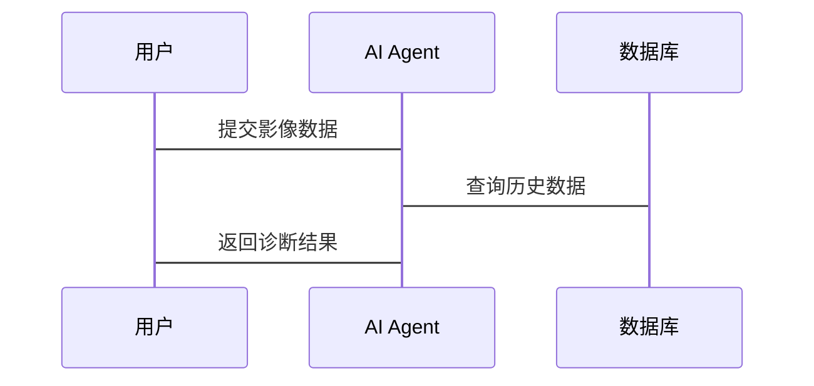

                 


# AI Agent在智能医疗影像分析中的角色

---

## 关键词

AI Agent, 医疗影像分析, 智能医疗, 深度学习, 图像分割, 目标检测

---

## 摘要

AI Agent在智能医疗影像分析中的角色日益重要，尤其是在提高诊断准确性和效率方面。本文详细探讨AI Agent在医疗影像分析中的应用，从背景介绍、核心概念、算法原理到系统架构设计、项目实战和最佳实践，全面解析AI Agent如何推动医疗影像分析的智能化发展。文章结合实际案例和数学公式，深入浅出地阐述AI Agent在医疗影像分析中的作用及其未来发展方向。

---

## 正文

### 第一章：背景介绍

#### 1.1 AI Agent与医疗影像分析概述

##### 1.1.1 AI Agent的基本概念
AI Agent（人工智能代理）是一种智能系统，能够感知环境、执行任务并做出决策。它通过学习和推理，能够在复杂环境中完成特定目标。

##### 1.1.2 医疗影像分析的定义与重要性
医疗影像分析是通过计算机技术对医学影像进行处理、分析和诊断的过程，旨在辅助医生提高诊断效率和准确性。

##### 1.1.3 AI Agent在医疗影像分析中的角色
AI Agent能够自动化处理大量医疗影像数据，辅助医生快速识别病灶，提高诊断效率。

#### 1.2 问题背景与描述
医疗影像分析面临数据量大、诊断时间长、医生资源有限等挑战。AI Agent能够有效缓解这些问题。

#### 1.3 问题解决与边界
AI Agent在医疗影像分析中的应用边界包括数据隐私、模型泛化能力等。

### 第二章：核心概念与联系

#### 2.1 AI Agent的核心概念与原理
AI Agent通过深度学习、计算机视觉等技术实现对医疗影像的分析。

#### 2.2 医疗影像分析的核心原理
医疗影像分析涉及图像处理、目标检测等技术。

#### 2.3 AI Agent与医疗影像分析的协同工作原理
AI Agent与医疗影像分析系统的结合，实现了智能化的诊断流程。

### 第三章：算法原理讲解

#### 3.1 基于深度学习的目标检测算法
目标检测算法如Faster R-CNN用于识别医疗影像中的病灶。

##### 3.1.1 算法流程图


##### 3.1.2 模型实现
目标检测模型的损失函数：
$$ \text{loss} = \text{分类损失} + \text{定位损失} $$

##### 3.1.3 应用案例
在CT影像中检测肿瘤病灶。

#### 3.2 基于深度学习的图像分割算法
图像分割算法如U-Net用于分割医疗影像中的特定区域。

##### 3.2.1 算法流程图


##### 3.2.2 模型实现
分割模型的损失函数：
$$ \text{loss} = \text{交叉熵损失} + \text{Dice损失} $$

##### 3.2.3 应用案例
在MRI影像中分割脑部肿瘤区域。

### 第四章：系统分析与架构设计

#### 4.1 问题场景介绍
医疗影像分析系统需要处理大量影像数据，要求高精度和高效率。

#### 4.2 项目介绍与系统功能设计

##### 4.2.1 领域模型
```mermaid
classDiagram
    class 医疗影像分析系统 {
        +输入影像数据
        +输出诊断结果
        - 分析算法
    }
    class AI Agent {
        +接收影像数据
        +执行分析任务
        - 输出诊断结果
    }
    医疗影像分析系统 <-->> AI Agent
```

##### 4.2.2 系统架构设计


##### 4.2.3 接口设计
AI Agent与前端界面的交互接口设计。

#### 4.3 交互流程设计


### 第五章：项目实战

#### 5.1 环境安装
安装Python、TensorFlow、Keras等环境。

#### 5.2 核心代码实现

##### 5.2.1 目标检测代码示例
```python
import tensorflow as tf
model = tf.keras.models.load_model('model.h5')
result = model.predict(img)
```

##### 5.2.2 图像分割代码示例
```python
import keras
model = keras.models.load_model('segmentation_model.h5')
segmented_image = model.predict(img)
```

#### 5.3 代码解读与分析
详细解读代码实现和运行结果。

#### 5.4 实际案例分析
分析一个实际医疗影像分析案例。

### 第六章：最佳实践

#### 6.1 小结
总结AI Agent在医疗影像分析中的应用及其优势。

#### 6.2 注意事项
数据隐私保护、模型泛化能力等注意事项。

#### 6.3 拓展阅读
推荐相关领域的书籍和论文。

---

## 结语

AI Agent在智能医疗影像分析中的角色不可忽视，它通过深度学习和计算机视觉技术，显著提高了诊断效率和准确性。未来，随着技术的进步，AI Agent将在医疗影像分析中发挥更大的作用。

