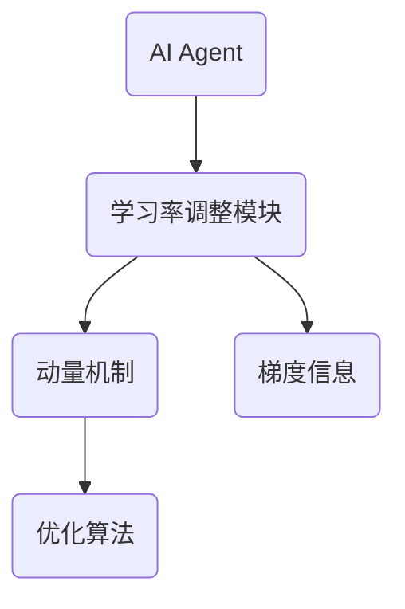
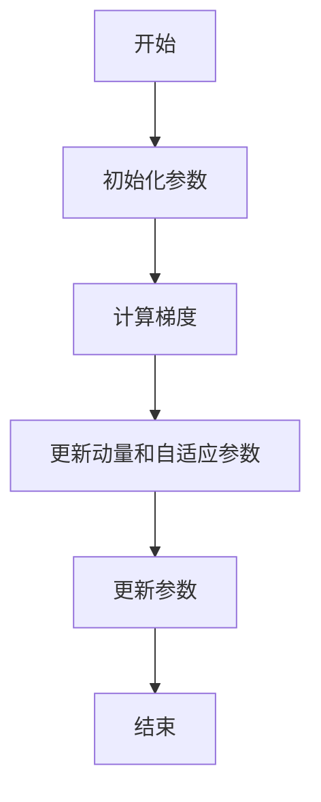

                 


# AI Agent的自适应学习率调整策略

> 关键词：AI Agent，自适应学习率，学习率调整，优化算法，机器学习，动态环境

> 摘要：本文系统地探讨了AI Agent中自适应学习率调整策略的核心概念、算法原理、系统设计和项目实现。通过详细分析自适应学习率调整的重要性及其在动态环境中的应用，本文旨在为读者提供一个全面的理解，涵盖从理论到实践的各个方面。

---

# 第一部分: AI Agent的自适应学习率调整策略背景与基础

## 第1章: AI Agent与自适应学习率调整概述

### 1.1 AI Agent的基本概念
#### 1.1.1 AI Agent的定义与分类
AI Agent（人工智能代理）是指能够感知环境、做出决策并执行任务的智能体。根据功能和智能水平，AI Agent可以分为简单反射型、基于模型的反应型、目标驱动型和实用驱动型等类别。

#### 1.1.2 自适应学习率调整的背景与意义
在动态环境中，AI Agent需要不断调整其行为以适应变化。学习率是机器学习算法中的关键超参数，直接影响模型的收敛速度和最终性能。传统固定学习率方法在动态环境中表现不佳，因此需要自适应学习率调整策略。

#### 1.1.3 自适应学习率调整的核心问题
自适应学习率调整的核心问题是如何根据环境反馈动态调整学习率，以平衡探索与利用，加速收敛并提高稳定性。

---

## 第2章: 自适应学习率调整的核心概念与联系

### 2.1 核心概念原理
#### 2.1.1 动量的概念与作用
动量是一种优化技术，通过引入动量项来加速梯度下降，减少振荡，加快收敛速度。

#### 2.1.2 自适应学习率调整的数学模型
自适应学习率调整通过动态调整学习率参数，适应梯度变化和参数空间的复杂性。

#### 2.1.3 动量与自适应学习率的结合
结合动量和自适应学习率可以进一步提高优化效率，平衡全局和局部搜索。

### 2.2 核心概念属性特征对比
下表对比了不同自适应学习率调整算法的核心特征：

| 算法 | 参数自适应 | 动量机制 | 适用场景 |
|------|------------|----------|----------|
| Adam | 是         | 是       | 动态环境 |
| Adagrad | 是       | 否       | 高维数据 |
| RMSprop | 是       | 否       | RNN训练 |

### 2.3 ER实体关系图架构
自适应学习率调整的实体关系图如下：



---

## 第3章: 自适应学习率调整的数学模型与算法原理

### 3.1 自适应学习率调整的数学模型
自适应学习率调整的数学模型通常包括以下部分：

$$ \text{学习率} = \frac{\text{初始学习率}}{1 + \text{衰减率} \times \text{步数}} $$

### 3.2 算法实现与优化

#### 3.2.1 Adam优化算法
Adam结合了动量和自适应学习率调整，数学公式如下：

$$ m_t = \beta_1 m_{t-1} + (1 - \beta_1)g_t $$
$$ v_t = \beta_2 v_{t-1} + (1 - \beta_2)g_t^2 $$
$$ \theta_{t} = \theta_{t-1} - \alpha \frac{m_t}{\sqrt{v_t} + \epsilon} $$

#### 3.2.2 RMSprop优化算法
RMSprop通过自适应调整学习率，公式如下：

$$ s_t = \beta s_{t-1} + (1 - \beta)g_t^2 $$
$$ \theta_{t} = \theta_{t-1} - \frac{\alpha}{\sqrt{s_t} + \epsilon}g_t $$

### 3.3 算法流程图
以下为Adam优化算法的流程图：



---

## 第4章: 系统设计与架构方案

### 4.1 问题场景介绍
在动态环境中，AI Agent需要实时调整学习率以适应新的输入数据和任务需求。

### 4.2 系统功能设计
系统功能包括数据预处理、优化器选择、参数更新和性能监控。

### 4.3 系统架构设计
系统架构如下：


---

## 第5章: 项目实战与案例分析

### 5.1 环境安装
需要安装Python和相关库，如TensorFlow或PyTorch。

### 5.2 核心代码实现

```python
import numpy as np

def adaptive_learning_rate_adjustment(optimizer, learning_rate, decay_rate):
    current_learning_rate = learning_rate
    for step in range(num_steps):
        gradient = compute_gradient()
        current_learning_rate = learning_rate / (1 + decay_rate * step)
        update_parameters(gradient * current_learning_rate)
```

### 5.3 实际案例分析
通过具体案例展示如何实现和优化自适应学习率调整策略，分析结果并总结经验。

---

## 第6章: 总结与展望

### 6.1 本章小结
自适应学习率调整是提高AI Agent性能的关键技术，结合动量机制可以进一步优化。

### 6.2 未来研究方向
未来研究可以探索更高效的自适应调整算法和多目标优化策略。

### 6.3 注意事项与最佳实践
- 定期监控学习率和性能指标。
- 根据任务需求选择合适的优化算法。
- 避免过度拟合和梯度消失问题。

---

通过以上结构，文章详细探讨了AI Agent自适应学习率调整策略的各个方面，从理论到实践，为读者提供了全面的指导。

