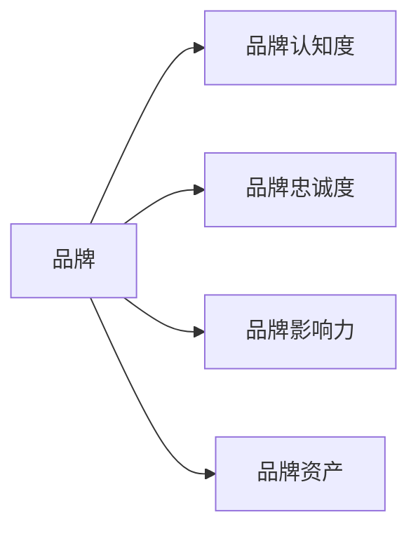

                 


# AI辅助企业品牌资产评估：多维度品牌价值量化与追踪

> 关键词：AI技术，品牌资产评估，多维度量化，品牌价值追踪，机器学习，深度学习

> 摘要：本文系统探讨了如何利用人工智能技术进行企业品牌资产评估，涵盖从理论到实践的各个方面。通过分析品牌价值的多维度特征，结合AI算法，提出了一套完整的解决方案，并通过实际案例展示了如何实现品牌价值的量化与追踪。

---

# 目录

## 第一部分：背景介绍

### 第1章：问题背景与定义

#### 1.1 问题背景
- 1.1.1 传统品牌资产评估的局限性
- 1.1.2 AI技术在品牌评估中的优势
- 1.1.3 当前市场对品牌价值量化的需求

#### 1.2 问题描述
- 1.2.1 品牌价值的多维度特征
- 1.2.2 品牌资产评估中的数据挑战
- 1.2.3 现有解决方案的不足

#### 1.3 问题解决
- 1.3.1 AI辅助品牌资产评估的核心目标
- 1.3.2 多维度品牌价值量化的方法
- 1.3.3 品牌价值追踪的技术路径

#### 1.4 边界与外延
- 1.4.1 品牌价值评估的适用范围
- 1.4.2 与相关领域的区别与联系
- 1.4.3 解决方案的局限性与未来改进方向

#### 1.5 核心概念组成
- 1.5.1 品牌价值的定义与维度
- 1.5.2 多维度评估的核心要素
- 1.5.3 AI辅助评估的实现机制

---

## 第二部分：核心概念与联系

### 第2章：品牌价值评估的核心原理

#### 2.1 核心概念原理
- 2.1.1 品牌价值的多维度特征
- 2.1.2 数据驱动的品牌评估方法
- 2.1.3 AI技术在品牌价值评估中的应用

#### 2.2 核心概念对比
- 2.2.1 品牌价值与企业价值的对比
- 2.2.2 不同品牌评估方法的优劣势分析
- 2.2.3 AI驱动与传统评估方法的差异

#### 2.3 实体关系图


---

## 第三部分：算法原理讲解

### 第3章：AI辅助品牌价值评估算法

#### 3.1 算法流程
- 数据预处理
  - 数据清洗
  - 特征提取
- 模型训练
  - 线性回归模型
  - 神经网络模型
- 模型评估
  - 精度、召回率、F1分数
- 模型优化
  - 调参与交叉验证

#### 3.2 算法实现
- 使用Python的机器学习库（如scikit-learn、TensorFlow）
- 代码示例：
  ```python
  import numpy as np
  from sklearn.linear_model import LinearRegression

  # 数据预处理
  X = np.array([1, 2, 3, 4, 5]).reshape(-1, 1)
  y = np.array([2, 4, 6, 8, 10])

  # 训练模型
  model = LinearRegression()
  model.fit(X, y)

  # 预测
  print(model.predict([[6]]))
  ```

---

## 第四部分：系统分析与架构设计

### 第4章：系统架构与实现方案

#### 4.1 系统功能设计
- 问题场景介绍
- 系统功能模块
  - 数据采集模块
  - 数据处理模块
  - 模型训练模块
  - 结果展示模块

#### 4.2 系统架构设计
- 使用微服务架构
- 数据流设计
- 模块交互设计

#### 4.3 系统架构图


---

## 第五部分：项目实战

### 第5章：项目实施与案例分析

#### 5.1 环境安装
- 安装Python、Jupyter Notebook、机器学习库（如scikit-learn、TensorFlow）

#### 5.2 核心实现代码
- 数据预处理代码
  ```python
  import pandas as pd
  df = pd.read_csv('brand_data.csv')
  df.head()
  ```

- 模型训练代码
  ```python
  from sklearn.model_selection import train_test_split
  X = df[['feature1', 'feature2']]
  y = df['target']
  X_train, X_test, y_train, y_test = train_test_split(X, y, test_size=0.2)
  model.fit(X_train, y_train)
  ```

#### 5.3 实际案例分析
- 数据来源与清洗
- 模型训练与验证
- 结果展示与解读

---

## 第六部分：总结与展望

### 第6章：总结与展望

#### 6.1 最佳实践
- 数据质量的重要性
- 模型选择与调优
- 结果解释与可视化

#### 6.2 项目小结
- 项目目标达成情况
- 实施过程中的经验与教训

#### 6.3 注意事项
- 数据隐私与安全
- 模型的可解释性
- 业务与技术的结合

#### 6.4 拓展阅读
- 推荐相关书籍与论文
- 提供进一步学习的资源

---

# 结语

通过系统地介绍AI技术在品牌资产评估中的应用，本文为读者提供了一套完整的解决方案。从理论到实践，从算法到系统架构，再到项目实战，相信读者能够通过本文深入理解如何利用AI技术量化和追踪品牌价值。未来，随着AI技术的不断发展，品牌资产评估将更加精准和高效。

