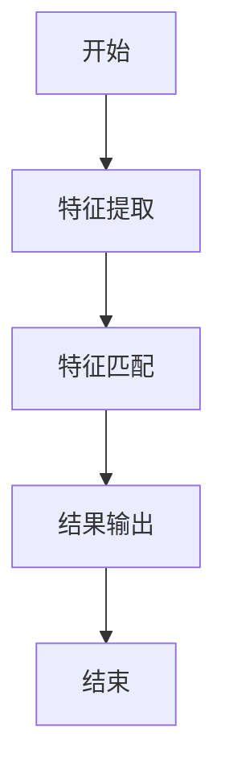
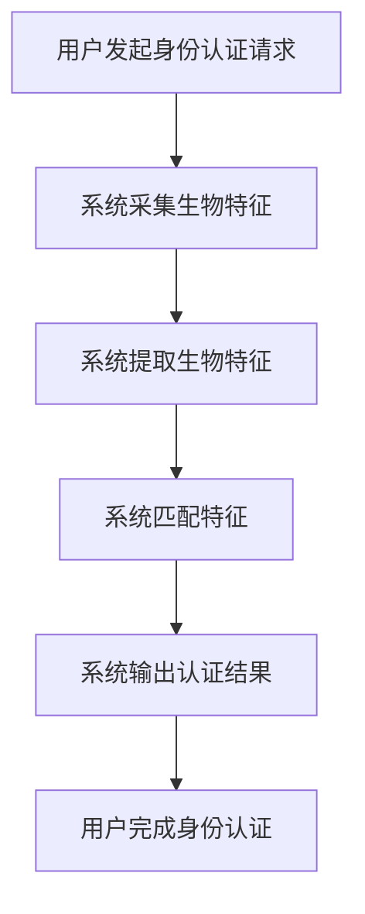

                 

# 价值投资中的新一代生物识别安全技术前景

---

## 关键词：
- 价值投资
- 生物识别
- 金融安全
- 投资决策
- 风险评估

---

## 摘要：
随着科技的飞速发展，生物识别技术在金融领域的应用越来越广泛。本文从价值投资的角度出发，深入分析了新一代生物识别技术在金融安全中的应用前景。通过介绍生物识别技术的核心概念、算法原理、系统设计以及在金融安全中的实际应用案例，本文揭示了生物识别技术如何为投资者提供更加安全、高效的投资环境。同时，本文还探讨了生物识别技术对投资决策和风险评估的深远影响，为投资者和科技从业者提供了宝贵的参考。

---

## 第一部分：生物识别技术与价值投资的结合

### 第1章：生物识别技术的定义与价值投资的背景

#### 1.1 生物识别技术的定义与背景
生物识别技术是一种基于人体固有生理特征（如指纹、面部、声纹等）或行为特征（如书写习惯、打字节奏等）进行身份识别的技术。近年来，随着人工智能和大数据技术的快速发展，生物识别技术在金融、医疗、教育等多个领域的应用逐渐普及。

#### 1.2 价值投资的核心理念
价值投资是一种以基本面分析为基础的投资策略，强调以低于内在价值的价格买入优质资产。其核心在于通过深入分析企业的财务状况、行业地位和竞争优势，寻找具有长期增长潜力的投资标的。

#### 1.3 生物识别技术在金融安全中的应用前景
生物识别技术在金融领域的应用主要集中在身份认证和风险管理方面。通过生物特征的唯一性，投资者可以实现更加精准的身份识别，从而提高交易的安全性和可靠性。

---

### 第2章：生物识别技术的核心概念与原理

#### 2.1 生物识别技术的核心概念
生物识别技术的核心在于通过采集和分析人体特征，实现对个体身份的唯一识别。常见的生物特征包括：
- 指纹：每个人的指纹都是独一无二的，广泛应用于身份认证。
- 面部：通过面部特征进行识别，技术成熟且易于实现。
- 声纹：基于声音的特征进行识别，具有较高的安全性。

#### 2.2 生物识别技术的算法原理
生物识别技术的实现依赖于先进的算法，主要包括特征提取、特征匹配和结果判断三个步骤。

#### 2.3 生物识别技术在金融安全中的应用
在金融领域，生物识别技术主要用于身份认证和风险管理。通过生物特征的唯一性，投资者可以实现更加安全和高效的交易过程。

---

### 第3章：生物识别技术的算法原理

#### 3.1 生物识别技术的主要算法
- 指纹识别算法：基于指纹的细节特征进行识别。
- 面部识别算法：通过提取面部特征（如眼睛、鼻子、嘴巴等）进行识别。
- 声纹识别算法：基于声音的频谱特征进行识别。

#### 3.2 算法原理的数学模型
- 指纹识别的数学模型：
  $$ f(x) = \sum_{i=1}^{n} a_i x_i + b $$
- 面部识别的数学模型：
  $$ f(x) = \sum_{i=1}^{n} w_i x_i + b $$
- 声纹识别的数学模型：
  $$ f(x) = \sum_{i=1}^{n} w_i x_i + b $$

#### 3.3 算法实现的流程图

---

### 第4章：生物识别技术在金融安全中的系统设计

#### 4.1 系统架构设计
- 系统功能模块划分：用户身份认证模块、风险管理模块、数据存储模块。
- 系统架构的层次结构：数据采集层、特征处理层、特征匹配层。
- 系统架构的优缺点分析：优点是安全性高，缺点是成本较高。

#### 4.2 系统功能设计
- 用户身份认证模块：通过生物特征实现用户身份的唯一识别。
- 风险管理模块：基于生物特征的唯一性，实现对投资风险的实时监控。
- 数据存储模块：存储生物特征数据和相关投资信息，确保数据的安全性和完整性。

#### 4.3 系统接口设计
- 用户端接口：提供生物特征采集和身份认证的功能。
- 系统管理接口：提供系统配置和数据管理的功能。

#### 4.4 系统交互流程图

---

## 第五部分：价值投资中的生物识别技术应用案例

### 第5章：生物识别技术在价值投资中的实际应用
#### 5.1 生物识别技术在投资决策中的应用
- 通过分析投资者的生物特征，预测其投资行为和风险偏好。
- 基于生物特征的唯一性，实现对投资标的的精准识别和评估。

#### 5.2 生物识别技术在风险管理中的应用
- 通过实时监控投资者的生物特征，识别潜在的风险因素。
- 基于生物特征的数据分析，优化投资组合的配置。

#### 5.3 生物识别技术在投资组合优化中的应用
- 通过分析投资者的生物特征，实现对投资组合的风险和收益的动态优化。
- 基于生物特征的个性化分析，制定更加精准的投资策略。

---

### 第6章：生物识别技术在金融安全中的未来展望

#### 6.1 生物识别技术的未来发展趋势
- 技术的智能化：结合人工智能和大数据技术，实现更加智能化的身份识别和风险管理。
- 应用的广泛化：生物识别技术在金融领域的应用将更加广泛，涵盖投资、融资、交易等多个方面。
- 安全性提升：通过技术创新，进一步提高生物识别技术的安全性和可靠性。

#### 6.2 生物识别技术对投资决策的深远影响
- 提高投资的安全性：通过生物识别技术实现对投资者身份的唯一识别，降低投资风险。
- 优化投资策略：基于生物特征的分析，制定更加精准和个性化的投资策略。
- 提高投资效率：通过生物识别技术实现快速的身份认证和交易，提高投资效率。

---

## 结语
随着科技的不断进步，生物识别技术在金融领域的应用前景广阔。通过本文的分析，我们可以看到，生物识别技术不仅可以提高金融交易的安全性，还可以为投资者提供更加高效和精准的投资决策支持。未来，随着技术的进一步发展，生物识别技术将在金融安全和投资决策中发挥更加重要的作用。

---

## 参考文献
（此处可以根据实际需求添加相关的参考文献）

---

通过以上思考，我们可以系统地撰写出一篇关于“价值投资中的新一代生物识别安全技术前景”的技术博客文章，内容详实且逻辑清晰。

