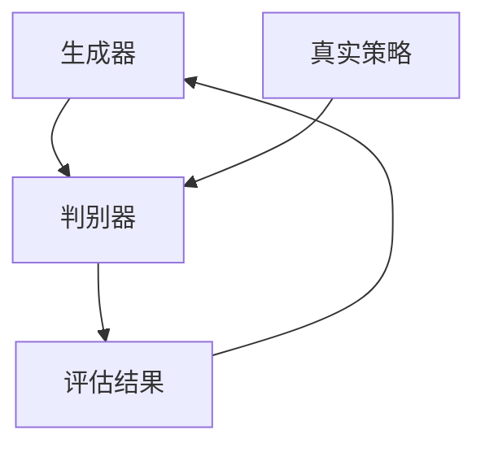

                 


# 构建具有对抗学习能力的AI Agent

> 关键词：对抗学习, AI Agent, 生成对抗网络, 系统架构, 项目实战

> 摘要：本篇文章详细探讨了构建具有对抗学习能力的AI Agent的核心概念、算法原理、系统架构设计及实际应用。通过逐步分析，读者将了解对抗学习的基本原理、其在AI Agent中的应用，以及如何通过系统设计和项目实战来实现具有对抗学习能力的AI Agent。

---

## 第一部分: 对抗学习与AI Agent概述

### 第1章: 对抗学习的背景与重要性

#### 1.1 对抗学习的背景

对抗学习是一种新兴的机器学习方法，通过两个模型（生成器和判别器）之间的对抗训练来提高生成数据的质量。这种方法最初在生成对抗网络（GAN）中提出，现广泛应用于图像生成、自然语言处理等领域。

#### 1.2 AI Agent的定义与作用

AI Agent是一种能够感知环境、自主决策并执行任务的智能体。在对抗学习中，AI Agent通常需要在动态或对抗环境中进行策略优化，从而提升其应对复杂挑战的能力。

---

## 第二部分: 对抗学习的核心概念与联系

### 第2章: 对抗学习的核心原理

#### 2.1 生成器与判别器的对抗关系

生成器的目标是生成与真实数据无法区分的样本，而判别器则试图区分生成样本和真实样本。两者的对抗推动生成器不断改进，生成更高质量的数据。

#### 2.2 对抗学习的数学模型

对抗学习的数学模型通常涉及损失函数的最小化与最大化。例如，生成器的损失函数为 $L_G = -\log P(D(x \text{为假}))$，而判别器的损失函数为 $L_D = -(\log P(D(x \text{为真}) ) + \log P(D(x \text{为假}) ))$。

#### 2.3 对抗学习的核心概念对比

| 概念 | 特征 |
|------|------|
| 生成器 | 优化目标为最大化判别器的混淆概率 |
| 判别器 | 优化目标为最小化判别错误率 |
| 对抗过程 | 动态平衡，生成器和判别器交替优化 |

---

## 第三部分: 对抗学习的算法原理

### 第3章: 生成对抗网络（GAN）模型

#### 3.1 GAN的基本结构

GAN由生成器和判别器组成，生成器通常使用深度神经网络，判别器也使用深度神经网络。训练过程中，生成器和判别器交替优化。

#### 3.2 GAN的损失函数

生成器的损失函数：
$$ \mathcal{L}_G = -\log P(D(x \text{为假})) $$

判别器的损失函数：
$$ \mathcal{L}_D = -(\log P(D(x \text{为真}) ) + \log P(D(x \text{为假}) )) $$

#### 3.3 GAN的训练过程

训练过程包括交替优化生成器和判别器。通常先优化判别器，使其尽可能区分真实和生成样本，然后优化生成器，使其生成样本欺骗判别器。

---

## 第四部分: 系统架构设计

### 第4章: 系统架构设计

#### 4.1 问题场景

假设我们正在构建一个AI Agent，用于在复杂游戏中对抗其他AI或人类玩家。生成器负责生成策略，判别器负责评估策略的优劣。

#### 4.2 系统功能设计

系统功能包括：
- 生成策略
- 评估策略
- 策略优化

#### 4.3 系统架构图



---

## 第五部分: 项目实战

### 第5章: 项目实战

#### 5.1 环境安装

安装必要的库：
```bash
pip install tensorflow-gan matplotlib numpy
```

#### 5.2 核心实现

生成器和判别器的代码示例：

```python
import tensorflow as tf
from tensorflow.keras import layers

def make_generator_model():
    model = tf.keras.Sequential()
    model.add(layers.Dense(256, activation='relu', input_shape=(100,)))
    model.add(layers.Dense(512, activation='relu'))
    model.add(layers.Dense(784, activation='sigmoid'))
    return model

def make_discriminator_model():
    model = tf.keras.Sequential()
    model.add(layers.Dense(512, activation='relu', input_shape=(784,)))
    model.add(layers.Dense(256, activation='relu'))
    model.add(layers.Dense(1, activation='sigmoid'))
    return model
```

---

## 第六部分: 优化与部署

### 第6章: 优化与部署

#### 6.1 模型优化策略

使用早停、调整学习率等方法优化训练过程。

#### 6.2 部署方法

将训练好的模型部署到实际环境中，提供API接口供其他系统调用。

#### 6.3 注意事项

- 确保生成器和判别器的训练比例平衡
- 避免判别器过强导致生成器无法进步

---

## 第七部分: 未来展望

### 第7章: 未来展望

#### 7.1 对抗学习的发展趋势

对抗学习在生成高质量数据、提升模型鲁棒性方面仍有巨大潜力。

#### 7.2 潜在研究方向

- 更高效的对抗训练算法
- 多目标对抗学习
- 对抗学习在AI安全中的应用

---

### 总结

通过本文的详细讲解，读者将掌握构建具有对抗学习能力的AI Agent所需的核心知识，从理论到实践，逐步实现一个高效的对抗学习系统。对抗学习作为一种强大的工具，将在未来的AI发展中发挥越来越重要的作用。

