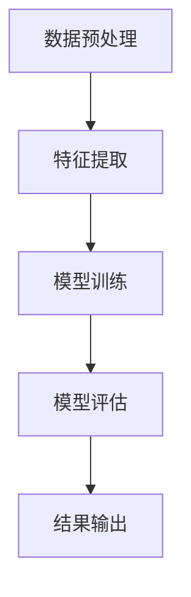

                 


```markdown
# 设计智能化的企业财务报告质量评估模型

> 关键词：智能化财务报告质量评估、机器学习、自然语言处理、企业财务管理、数据驱动决策、财务风险预警

> 摘要：本文详细探讨了设计智能化企业财务报告质量评估模型的关键步骤，包括背景分析、核心概念阐述、算法原理、系统架构设计、项目实战以及最佳实践。文章从企业财务管理的实际需求出发，结合机器学习和自然语言处理技术，提出了一种创新的智能化评估方法，旨在提升财务报告的质量和效率。

---

## 第1章: 背景介绍与问题分析

### 1.1 企业财务报告质量评估的重要性
财务报告是企业经营状况的重要反映，其质量和准确性直接影响企业的决策和价值评估。传统评估方法依赖人工审核，存在效率低、主观性强等问题。

### 1.2 智能化评估的必要性
随着企业数据的快速增长和复杂性增加，传统方法难以满足高效、精准的评估需求。智能化技术的应用可以显著提升评估的效率和准确性。

### 1.3 问题解决思路
通过结合机器学习和自然语言处理技术，设计一个智能化的企业财务报告质量评估模型，实现自动化、智能化的评估。

---

## 第2章: 核心概念与技术原理

### 2.1 核心概念
- **财务数据特征**：包括财务指标、科目分类、时间序列等。
- **文本特征**：包括报告内容的语义、关键词提取等。
- **评估指标**：包括准确性、可解释性、效率等。

### 2.2 核心概念对比分析
#### 表格对比
| 特征类型 | 描述 | 示例 |
|----------|------|------|
| 财务指标 | 数值型数据 | 营业收入、净利润等 |
| 文本内容 | 文本型数据 | 财务报告中的描述性内容 |

#### ER实体关系图（Mermaid）
```mermaid
erd
  left(财务数据表) {
    id int
    收入 int
    利润 int
    时间 date
  }
  left(文本内容表) {
    id int
    文本内容 string
    关键词 string
  }
  left(评估结果表) {
    id int
    评估得分 float
    反馈 string
  }
  财务数据表 --> 评估结果表
  文本内容表 --> 评估结果表
```

---

## 第3章: 智能化评估模型的算法原理

### 3.1 算法选择与原理
- **机器学习算法**：如随机森林、支持向量机（SVM）用于分类。
- **深度学习算法**：如LSTM用于处理时间序列数据，BERT用于文本分析。

### 3.2 算法流程图（Mermaid）


### 3.3 数学模型与公式
#### 损失函数
$$ L = -\frac{1}{n}\sum_{i=1}^{n} y_i \log(p_i) + (1 - y_i)\log(1 - p_i) $$
其中，\( p_i \) 是模型预测的概率，\( y_i \) 是真实标签。

#### 模型权重更新
$$ w_{new} = w_{old} - \eta \cdot \frac{\partial L}{\partial w} $$
其中，\( \eta \) 是学习率。

---

## 第4章: 系统架构与设计

### 4.1 系统功能设计
- 数据采集模块：从财务系统中获取数据。
- 数据处理模块：清洗、转换数据。
- 模型训练模块：训练机器学习模型。
- 评估模块：输出评估结果和反馈。

### 4.2 系统架构图（Mermaid）


---

## 第5章: 项目实战与案例分析

### 5.1 环境安装
- Python 3.8+
- TensorFlow 2.5+
- Scikit-learn 0.24+

### 5.2 核心代码实现
```python
import pandas as pd
from sklearn.model import SVC
from sklearn.metrics import accuracy_score

# 数据加载
data = pd.read_csv('financial_report.csv')

# 特征提取
X = data.drop('label', axis=1)
y = data['label']

# 模型训练
model = SVC()
model.fit(X, y)

# 模型评估
y_pred = model.predict(X)
print(f'Accuracy: {accuracy_score(y, y_pred)}')
```

### 5.3 案例分析
以某企业为例，分析模型的评估结果，解释每个报告的评分依据和改进建议。

---

## 第6章: 最佳实践与注意事项

### 6.1 最佳实践
- 数据预处理是关键，需确保数据的完整性和准确性。
- 模型调参时，需平衡准确性和可解释性。
- 部署模型后，需定期更新以适应数据变化。

### 6.2 注意事项
- 模型的泛化能力有限，需避免过拟合。
- 数据隐私保护需严格遵守相关法规。

---

## 第7章: 总结与展望

### 7.1 总结
智能化企业财务报告质量评估模型通过结合机器学习和自然语言处理技术，显著提升了评估的效率和准确性，为企业财务管理提供了新的思路。

### 7.2 展望
未来，随着技术的发展，模型将更加智能化和个性化，为企业提供更精准的决策支持。

---

**最佳实践 Tips**:
1. 在模型训练前，确保数据的清洗和特征工程充分。
2. 使用交叉验证评估模型的泛化能力。
3. 结合业务场景，选择合适的评估指标。

通过本文的详细讲解，读者可以系统地掌握设计智能化企业财务报告质量评估模型的关键步骤和方法，为企业财务管理的智能化转型提供有力支持。
```

