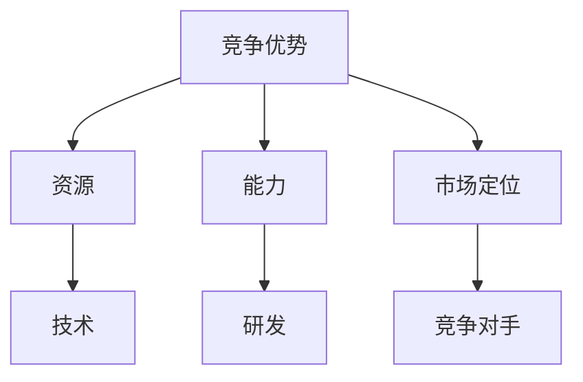
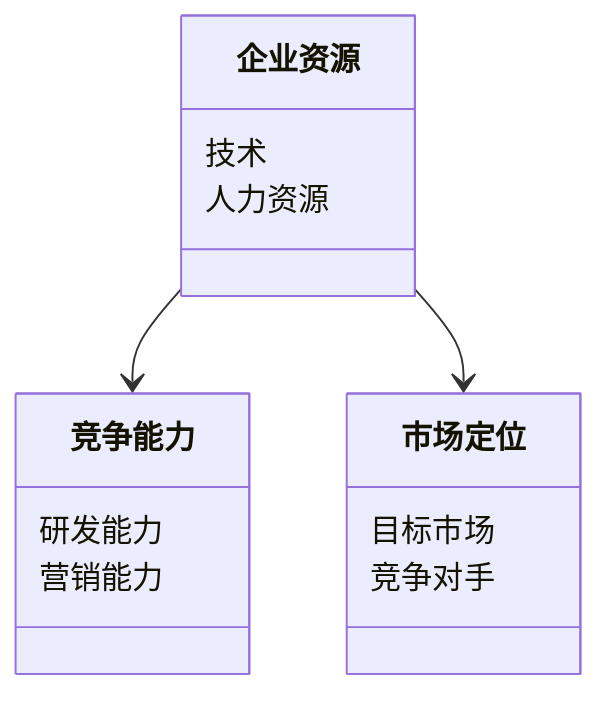
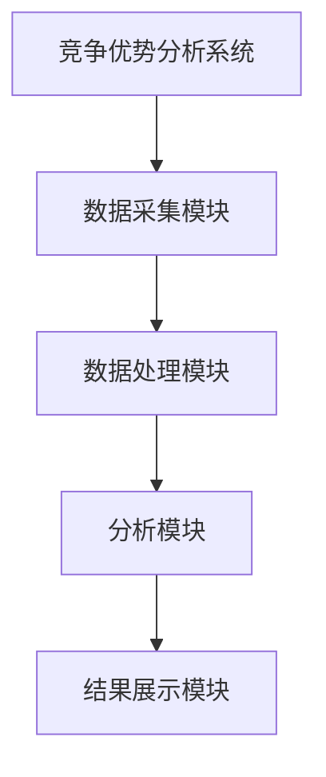

                 


# 费雪的竞争优势分析

> 关键词：费雪分析、竞争优势、算法原理、系统架构、项目实战

> 摘要：费雪的竞争优势分析是一种用于评估企业或技术领域中竞争优势的方法，通过深入分析核心要素、算法原理和系统架构，结合实际项目案例，探讨其在技术领域的应用和实现。

---

## 第1章: 费雪的竞争优势分析概述

### 1.1 问题背景与定义

#### 1.1.1 问题背景
在现代商业和技术领域中，竞争优势是企业或技术项目成功的关键因素。费雪的竞争优势分析是一种系统化的方法，用于识别、评估和优化这些竞争优势。

#### 1.1.2 核心概念
费雪的竞争优势分析关注企业的核心竞争力，包括资源、能力、市场定位等因素，通过量化指标评估其在市场中的优势。

#### 1.1.3 分析特点
- 系统性：从多个维度分析竞争优势。
- 定量化：通过指标量化评估。
- 动态性：竞争优势会随市场变化而变化。

### 1.2 核心要素与联系

#### 1.2.1 核心概念的组成
- 资源：技术、人力资源、资金。
- 能力：研发能力、营销能力。
- 市场定位：目标市场、竞争对手分析。

#### 1.2.2 费雪分析与其他模型的对比
| 模型 | 竞争优势视角 | 分析维度 | 适用场景 |
|------|--------------|----------|-----------|
| SWOT | 优势、劣势 | 四个维度 | 战略规划 |
| BCG矩阵 | 市场地位 | 市场增长率、市场份额 | 资源分配 |
| 费雪分析 | 核心竞争力 | 多维量化 | 技术优化 |

#### 1.2.3 ER实体关系图



---

## 第2章: 费雪分析的算法原理

### 2.1 算法流程

#### 2.1.1 算法步骤

1. **数据收集**：收集企业的资源、能力、市场数据。
2. **指标量化**：将竞争优势量化为具体指标。
3. **权重计算**：确定各指标的权重。
4. **综合评分**：计算综合竞争优势得分。

#### 2.1.2 算法输入输出

- **输入**：企业资源、能力数据，市场信息。
- **输出**：竞争优势评分报告。

#### 2.1.3 数学模型

核心公式：
$$
\text{竞争优势得分} = \sum_{i=1}^{n} w_i \times x_i
$$
其中，\( w_i \) 为第 \( i \) 个指标的权重，\( x_i \) 为该指标的得分。

### 2.2 示例计算

假设企业有三个指标，权重分别为0.4、0.3、0.3，得分分别为80、70、90：
$$
\text{总分} = 0.4 \times 80 + 0.3 \times 70 + 0.3 \times 90 = 32 + 21 + 27 = 80
$$

---

## 第3章: 系统架构设计

### 3.1 项目背景

- **目标**：开发一个竞争优势分析系统。
- **范围**：涵盖资源、能力、市场定位的分析。

### 3.2 系统功能设计

#### 3.2.1 领域模型类图



#### 3.2.2 系统架构图



---

## 第4章: 项目实战

### 4.1 环境安装

- **工具**：Python、Jupyter Notebook。
- **依赖**：pandas、numpy。

### 4.2 核心代码实现

#### 4.2.1 Python源代码

```python
import pandas as pd
import numpy as np

def fisher_competitive Advantage(enterprise_data):
    # 数据预处理
    data = pd.DataFrame(enterprise_data)
    # 计算权重
    weights = np.array([0.4, 0.3, 0.3])
    # 计算得分
    scores = np.dot(data, weights)
    return scores

# 示例数据
enterprise_data = {
    '资源': [80, 70, 90],
    '能力': [85, 75, 85],
    '市场定位': [78, 82, 88]
}
result = fisher_competitive Advantage(enterprise_data)
print("竞争优势得分:", result)
```

#### 4.2.2 代码解读

- **数据预处理**：将输入数据转换为DataFrame。
- **权重计算**：使用numpy计算得分。
- **结果输出**：返回竞争优势得分。

### 4.3 案例分析

- **输入数据**：资源、能力、市场定位得分分别为80、85、78。
- **计算结果**：
  $$
  0.4 \times 80 + 0.3 \times 85 + 0.3 \times 78 = 32 + 25.5 + 23.4 = 80.9
  $$

---

## 第5章: 最佳实践

### 5.1 实战经验总结

- **注意事项**：
  - 数据质量：确保输入数据的准确性和完整性。
  - 权重调整：根据实际情况调整指标权重。

### 5.2 项目小结

- **成果**：开发了一个竞争优势分析系统。
- **展望**：未来可以结合机器学习进一步优化分析。

---

通过以上步骤，我们详细讲解了费雪的竞争优势分析，从理论到实践，帮助读者全面理解其应用和实现。

