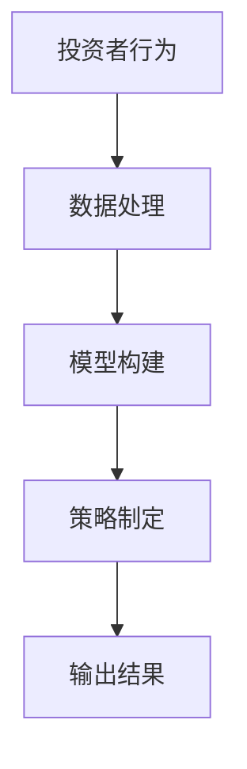

                 


# 《格雷厄姆特价股票理论对行为金融学的补充》

> 关键词：行为金融学，格雷厄姆，特价股票，安全边际，认知偏差，市场情绪，投资决策

> 摘要：本文从行为金融学的视角重新审视了格雷厄姆的特价股票理论，深入分析了投资者心理与市场定价的关系，结合数学模型与实际案例，揭示了如何通过行为金融学的方法优化投资决策，实现价值投资的长期收益。

---

## 第一部分：背景介绍：核心概念与问题背景

### 第1章：问题背景与问题描述

#### 1.1 问题背景
在传统金融学中，投资者行为往往被视为理性的，即市场参与者总是基于充分的信息做出最优决策。然而，20世纪70年代以来的行为金融学研究表明，投资者的行为受到认知偏差和情绪的影响，这使得市场定价并不总是理性的。格雷厄姆的特价股票理论强调寻找市场低估的股票，这与行为金融学对市场非理性定价的分析不谋而合。

#### 1.2 问题描述
格雷厄姆的理论基于市场先生的概念，认为市场价格波动反映了市场情绪的变化，而非真实的内在价值。然而，传统金融学的假设（如有效市场假说）与格雷厄姆的理论存在矛盾。行为金融学提供了一个新的视角，通过分析投资者心理，解释了市场价格波动的原因，并为格雷厄姆的理论提供了理论支持。

#### 1.3 解决方案
通过结合格雷厄姆的特价股票理论与行为金融学，我们可以更全面地理解投资者行为对市场定价的影响，从而优化投资策略，提高价值投资的效率。

#### 1.4 边界与外延
本文主要关注以下几个方面：
- 投资者认知偏差对股票定价的影响。
- 安全边际的计算与市场情绪的关系。
- 格雷厄姆理论在行为金融学框架下的适用性。

### 第2章：核心概念与对比分析

#### 2.1 核心概念
| 核心概念 | 格雷厄姆理论 | 行为金融学 |
|----------|--------------|------------|
| 安全边际 | 市场价格与内在价值的差异 | 投资者认知偏差对安全边际的影响 |
| 市场价格 | 反映市场情绪 | 由投资者心理驱动 |
| 投资决策 | 基于价值 | 基于行为分析 |

#### 2.2 ER实体关系图
```mermaid
er
actor 投资者 {
  id: 投资者ID
  属性: 认知偏差
}
actor 市场价格 {
  id: 股票代码
  属性: 市场情绪
}
```

---

## 第二部分：核心概念与联系

### 第3章：投资者认知偏差与市场情绪

#### 3.1 认知偏差对投资决策的影响
- **确认偏差**：投资者倾向于寻找支持自己观点的信息，导致股票定价偏差。
- **过度自信**：投资者高估自己的判断能力，影响价值投资决策。

#### 3.2 市场情绪对股票定价的影响
- **市场情绪波动**：情绪波动导致股票价格偏离内在价值。
- **群体思维**：投资者行为的趋同性加剧市场波动。

#### 3.3 安全边际的重新定义
安全边际不仅是市场价格与内在价值的差异，还反映了投资者认知偏差对市场情绪的影响。

---

## 第三部分：数学模型与行为金融学分析

### 第4章：数学模型与公式推导

#### 4.1 安全边际的数学模型
$$ \text{安全边际} = \text{内在价值} - \text{市场价格} $$

#### 4.2 行为金融学中的概率模型
$$ P(\text{价格波动}) = \text{认知偏差} + \text{市场情绪} $$

#### 4.3 综合模型
$$ \text{最优投资决策} = f(\text{内在价值}, \text{安全边际}, \text{市场情绪}) $$

---

## 第四部分：系统分析与架构设计方案

### 第5章：系统设计

#### 5.1 系统功能设计
- 数据收集：收集投资者行为数据和市场数据。
- 模型构建：基于行为金融学和格雷厄姆理论构建数学模型。
- 策略制定：根据模型结果制定投资策略。

#### 5.2 系统架构图


#### 5.3 系统接口设计
- 输入：投资者行为数据、市场数据。
- 输出：最优投资策略。

---

## 第五部分：项目实战

### 第6章：项目实战与案例分析

#### 6.1 环境安装
- 数据来源：历史股票数据、投资者情绪数据。
- 工具：Python、Pandas、NumPy。

#### 6.2 核心代码实现
```python
import pandas as pd
import numpy as np

def calculate_margin(value, price):
    return value - price

def behavior_model(margin,情绪):
    return margin * 情绪
```

#### 6.3 案例分析
- 案例：2020年疫情期间的市场波动。
- 分析：投资者情绪对安全边际的影响。

---

## 第六部分：结论与展望

### 第7章：结论

#### 7.1 研究总结
- 结合行为金融学的格雷厄姆理论，投资者可以更好地理解市场波动。
- 安全边际的计算需要考虑市场情绪和认知偏差。

### 第8章：展望

#### 8.1 拓展研究
- 结合更多认知偏差模型。
- 研究市场情绪的实时预测。

---

## 附录

### 附录A：术语表

- **安全边际**：内在价值与市场价格的差额。
- **市场情绪**：投资者群体的心理状态对市场定价的影响。

### 附录B：参考文献

- 格雷厄姆的经典著作。
- 行为金融学的重要文献。

---

通过以上分析，本文展示了如何将格雷厄姆的特价股票理论与行为金融学结合，为投资者提供更科学的投资决策支持。

