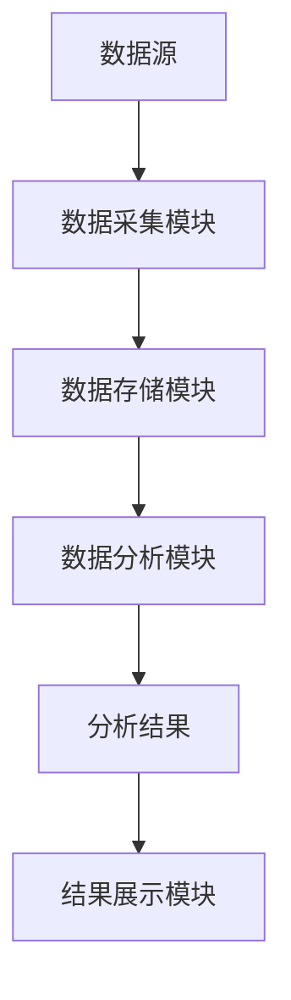

                 


# 特价股票与公司敏捷创新文化的深度分析方法

> 关键词：特价股票、敏捷创新文化、股票分析、算法原理、系统架构

> 摘要：本文将深度探讨特价股票与公司敏捷创新文化之间的关系，结合股票分析的核心方法论，系统性地分析如何利用敏捷创新文化提升股票分析的效率与准确性。通过数学模型、算法原理和系统架构的详细阐述，本文将为投资者和企业提供一套全新的视角来审视特价股票市场的机遇与挑战。

---

# 第1章: 特价股票的定义与特征

## 1.1 特价股票的定义

### 1.1.1 特价股票的定义与范围
特价股票通常指价格低于某一特定基准（如2美元）的股票，具有高波动性和高风险的特点。这些股票通常来自小盘股或处于困境中的公司，但同时也可能隐藏着投资机会。

### 1.1.2 特价股票的分类与特点
- **分类**：
  - 根据行业：如科技、金融、制造等行业的特价股票。
  - 根据市场：如创业板、主板的特价股票。
  - 根据公司规模：如小盘股、中盘股的特价股票。
  
- **特点**：
  - 价格波动剧烈。
  - 市值较小，流动性较低。
  - 风险高，回报潜力大。

### 1.1.3 特价股票的投资价值分析
投资者选择特价股票时，需要关注以下关键指标：
- 公司基本面：盈利能力、资产负债率、现金流等。
- 市场情绪：市场波动、投资者情绪对股票价格的影响。
- 行业趋势：行业前景对股票价值的影响。

---

## 1.2 敏捷创新文化的定义

### 1.2.1 敏捷创新文化的起源与背景
敏捷创新文化起源于软件开发领域，强调快速迭代、客户合作和持续改进。其核心思想是通过灵活的组织结构和高效的团队协作，快速响应市场变化。

### 1.2.2 敏捷创新文化的特征与优势
- **特征**：
  - 灵活性：能够快速调整策略和方向。
  - 可扩展性：适用于不同规模和类型的组织。
  - 用户中心：注重客户反馈和需求。

- **优势**：
  - 提高企业对市场变化的反应速度。
  - 降低失败风险，通过快速迭代优化产品和服务。
  - 提高团队士气和创造力。

### 1.2.3 敏捷创新文化的核心要素
- 团队协作：强调跨部门合作和扁平化管理。
- 持续改进：通过反馈和优化不断改进产品和服务。
- 客户导向：以客户需求为核心驱动创新。

---

## 1.3 特价股票与敏捷创新文化的关联

### 1.3.1 特价股票市场的特点
- **波动性**：价格波动剧烈，市场情绪主导。
- **风险与机会**：高风险伴随着高回报的潜力。
- **市场参与**：参与者包括机构投资者、散户和投机者。

### 1.3.2 敏捷创新文化对企业的影响
- 提高企业对市场变化的敏感度。
- 优化企业内部决策流程，快速响应市场变化。
- 提升企业的创新能力，抓住市场机会。

---

## 1.4 特价股票分析的核心方法论

### 1.4.1 特价股票分析的框架
- **数据采集**：收集历史价格、财务数据、行业趋势等。
- **数据分析**：通过统计分析和算法建模预测股票走势。
- **决策支持**：基于分析结果制定投资策略。

### 1.4.2 敏捷创新文化在股票分析中的应用
- **快速迭代**：通过持续优化分析模型提高预测准确性。
- **团队协作**：跨学科团队合作提高分析效率。
- **客户导向**：根据投资者需求定制分析工具和服务。

---

## 1.5 算法原理与数学模型

### 1.5.1 特价股票价格波动模型
#### 1.5.1.1 时间序列分析模型
$$ P(t) = \alpha + \beta t + \epsilon_t $$
其中，$P(t)$ 表示第 $t$ 时刻的价格，$\alpha$ 和 $\beta$ 是模型参数，$\epsilon_t$ 是随机误差项。

#### 1.5.1.2 随机游走模型
$$ P(t) = P(t-1) + \epsilon_t $$
表示价格的变动是随机的，无法通过历史数据预测未来价格。

---

## 1.6 系统架构设计

### 1.6.1 系统功能模块
- **数据采集模块**：负责收集股票价格、财务数据等。
- **数据分析模块**：进行数据清洗、特征提取和建模。
- **结果展示模块**：以可视化方式呈现分析结果。

### 1.6.2 系统架构图


---

## 1.7 项目实战

### 1.7.1 环境搭建
- 数据源：使用Yahoo Finance API获取历史数据。
- 工具：Python、Pandas、Matplotlib、Scikit-learn。

### 1.7.2 核心代码实现
```python
import pandas as pd
import numpy as np
from sklearn.linear_model import LinearRegression

# 数据加载
data = pd.read_csv('stock_data.csv')
data['date'] = pd.to_datetime(data['date'])

# 特征提取
features = data[['open', 'high', 'low', 'volume']]
labels = data['close']

# 模型训练
model = LinearRegression()
model.fit(features, labels)

# 预测与评估
predicted = model.predict(features)
print('预测准确性：', model.score(features, labels))
```

---

## 1.8 总结与展望

### 1.8.1 总结
本文从特价股票和敏捷创新文化的定义出发，分析了两者之间的关系，并提出了基于敏捷创新文化的股票分析方法。通过数学模型和系统架构的设计，为投资者提供了新的分析视角。

### 1.8.2 展望
未来，随着人工智能和大数据技术的发展，敏捷创新文化在股票分析中的应用将更加广泛和深入。投资者可以通过更加灵活和高效的分析方法，抓住市场中的更多机会。

---

接下来的文章将围绕这些核心内容展开详细分析，通过实际案例和系统设计，进一步探讨如何将敏捷创新文化应用于股票分析的实践中。

