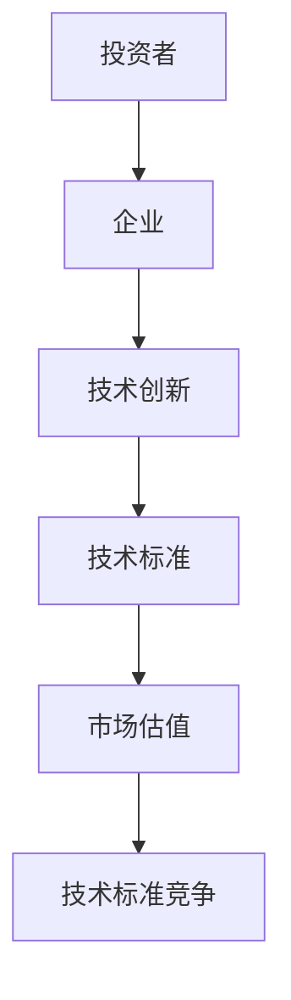

                 

# 股市估值差异对国际技术标准竞争的影响

> 关键词：股市估值差异、国际技术标准、技术标准竞争、股市估值、技术创新、投资者预期

> 摘要：股市估值差异是指不同市场或企业间股票估值的差异，这种差异对国际技术标准的竞争有着深远的影响。本文通过分析股市估值差异对技术创新和市场预期的影响，探讨其如何影响技术标准的竞争格局，并通过案例分析和系统模型，揭示两者之间的内在联系和相互作用机制。

---

## 第一部分: 背景与概念

### 第1章: 股市估值差异的定义与特征

#### 1.1 股市估值差异的定义
股市估值差异是指在不同市场、行业或企业之间，股票的市场估值存在显著差异的现象。这种差异通常由市场结构、投资者预期、信息不对称等因素引起。

#### 1.2 股市估值差异的衡量指标
- 市盈率（P/E Ratio）：市盈率=股价/每股收益，衡量市场对股票的估值。
- 市净率（P/B Ratio）：市净率=股价/每股净资产，反映市场对资产的估值。
- 市销率（P/S Ratio）：市销率=股价/每股收入，适用于亏损企业的估值。

#### 1.3 股市估值差异的分类与特征
- 市场性差异：不同市场的估值差异，如美股与港股的差异。
- 行业性差异：不同行业的估值差异，如科技股与传统制造业的差异。
- 企业性差异：同一行业内的不同企业的估值差异。

---

### 第2章: 国际技术标准竞争的定义与特征

#### 2.1 国际技术标准的定义
国际技术标准是指在国际范围内被广泛接受和采用的技术规范，通常由行业协会或国际组织制定。

#### 2.2 技术标准竞争的核心要素
- 技术创新：技术标准的核心竞争力。
- 市场接受度：用户对技术标准的接受程度。
- 制定机构的影响力：国际组织或行业协会的权威性。

#### 2.3 国际技术标准竞争的驱动因素
- 技术创新的需求：企业为了技术领先而推动新标准的制定。
- 市场扩张的需要：企业通过技术标准进入新市场。
- 政策支持：政府通过政策引导技术标准的发展。

---

### 第3章: 股市估值差异与国际技术标准竞争的关系

#### 3.1 估值差异对技术创新的影响
- 投资者预期与技术创新的关系：投资者的高估值预期可能推动企业加大研发投入。
- 市场估值与企业研发投入的互动：高估值企业更有可能投入资源进行技术创新。

#### 3.2 技术创新对技术标准的影响
- 技术创新塑造技术标准：企业的技术创新能力决定了其在技术标准制定中的话语权。
- 技术标准反向影响技术创新：技术标准的普及可能限制企业的技术创新空间。

---

## 第二部分: 案例分析与机制分析

### 第4章: 典型行业的股市估值差异与技术标准竞争分析

#### 4.1 半导体行业的案例分析
- 半导体行业的估值差异现状：科技股的高估值与传统制造企业的低估值对比。
- 技术标准竞争格局：如半导体制造技术的国际标准竞争。
- 估值差异对技术标准竞争的影响：高估值企业的技术创新能力更强，可能主导技术标准的制定。

#### 4.2 通信设备行业的案例分析
- 通信设备行业的估值差异现状：如5G设备制造企业的高估值与传统通信设备企业的低估值。
- 技术标准竞争格局：如5G国际标准的竞争。
- 估值差异对技术标准竞争的影响：高估值企业更有可能推动技术创新，从而影响技术标准的竞争。

---

### 第5章: 股市估值差异对国际技术标准竞争的影响机制

#### 5.1 市场预期与技术创新的关系
- 投资者预期影响技术创新：高估值预期可能促使企业加大研发投入。
- 技术创新影响市场预期：技术创新成果可能提升企业的市场估值。

#### 5.2 技术创新与技术标准的竞争路径
- 技术创新塑造技术标准：企业通过技术创新确立其技术标准的话语权。
- 技术标准的普及与技术创新的互动：技术标准的广泛应用可能促进技术创新。

#### 5.3 综合影响路径的系统分析
- 从估值差异到技术创新：高估值企业更有可能投入资源进行技术创新。
- 从技术创新到技术标准竞争：技术创新能力强的企业可能主导技术标准的制定。
- 综合影响路径：估值差异→技术创新→技术标准竞争。

---

## 第三部分: 系统分析与应对策略

### 第6章: 股市估值差异对国际技术标准竞争的系统分析

#### 6.1 问题场景介绍
- 技术标准竞争的核心问题：技术创新能力与市场估值的相互影响。
- 股市估值差异对企业技术创新的影响：高估值企业更有可能推动技术创新。

#### 6.2 系统功能设计
- 领域模型类图：展示企业、投资者、技术标准制定机构之间的关系。
- 系统架构设计：展示系统各模块的交互与依赖关系。

#### 6.3 系统架构图

---

### 第7章: 应对股市估值差异的国际技术标准竞争策略

#### 7.1 优化技术创新机制
- 企业层面：加大研发投入，提升技术创新能力。
- 投资者层面：优化估值模型，避免过度估值或低估。

#### 7.2 政府与国际组织的协调作用
- 政府：通过政策引导，促进技术创新与技术标准的协调发展。
- 国际组织：制定公平的技术标准竞争规则，减少估值差异的影响。

---

## 第四部分: 总结与展望

### 第8章: 总结与展望

#### 8.1 核心结论
- 股市估值差异对国际技术标准竞争有显著影响。
- 高估值企业更有可能推动技术创新，从而影响技术标准的竞争格局。

#### 8.2 未来研究方向
- 进一步研究估值差异与技术创新的具体关系。
- 探讨更多行业的案例，丰富研究内容。

---

## 第五部分: 附录

### 附录A: 数据来源与分析方法
- 数据来源：股票估值数据、技术标准竞争数据。
- 分析方法：回归分析、案例研究。

### 附录B: 典型案例分析
- 半导体行业的详细分析。
- 通信设备行业的详细分析。

### 附录C: 政策建议
- 优化估值模型，促进技术创新。
- 加强国际合作，制定公平的技术标准竞争规则。

---

通过以上结构，我们可以系统地分析股市估值差异对国际技术标准竞争的影响，为企业、投资者和政策制定者提供有价值的参考。

