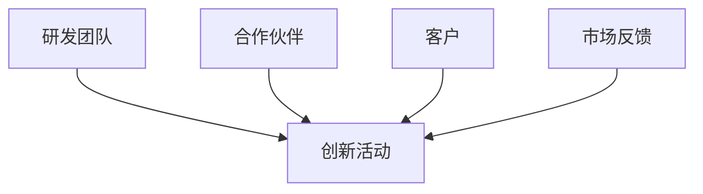
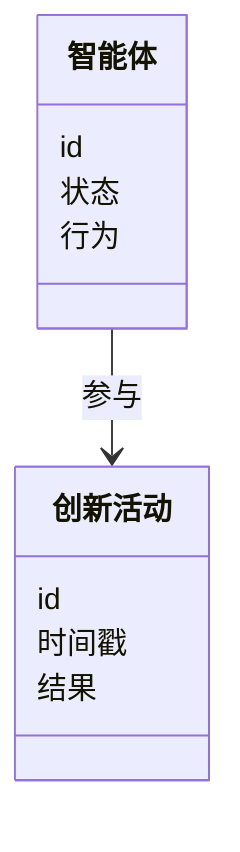

                 


# 多智能体系统在公司创新生态系统评估中的应用

> 关键词：多智能体系统、创新生态系统、评估模型、协作机制、系统架构、动态交互、数据驱动

> 摘要：本文探讨了多智能体系统在公司创新生态系统评估中的应用。通过分析多智能体系统的定义、核心概念、算法原理、系统架构设计，以及实际项目案例，展示了如何利用多智能体系统构建动态、实时的创新评估模型。本文还总结了多智能体系统的优势、挑战和最佳实践，为公司创新生态系统评估提供了新的视角和解决方案。

---

## 第1章：多智能体系统概述

### 1.1 多智能体系统的定义与特点
多智能体系统（Multi-Agent Systems，MAS）由多个智能体（agent）组成，每个智能体能够感知环境、自主决策并与其他智能体协作或竞争。与传统单智能体系统相比，多智能体系统的优点在于其动态性、协作性和分布性，适用于复杂问题的解决。

#### 1.1.1 多智能体系统的定义
- 智能体（Agent）：具备感知、推理、规划和行动能力的实体。
- 多智能体系统：多个智能体通过交互和协作完成共同目标的系统。

#### 1.1.2 多智能体系统的特征
| 特性 | 描述 |
|------|------|
| 分布性 | 智能体独立运行，分布在网络中 |
| 协作性 | 智能体之间通过协作完成复杂任务 |
| 动态性 | 系统环境和智能体状态不断变化 |
| 自主性 | 智能体能够自主决策和行动 |

### 1.2 多智能体系统在公司创新生态系统评估中的应用背景
公司创新生态系统由内部团队、合作伙伴、客户和市场构成，涉及多个利益相关者。传统的评估方法通常静态、单一，难以捕捉动态变化。多智能体系统的动态性和协作性使其成为创新生态系统评估的理想工具。

---

## 第2章：核心概念与联系

### 2.1 创新生态系统评估的核心概念
创新生态系统评估需要考虑创新活动的多个维度，包括研发能力、团队协作、市场反馈和资源分配。

#### 2.1.1 创新生态系统的核心要素
- **研发团队**：负责技术开发和创新。
- **合作伙伴**：提供外部资源和支持。
- **市场反馈**：影响产品方向和技术创新。
- **资源分配**：优化资源配置以支持创新。

### 2.2 多智能体系统与创新生态系统的关系
多智能体系统的智能体可以分别代表创新生态系统中的不同角色，如研发团队、合作伙伴和客户。

#### 2.2.1 实体关系图
使用Mermaid绘制创新生态系统中的实体关系图：



---

## 第3章：算法原理

### 3.1 多智能体系统的核心算法
多智能体系统的算法包括分布式计算、协调机制和动态规划。

#### 3.1.1 分布式计算
分布式计算将任务分解为多个部分，由不同智能体分别处理。例如，使用分布式一致性算法（如Paxos）保证系统的一致性。

#### 3.1.2 协调机制
智能体之间通过消息传递进行协作。使用协商算法（如分布式协商）达成一致。

#### 3.1.3 动态规划
动态规划用于处理多智能体系统的动态性问题，优化决策路径。

#### 3.1.4 数学模型
多智能体系统中的协作可以用数学模型描述：

$$ V(i) = \max_{a_i} \sum_{j \neq i} V(j) $$

其中，$V(i)$ 表示智能体$i$的效用，$a_i$ 表示智能体$i$的行动。

---

## 第4章：系统分析与架构设计

### 4.1 系统架构设计
创新生态系统评估的多智能体系统架构包括数据采集层、智能体协作层和评估层。

#### 4.1.1 领域模型
使用Mermaid类图展示领域模型：



#### 4.1.2 系统架构图
使用Mermaid架构图展示系统架构：


---

## 第5章：项目实战

### 5.1 项目背景
某公司希望评估其创新生态系统，优化资源配置。

#### 5.1.1 系统设计
设计创新活动监测和评估系统，实时跟踪创新活动并生成评估报告。

#### 5.1.2 核心代码实现
使用Python实现多智能体系统：

```python
class Agent:
    def __init__(self, id):
        self.id = id
        self.state = "idle"

    def act(self, action):
        # 处理动作
        pass

# 初始化智能体
agents = [Agent(i) for i in range(5)]

# 智能体协作
for agent in agents:
    agent.act("monitor")
```

#### 5.1.3 案例分析
通过代码实现创新活动的实时监测和评估，生成动态报告。

---

## 第6章：应用案例与最佳实践

### 6.1 应用案例
分析某公司使用多智能体系统优化创新生态系统的过程，展示实际应用的效果。

### 6.2 最佳实践
- **选择合适的工具**：根据需求选择适合的多智能体系统框架。
- **数据驱动**：利用实时数据优化系统性能。
- **系统维护**：定期更新智能体策略以适应变化。

---

## 结语

多智能体系统为公司创新生态系统评估提供了强大的工具，通过动态、协作的方式优化创新过程。尽管面临挑战，但通过合理设计和实践，多智能体系统能够在创新生态系统评估中发挥重要作用。

---

**温馨提示**：本文内容基于多智能体系统理论和实际项目经验，旨在为公司创新生态系统评估提供新的视角和解决方案。

