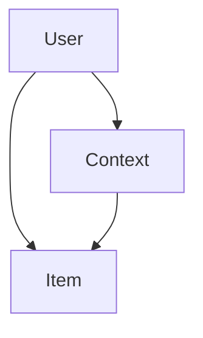
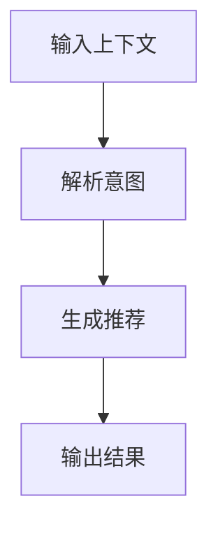
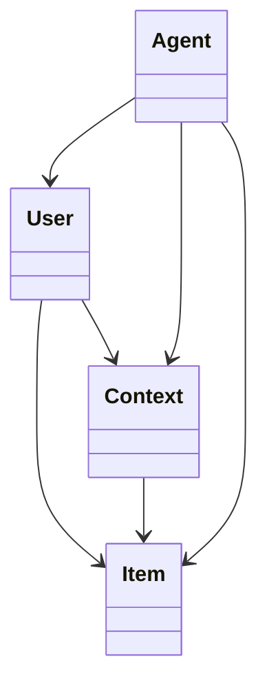

                 


# 开发AI Agent的上下文感知推荐系统

## 关键词：AI Agent, 上下文感知推荐系统, 自然语言处理, 推荐算法, 系统架构, 项目实战

## 摘要：  
本文将详细探讨开发AI Agent驱动的上下文感知推荐系统的背景、核心概念、算法原理、系统架构以及项目实战。通过逐步分析，本文旨在帮助读者理解如何结合自然语言处理和推荐算法，构建一个能够根据上下文信息提供智能化推荐的系统。文章还将通过实际案例分析，展示如何在项目中实现这一系统，并提供相关的最佳实践和优化建议。

---

# 第一部分: AI Agent与上下文感知推荐系统背景介绍

# 第1章: 问题背景与核心概念

## 1.1 问题背景  
### 1.1.1 当前推荐系统的局限性  
传统的推荐系统通常基于用户的历史行为数据或协同过滤算法，但这些系统往往忽略了用户在特定场景下的实时需求和上下文信息。例如，用户在搜索“滑雪装备”时，系统可能无法区分用户是想购买装备还是寻找滑雪教程。  

### 1.1.2 上下文感知推荐的必要性  
上下文感知推荐系统能够根据用户的行为、位置、时间以及其他环境信息，实时调整推荐结果。这种推荐方式能够显著提高推荐的精准度和用户满意度。  

### 1.1.3 AI Agent在推荐系统中的作用  
AI Agent（智能代理）能够主动理解用户需求，并根据上下文信息动态调整推荐策略。通过结合自然语言处理和机器学习技术，AI Agent能够更准确地捕捉用户的意图，并提供个性化的推荐。

## 1.2 核心概念与问题描述  
### 1.2.1 AI Agent的定义与特征  
- **定义**：AI Agent是一种能够感知环境、理解用户需求并主动执行任务的智能实体。  
- **特征**：自主性、反应性、目标导向、学习能力。  

### 1.2.2 上下文感知推荐系统的定义  
- **定义**：一种能够根据用户的上下文信息（如位置、时间、行为、情绪等）动态调整推荐结果的推荐系统。  

### 1.2.3 问题解决的边界与外延  
- **边界**：仅关注用户在特定场景下的需求，不涉及全局推荐策略的调整。  
- **外延**：可以扩展到多模态数据（如图像、视频）的处理，进一步提升推荐的精准度。  

## 1.3 核心要素与概念结构  
- **核心要素**：用户、上下文、目标、推荐结果、AI Agent。  
- **概念结构**：用户通过AI Agent提供上下文信息，系统根据这些信息生成推荐结果。  

---

# 第二部分: 核心概念与联系

# 第2章: AI Agent与上下文感知推荐系统的核心原理  

## 2.1 核心概念原理  
### 2.1.1 AI Agent的决策机制  
AI Agent通过自然语言处理技术解析用户的输入，结合上下文信息生成推荐结果。  

### 2.1.2 上下文感知推荐的实现原理  
- **输入**：用户的查询、位置、时间等信息。  
- **处理**：解析上下文信息，结合推荐算法生成推荐列表。  
- **输出**：个性化推荐结果。  

## 2.2 概念属性特征对比  
| 概念 | 特性 |  
|------|------|  
| AI Agent | 自主性、学习能力 |  
| 上下文感知推荐系统 | 实时性、动态调整 |  

## 2.3 ER实体关系图  


---

# 第三部分: 算法原理讲解  

# 第3章: 算法原理与实现  

## 3.1 算法原理  
### 3.1.1 自然语言处理模型（如BERT）  
- **BERT模型**：用于解析用户的自然语言输入，生成上下文表示。  

### 3.1.2 推荐算法（如协同过滤）  
- **协同过滤**：基于用户的相似性或物品的相似性生成推荐列表。  

## 3.2 算法流程图  


## 3.3 算法实现代码  
```python
def context-aware_recommendation(context):
    # 示例代码
    pass
```

---

# 第四部分: 系统分析与架构设计  

# 第4章: 系统架构与设计  

## 4.1 问题场景介绍  
### 4.1.1 用户需求分析  
- 用户希望根据实时上下文信息获得个性化推荐。  

### 4.1.2 系统目标设定  
- 实现一个能够根据用户输入生成上下文感知推荐的系统。  

## 4.2 系统功能设计  
### 4.2.1 领域模型类图  


---

# 第五部分: 项目实战  

# 第5章: 项目实战与案例分析  

## 5.1 环境安装  
### 5.1.1 安装Python与相关库  
- 安装Python 3.x  
- 安装TensorFlow、Keras、BERT等库。  

## 5.2 核心实现  
### 5.2.1 实现自然语言处理模块  
```python
def parse_context(context):
    # 示例代码
    return parsed_context
```

### 5.2.2 实现推荐算法模块  
```python
def collaborative_filtering(user_id):
    # 示例代码
    return recommendations
```

## 5.3 案例分析  
- 通过具体案例分析，展示如何实现上下文感知推荐系统。  

---

# 第六部分: 最佳实践  

# 第6章: 最佳实践与总结  

## 6.1 小结  
- 总结本文的主要内容和关键点。  

## 6.2 注意事项  
- 系统优化、性能调优、代码规范等。  

## 6.3 拓展阅读  
- 推荐相关书籍、论文和资源。  

---

# 第七部分: 参考文献  

## 7.1 参考文献  
- TensorFlow官方文档  
- BERT论文  
- 协同过滤相关文献  

---

以上是《开发AI Agent的上下文感知推荐系统》的技术博客文章的目录大纲和内容概要。文章通过逐步分析，深入浅出地讲解了开发该系统的背景、核心概念、算法原理、系统架构以及项目实战，为读者提供了一套完整的开发指南。

