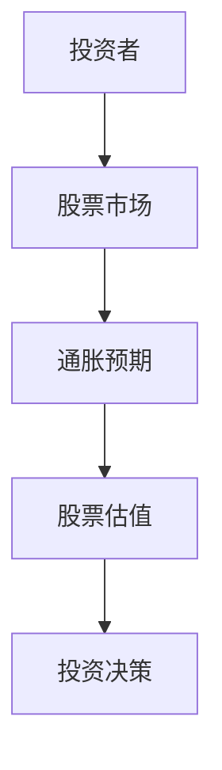
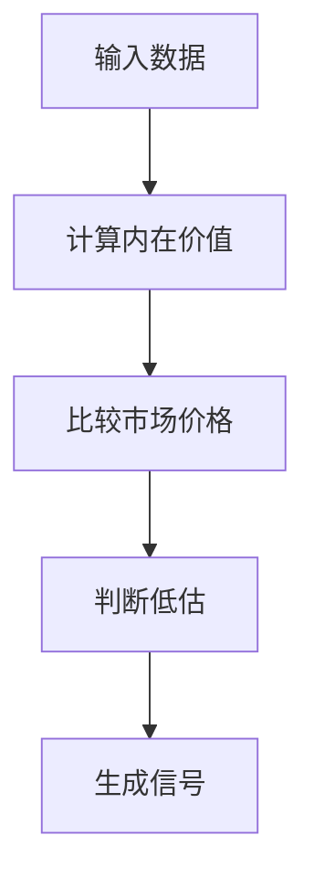
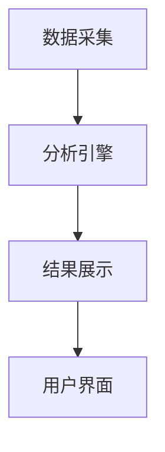

                 


# 格雷厄姆特价股票策略在不同通胀预期环境中的效果

## 关键词：格雷厄姆策略，特价股票，通胀预期，价值投资，股票估值

## 摘要

本文探讨格雷厄姆的价值投资策略在不同通胀预期环境下的效果。通过分析通胀对股市的影响，构建数学模型，评估策略的有效性，并提出优化建议。文章结合理论与实证，为投资者提供在通胀环境下应用格雷厄姆策略的指导。

---

## 第1章：格雷厄姆特价股票策略概述

### 1.1 格雷厄姆投资理论的起源

格雷厄姆是价值投资之父，提出“烟蒂投资”策略，寻找市场价格远低于内在价值的股票。他的理论强调安全边际，认为市场波动提供投资机会。

### 1.2 通胀预期的定义与影响

通胀预期指市场对未来通胀率的预期，影响股市表现。高通胀可能导致股市波动，影响股票估值，尤其是依赖现金流折现的模型。

### 1.3 格雷厄姆策略与通胀预期的关联

格雷厄姆策略在通缩环境表现良好，但高通胀环境可能削弱其效果。本文研究通胀预期对策略的影响，提出调整方法。

---

## 第2章：核心概念与联系

### 2.1 核心概念对比

| 概念         | 格雷厄姆策略                  | 通胀预期                  |
|--------------|-------------------------------|---------------------------|
| 核心目标     | 发现低估股票                  | 预测通胀对股市影响         |
| 方法论       | 价值评估，安全边际            | 经济模型，预期分析          |
| 输入数据     | 历史价格，财务数据            | 经济指标，市场预期          |
| 输出结果     | 投资建议，买入信号            | 市场预测，投资策略调整       |

### 2.2 实体关系图



---

## 第3章：算法原理与数学模型

### 3.1 格雷厄姆策略的算法流程



### 3.2 数学模型

格雷厄姆的内在价值公式：

$$
\text{内在价值} = \frac{\text{现金流}}{\text{折现率}}
$$

考虑通胀的调整公式：

$$
\text{调整后价值} = \frac{\text{现金流}}{\text{折现率} \times (1+\text{通胀率})}
$$

### 3.3 Python实现

```python
def calculate_intrinsic_value(cash_flow, discount_rate, inflation_rate):
    return cash_flow / (discount_rate * (1 + inflation_rate))

# 示例
cash_flow = 100
discount_rate = 0.05
inflation_rate = 0.02

value = calculate_intrinsic_value(cash_flow, discount_rate, inflation_rate)
print(value)
```

---

## 第4章：系统分析与架构设计

### 4.1 系统功能设计

模块化设计：

1. 数据采集模块：获取股票数据和经济指标。
2. 分析引擎：计算估值，考虑通胀调整。
3. 结果展示：可视化分析结果。

### 4.2 系统架构图



### 4.3 接口设计

API接口：

```python
def get_data(inflation_rate):
    return inflation_rate

def calculate_value(price, cash_flow, rate):
    return price / rate
```

---

## 第5章：项目实战

### 5.1 环境搭建

安装Python和相关库：

```bash
pip install pandas numpy
```

### 5.2 核心实现代码

```python
import pandas as pd
import numpy as np

def calculate_adjusted_value(df, inflation_rate):
    df['调整后价值'] = df['现金流'] / (df['折现率'] * (1 + inflation_rate))
    return df

# 示例数据
data = {
    '股票代码': ['AAPL', 'GOOG'],
    '现金流': [100, 150],
    '折现率': [0.05, 0.06],
    '通胀率': [0.02, 0.03]
}
df = pd.DataFrame(data)
adjusted_df = calculate_adjusted_value(df, 0.02)
print(adjusted_df)
```

### 5.3 案例分析

以苹果公司为例，在2%和3%的通胀预期下，计算其调整后的内在价值，比较传统策略与调整后策略的差异。

---

## 第6章：总结与展望

### 6.1 最佳实践

1. 在高通胀环境下，调整折现率，考虑通胀对现金流的影响。
2. 结合其他指标，如PEG，增强策略的有效性。
3. 定期回顾和调整投资组合，应对通胀变化。

### 6.2 小结

本文分析格雷厄姆策略在通胀环境下的应用，提出优化方法。通过理论与实证结合，为投资者提供指导。

### 6.3 注意事项

- 数据质量影响结果，需选择可靠的来源。
- 模型假设简化实际，需结合市场实际情况调整。
- 投资需考虑宏观经济因素，避免过度依赖单一策略。

### 6.4 拓展阅读

- 格雷厄姆的《 Intelligent Investor》
- 现代投资组合理论

---

通过以上结构，本文系统地分析了格雷厄姆策略在不同通胀预期下的效果，结合理论模型和实证分析，为投资者提供了实用的指导和优化建议。

