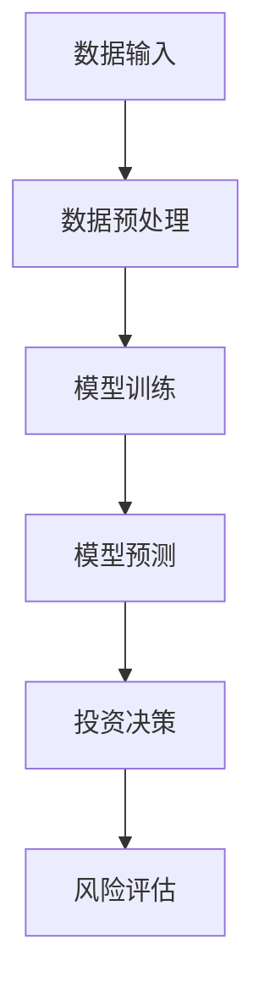

                 


# 《股市估值高低对企业网络安全投资策略的影响》

## 关键词：股市估值、企业网络安全、投资策略、数学模型、系统架构

## 摘要：  
本文探讨了股市估值的高低对企业网络安全投资策略的影响，分析了两者之间的内在联系，并提出了基于股市估值优化网络安全投资的数学模型和系统架构设计。通过案例分析和算法实现，本文为企业在不同市场环境下制定合理的网络安全投资策略提供了理论依据和实践指导。

---

# 第一部分：背景介绍

## 第1章：股市估值与企业网络安全投资概述

### 1.1 股市估值的基本概念

#### 1.1.1 股市估值的定义与计算方法  
股市估值是指通过对企业的财务状况、行业地位、市场前景等因素进行评估，确定其股票的市场价值。常用的估值方法包括市盈率（P/E）和市净率（P/B）。市盈率 = 股价 / 每股净利润，市净率 = 股价 / 每股净资产。

#### 1.1.2 企业网络安全投资的定义与范围  
企业网络安全投资是指企业在防护数据泄露、网络攻击等方面投入的资源和资金。包括硬件设备采购、软件开发、人员培训等。

#### 1.1.3 股市估值与企业网络安全投资的关系  
股市估值反映了投资者对企业的信心，高估值意味着市场对企业前景的看好，可能促使企业增加安全投入；反之，低估值可能导致企业压缩安全预算。

---

## 第2章：核心概念与联系

### 2.1 核心概念原理

#### 2.1.1 股市估值的核心要素  
- 财务表现：净利润、营业收入等。
- 行业地位：市场占有率、竞争格局。
- 市场预期：行业前景、政策变化。

#### 2.1.2 网络安全投资的核心要素  
- 技术投入：防火墙、入侵检测系统等。
- 人员投入：安全团队的规模和能力。
- 管理投入：安全策略的制定与执行。

#### 2.1.3 两者之间的相互作用机制  
股市估值影响企业预算，进而影响安全投入；而安全投入的多少又会影响企业的风险敞口，间接影响股市估值。

---

## 第3章：数学模型与算法原理

### 3.1 数学模型

#### 3.1.1 股市估值与网络安全投资的关系模型  
$$ V = f(P, S) $$  
其中，\( V \) 表示网络安全投资强度，\( P \) 表示股市估值，\( S \) 表示安全需求。

#### 3.1.2 具体模型实现  
$$ 投资强度 = \beta_0 + \beta_1 \times 股市估值 + \beta_2 \times 安全需求 $$  
通过回归分析，确定各参数的权重。

### 3.2 算法原理

#### 3.2.1 基于回归分析的预测模型  
$$ Y = \beta_0 + \beta_1X + \epsilon $$  
其中，\( Y \) 表示网络安全投资，\( X \) 表示股市估值，\( \epsilon \) 为误差项。

#### 3.2.2 算法实现步骤  
1. 数据收集：收集企业的股市估值和网络安全投资数据。
2. 数据预处理：去除异常值，标准化处理。
3. 模型训练：使用线性回归算法训练模型。
4. 模型验证：通过交叉验证评估模型性能。
5. 模型应用：基于当前股市估值预测网络安全投资。

---

## 第4章：系统分析与架构设计

### 4.1 问题场景介绍

#### 4.1.1 高估值下的过度投资风险  
企业可能因为高估值而过度投资，导致资源浪费。

#### 4.1.2 低估值下的投资不足问题  
企业可能因为低估值而减少安全投入，增加风险敞口。

### 4.2 系统功能设计

#### 4.2.1 预测模块  
- 输入：股市估值、安全需求。
- 输出：预测的投资强度。

#### 4.2.2 投资决策模块  
- 输入：预测结果。
- 输出：优化后的投资策略。

#### 4.2.3 风险评估模块  
- 输入：企业实际安全投入。
- 输出：风险评估报告。

### 4.3 系统架构设计

#### 4.3.1 系统架构图  


---

## 第5章：系统实现与案例分析

### 5.1 项目实战

#### 5.1.1 环境安装  
- 安装Python、Pandas、Scikit-learn等库。

#### 5.1.2 核心代码实现  
```python
import pandas as pd
from sklearn.linear_model import LinearRegression
from sklearn.metrics import mean_squared_error

# 数据加载
data = pd.read_csv('security_investment.csv')

# 数据预处理
X = data[['市盈率', '市净率']]
y = data['投资强度']

# 模型训练
model = LinearRegression()
model.fit(X, y)

# 模型预测
y_pred = model.predict(X)

# 模型评估
mse = mean_squared_error(y, y_pred)
print(f"均方误差：{mse}")
```

---

## 第6章：总结与展望

### 6.1 总结

本文通过分析股市估值与企业网络安全投资的关系，提出了基于回归分析的数学模型，并设计了相应的系统架构。通过案例分析，验证了模型的有效性。

### 6.2 展望

未来可以进一步研究其他因素（如宏观经济指标）对网络安全投资的影响，优化模型以提高预测精度。

---

通过以上步骤，我们完成了从理论分析到系统实现的全过程，为企业制定动态的网络安全投资策略提供了科学依据。

