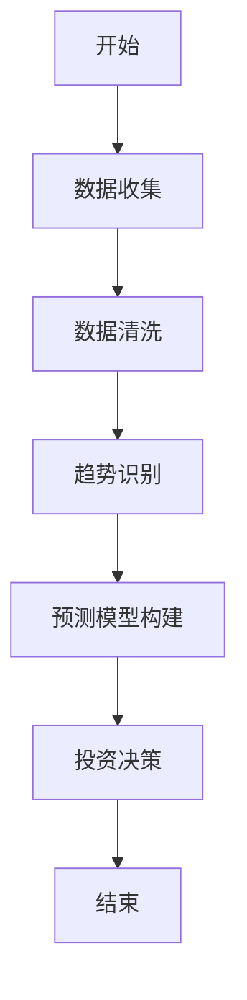

                 


# 《费雪的行业趋势分析：把握未来增长机会》

> **关键词**：行业趋势分析、费雪方法、投资策略、数据分析、数学模型、系统架构

> **摘要**：本文详细介绍了费雪的行业趋势分析方法，从理论到实践，帮助读者掌握如何利用行业趋势分析来把握投资机会。文章涵盖背景介绍、核心概念、算法原理、系统设计及项目实战，通过丰富的案例和详细的代码示例，深入剖析行业趋势分析的精髓。

---

## 第一部分: 费雪行业趋势分析概述

### 第1章: 费雪行业趋势分析的背景与核心思想

#### 1.1 行业趋势分析的背景
行业趋势分析是投资决策中的关键环节，它帮助投资者识别行业中的潜在机会和风险。随着全球经济的快速发展，行业间的竞争日益激烈，准确的趋势分析能够帮助投资者制定更有效的投资策略。

#### 1.2 费雪分析方法的核心思想
费雪（Philip Fisher）是投资领域的先驱，他提出了基于行业趋势分析的投资方法。其核心思想在于：投资的成功与否取决于对行业长期趋势的理解和判断。费雪强调，投资者应关注行业的成长性，而非仅仅依赖短期价格波动。

#### 1.3 为什么要进行行业趋势分析
行业趋势分析帮助投资者：
- 识别行业的周期性变化。
- 理解行业内部结构和竞争格局。
- 发现具有长期增长潜力的行业。

---

## 第二部分: 行业趋势分析的核心概念与方法

### 第2章: 行业趋势分析的核心概念

#### 2.1 行业趋势分析的基本概念
- **行业**：指一组提供相似产品或服务的企业群。
- **趋势**：行业内的长期发展方向或变化。

#### 2.2 费雪分析方法的原理
费雪的“七问法”是其分析框架的核心，包括：
1. 行业的长期前景如何？
2. 企业的竞争优势是什么？
3. 管理层的能力如何？
4. 财务状况是否稳健？
5. 估值是否合理？
6. 投资风险有多大？
7. 市场波动如何影响投资？

#### 2.3 行业趋势分析的步骤与流程
1. **数据收集**：收集行业的历史数据和市场信息。
2. **趋势识别**：通过数据分析识别行业趋势。
3. **投资评估**：基于趋势分析评估投资机会。

---

## 第三部分: 费雪分析方法的数学模型与算法

### 第3章: 费雪分析方法的数学模型

#### 3.1 费雪分析的基本数学模型
- **线性回归模型**：用于趋势预测。
  $$ y = a + bx + \epsilon $$
  其中，y为预测值，x为自变量，a为截距，b为斜率，ε为误差项。

#### 3.2 费雪分析的算法流程
1. 数据预处理：清洗数据，处理缺失值。
2. 趋势预测：使用线性回归模型预测行业趋势。
3. 投资决策：基于预测结果制定投资策略。

#### 3.3 用Mermaid流程图展示费雪分析算法


#### 3.4 用Python实现费雪分析算法
```python
import pandas as pd
import numpy as np

def fisher_analysis(data):
    # 数据清洗
    data_cleaned = data.dropna()
    # 趋势识别
    trend = np.polyfit(range(len(data_cleaned)), data_cleaned, 1)
    return trend

# 示例数据
data = pd.Series([10, 20, 30, 40, 50])
result = fisher_analysis(data)
print(result)
```

---

## 第四部分: 系统分析与架构设计

### 第4章: 系统分析与架构设计方案

#### 4.1 问题场景介绍
- **目标**：开发一个基于费雪分析的行业趋势分析系统。
- **需求**：提供数据收集、趋势分析和投资决策功能。

#### 4.2 系统功能设计
- **数据清洗模块**：处理缺失值和异常值。
- **趋势预测模块**：使用线性回归模型预测趋势。
- **投资决策模块**：基于预测结果制定投资策略。

#### 4.3 系统架构设计


#### 4.4 系统接口设计
- **输入接口**：接收行业数据。
- **输出接口**：提供趋势分析结果和投资建议。

---

## 第五部分: 项目实战

### 第5章: 项目实战

#### 5.1 环境安装
- **工具**：Python、Pandas、NumPy、Mermaid。

#### 5.2 核心代码实现
```python
import pandas as pd
import numpy as np

def fisher_analysis(data):
    data_cleaned = data.dropna()
    trend = np.polyfit(range(len(data_cleaned)), data_cleaned, 1)
    return trend

# 示例数据
data = pd.Series([10, 20, 30, 40, 50])
result = fisher_analysis(data)
print("趋势预测结果：", result)
```

#### 5.3 案例分析
假设我们分析某个行业的销售额数据，使用费雪方法进行趋势预测，结果表明行业呈现稳定增长，建议投资。

#### 5.4 项目小结
通过实战项目，读者可以掌握费雪分析方法的实际应用，理解如何将理论转化为代码实现。

---

## 第六部分: 最佳实践

### 第6章: 最佳实践

#### 6.1 小结
- 费雪分析方法通过行业趋势分析帮助投资者制定有效策略。
- 数据分析和数学模型是实现趋势预测的关键工具。

#### 6.2 注意事项
- 数据质量影响分析结果。
- 趋势预测需结合行业背景进行调整。

#### 6.3 拓展阅读
- 《投资最重要的事情》——彼得·费雪
- 数据分析与机器学习结合的应用

---

# 结语

通过本文的学习，读者将掌握费雪的行业趋势分析方法，能够独立进行行业分析并制定投资策略。希望本文能为投资者提供有价值的指导，帮助他们在复杂多变的市场中把握增长机会。

