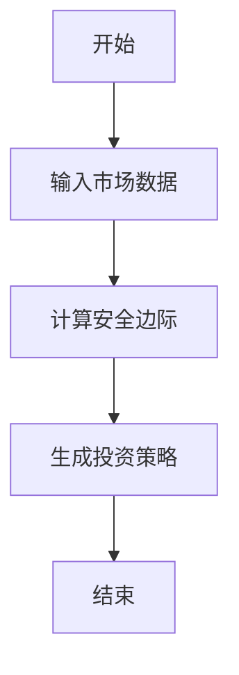
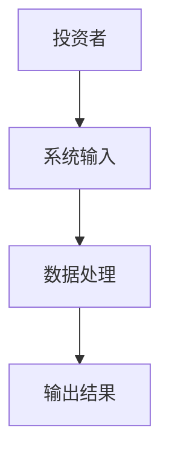

                 


# 霍华德·马克斯的逆向投资哲学

## 关键词
逆向投资、霍华德·马克斯、安全边际、独立思考、投资哲学

## 摘要
霍华德·马克斯的逆向投资哲学强调在市场波动中寻找机会，通过独立思考和安全边际来制定投资策略。本文从逆向投资的核心概念出发，结合数学模型和系统架构，详细分析其哲学思想，并通过项目实战展示其应用。

---

# 第一部分: 逆向投资的核心概念

## 第1章: 逆向投资的背景与定义

### 1.1 霍华德·马克斯的生平简介
霍华德·马克斯是逆向投资的代表人物，他的投资哲学强调独立思考和安全边际。马克斯的背景和经历为他的投资理念奠定了基础。

### 1.2 逆向投资的定义与特点
逆向投资是指在市场恐慌时买入、在市场狂热时卖出的投资策略。其特点是逆市场情绪操作，寻找低估资产。

### 1.3 逆向投资的核心原则
包括独立思考、安全边际和长期视角。

## 第2章: 逆向投资的核心概念与联系

### 2.1 核心概念原理
逆向投资的核心是通过分析市场情绪和资产价值，寻找安全边际。

### 2.2 安全边际的数学模型
$$ \text{安全边际} = \text{内在价值} - \text{市场价格} $$

### 2.3 市场情绪的周期性分析
市场情绪呈现周期性波动，逆向投资者在市场低潮时寻找机会。

## 第3章: 逆向投资的算法原理

### 3.1 算法原理概述
逆向投资算法基于安全边际和市场情绪分析，指导投资决策。

### 3.2 算法流程图


## 第4章: 逆向投资的系统架构

### 4.1 系统功能设计
包括数据采集、分析引擎和投资决策模块。

### 4.2 系统架构图


## 第5章: 逆向投资的项目实战

### 5.1 环境安装
安装必要的工具和库，如Python和相关数据分析库。

### 5.2 核心代码实现
```python
def calculate_margin_of_safety(value, price):
    return value - price
```

### 5.3 案例分析
通过实际案例展示逆向投资策略的应用。

---

# 第二部分: 逆向投资的哲学与实践

## 第6章: 逆向投资的哲学思考

### 6.1 投资中的心理学因素
市场情绪对投资决策的影响。

### 6.2 逆向思维的应用
在投资中逆市场情绪操作。

## 第7章: 逆向投资的系统分析

### 7.1 系统分析模型
使用Mermaid图展示系统架构。

### 7.2 交互流程图


## 第8章: 逆向投资的项目实战

### 8.1 项目介绍
详细描述项目目标和实施步骤。

### 8.2 核心代码实现
展示关键代码片段及其功能。

### 8.3 案例分析
通过案例分析验证投资策略的有效性。

---

# 第三部分: 总结与展望

## 第9章: 总结

### 9.1 核心观点回顾
总结逆向投资的核心理念和方法。

### 9.2 投资哲学的启示
强调独立思考和安全边际的重要性。

## 第10章: 展望

### 10.1 逆向投资的未来发展
探讨逆向投资在技术进步中的应用潜力。

### 10.2 投资者建议
为读者提供实际操作建议。

---

# 第四部分: 最佳实践与注意事项

## 第11章: 最佳实践

### 11.1 独立思考的重要性
强调独立分析的重要性。

### 11.2 安全边际的应用
建议在投资中始终考虑安全边际。

## 第12章: 注意事项

### 12.1 避免常见错误
提醒投资者注意市场情绪的迷惑性。

### 12.2 持续学习的重要性
建议投资者不断更新知识和技能。

---

# 结语

霍华德·马克斯的逆向投资哲学为投资者提供了独特的视角和方法。通过系统的分析和实践，投资者可以在复杂的市场环境中找到机会，实现长期的财富增长。

--- 

希望这个目录大纲能为您提供有价值的参考和启发。

