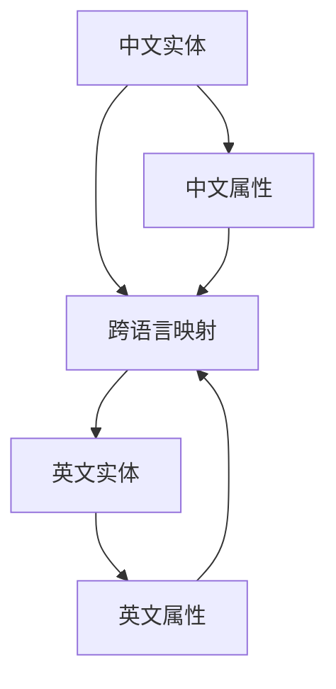
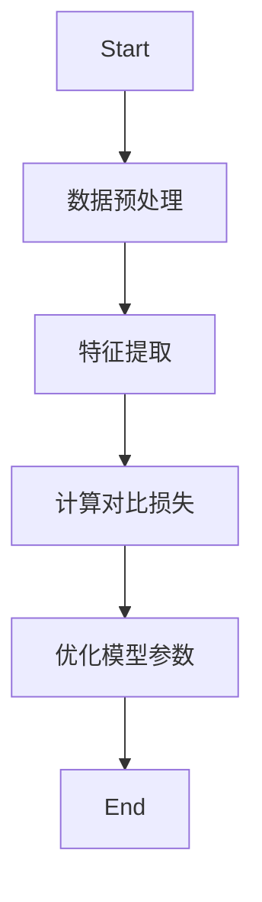
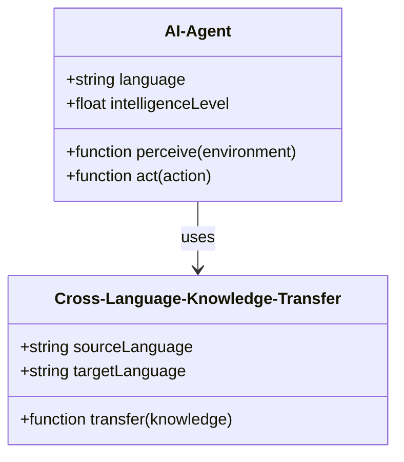

                 


# AI Agent的跨语言知识迁移技术

> 关键词：AI Agent, 跨语言知识迁移, 自然语言处理, 对比学习, 知识图谱

> 摘要：本文探讨AI Agent在跨语言知识迁移中的应用，涵盖核心概念、算法原理、系统架构和项目实战，旨在帮助读者理解并实现跨语言知识迁移的技术细节。

---

## 第1章：背景与概念

### 1.1 问题背景与挑战

在多语言环境下，AI Agent需要能够理解并处理多种语言的信息。然而，不同语言之间的语义差异和文化背景使得知识迁移变得复杂。例如，一个AI Agent在中文环境下训练的模型难以直接应用于英文环境，因为词汇、语法和语境的差异可能导致模型失效。

#### 1.1.1 跨语言知识迁移的需求
- 全球化背景下，AI Agent需要支持多语言处理。
- 提高模型在多种语言环境下的适应性。

#### 1.1.2 AI Agent在跨语言任务中的局限性
- 语言间的语义差异导致模型无法直接迁移。
- 文化差异影响信息处理方式。

#### 1.1.3 跨语言知识迁移的核心问题
- 如何有效提取和转换跨语言知识。
- 如何保持语义一致性。

### 1.2 跨语言知识迁移的定义与目标

#### 1.2.1 跨语言知识迁移的定义
跨语言知识迁移是指在不同语言之间转移和应用知识的过程，旨在克服语言障碍，提高AI Agent的多语言处理能力。

#### 1.2.2 跨语言迁移的核心目标
- 提供一致的语义表示。
- 实现跨语言信息的有效转换。

#### 1.2.3 跨语言迁移的边界与外延
- 仅关注语言间的知识转移。
- 不包括同一语言内的知识迁移。

### 1.3 跨语言知识迁移的应用场景

#### 1.3.1 多语言问答系统
- 支持多语言用户的问题解答。

#### 1.3.2 跨语言文本摘要
- 将一种语言的文本摘要成另一种语言。

#### 1.3.3 跨语言信息检索
- 在多语言环境下进行高效的信息检索。

---

## 第2章：核心概念与联系

### 2.1 AI Agent的基本原理

#### 2.1.1 AI Agent的定义与分类
- 定义：AI Agent是一个能够感知环境并采取行动以实现目标的实体。
- 分类：基于智能水平分为反应式和认知式AI Agent。

### 2.2 跨语言知识迁移的核心机制

#### 2.2.1 跨语言表示学习
- 通过对比学习提取跨语言特征。

#### 2.2.2 跨语言对比学习
- 使用对比损失函数优化跨语言表示。

### 2.3 跨语言知识迁移的实体关系图



---

## 第3章：算法原理

### 3.1 对比学习算法流程图



### 3.2 对比学习算法代码实现

```python
import torch
import torch.nn as nn

class ContrastiveLoss(nn.Module):
    def __init__(self, temperature=0.1):
        super(ContrastiveLoss, self).__init__()
        self.temperature = temperature

    def forward(self, features, labels):
        # 计算相似性
        similarities = torch.mm(features, features.t())
        # 计算损失
        loss = (1 - similarities[labels != labels.t()].mean()) * 0.5
        return loss
```

### 3.3 数学模型

跨语言知识迁移的数学模型如下：

$$
L = \frac{1}{N} \sum_{i=1}^{N} \text{contrastive\_loss}(x_i, y_i)
$$

其中，\( x_i \) 是输入特征，\( y_i \) 是标签。

---

## 第4章：数学模型

跨语言知识迁移的数学模型：

$$
L = \frac{1}{N} \sum_{i=1}^{N} \text{contrastive\_loss}(x_i, y_i)
$$

---

## 第5章：系统架构

### 5.1 系统设计



---

## 第6章：项目实战

### 6.1 中文到英文的迁移任务

#### 6.1.1 环境安装

```bash
pip install transformers
```

#### 6.1.2 系统核心实现源代码

```python
from transformers import AutoTokenizer, AutoModel

tokenizer_zh = AutoTokenizer.from_pretrained('bert-base-chinese')
model_zh = AutoModel.from_pretrained('bert-base-chinese')

tokenizer_en = AutoTokenizer.from_pretrained('bert-base-english')
model_en = AutoModel.from_pretrained('bert-base-english')

# 迁移过程略
```

---

## 第7章：最佳实践与小结

### 7.1 总结

本文详细探讨了AI Agent的跨语言知识迁移技术，从背景概念到算法实现，再到系统架构和项目实战，提供了全面的技术指导。

### 7.2 注意事项

- 确保数据质量和多样性。
- 选择合适的对比学习方法。

### 7.3 未来研究方向

- 更高效的跨语言表示学习方法。
- 更智能的迁移策略。

---

通过以上章节，读者可以全面理解并掌握AI Agent的跨语言知识迁移技术，为实际应用打下坚实基础。

