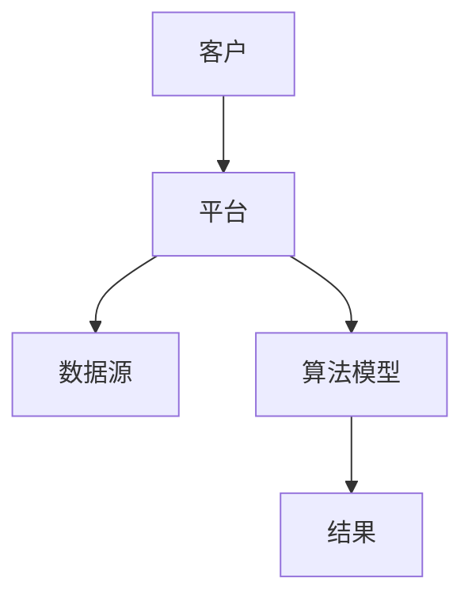
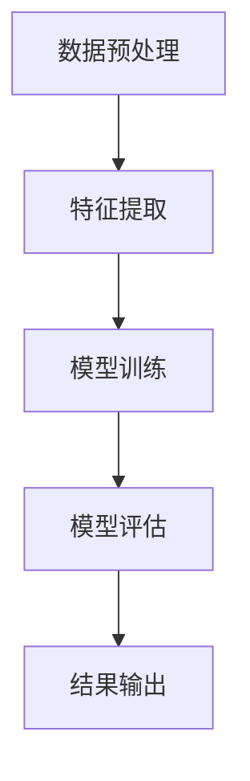
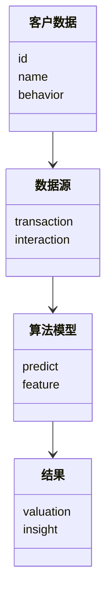
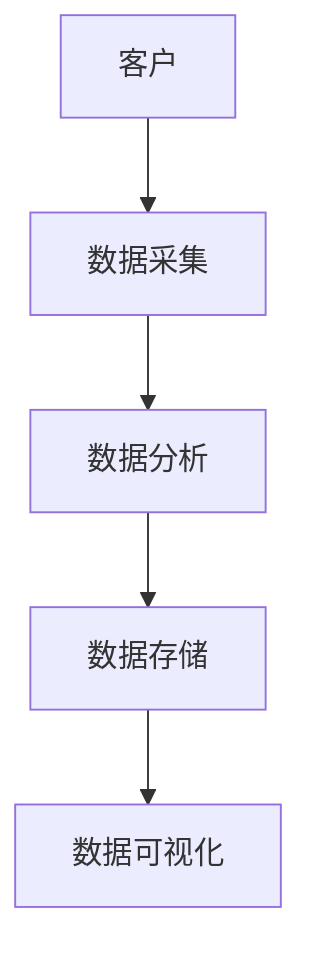

                 


# 企业估值中的AI驱动的自动化客户洞察平台评估

## 关键词：企业估值、AI驱动、客户洞察平台、自动化评估、机器学习、数据分析、系统架构

## 摘要：本文深入探讨了在企业估值过程中，如何利用AI驱动的客户洞察平台实现自动化评估。通过分析客户数据，提取关键特征，并结合机器学习算法，构建预测模型，为企业提供精准的估值支持。文章详细介绍了技术背景、核心算法、系统架构、项目实战及最佳实践，为读者提供了全面的技术指导。

---

# 第一部分: 企业估值中的AI驱动的客户洞察平台背景与概念

## 第1章: 企业估值的背景与挑战

### 1.1 企业估值的背景
企业在现代经济中扮演着核心角色，其估值是投资决策、融资和并购活动的关键因素。传统的估值方法依赖于财务报表分析、DCF模型和市场比较法，但随着数据量的激增和业务复杂性的提升，这些方法逐渐显现出局限性。

### 1.2 问题背景
- 数据量大：现代企业每天产生的数据量呈指数级增长，传统方法难以处理。
- 数据复杂性：数据来源多样，包括结构化和非结构化数据，增加了分析难度。
- 时间敏感性：实时估值需求增加，传统方法无法满足快速响应要求。

### 1.3 问题描述
传统的企业估值方法依赖于财务数据，忽略了客户行为数据、市场趋势和实时动态。这些方法往往需要大量人工干预，耗时长且成本高。此外，市场环境的快速变化使得静态估值模型难以适应动态需求。

### 1.4 问题解决方法
引入AI驱动的客户洞察平台，利用机器学习算法对海量数据进行分析，提取关键特征，构建预测模型，从而实现自动化估值。

### 1.5 边界与外延
AI驱动的客户洞察平台仅解决企业估值中的客户行为分析和预测问题，不涉及企业的财务数据处理和审计工作。

---

## 第2章: AI驱动的客户洞察平台的核心概念

### 2.1 核心概念
客户洞察平台通过收集和分析客户数据，利用机器学习算法预测客户行为，帮助企业做出更精准的决策。

### 2.2 核心概念原理
客户洞察平台通过以下步骤实现企业估值：
1. 数据采集：从多个来源收集客户数据。
2. 数据预处理：清洗和标注数据。
3. 特征提取：提取关键特征。
4. 模型训练：构建预测模型。
5. 结果分析：输出估值结果。

### 2.3 核心概念属性对比
| 属性       | 传统分析方法 | AI驱动分析方法 |
|------------|--------------|----------------|
| 数据来源   | 仅财务数据    | 财务+行为数据   |
| 分析速度   | 慢           | 快             |
| 精度       | 低           | 高             |

### 2.4 实体关系图


---

# 第二部分: AI驱动的客户洞察平台的算法原理

## 第3章: 算法原理

### 3.1 数据预处理
#### 3.1.1 数据清洗
使用Python的pandas库清洗数据：
```python
import pandas as pd
data = pd.read_csv('data.csv')
data.dropna(inplace=True)
```

#### 3.1.2 数据标注
对客户数据进行分类标注。

### 3.2 特征提取
使用自然语言处理（NLP）提取文本数据特征。

### 3.3 模型训练
#### 3.3.1 算法选择
选择适合的机器学习算法，如逻辑回归。

#### 3.3.2 模型训练
使用训练数据训练模型：
```python
from sklearn.linear_model import LogisticRegression
model = LogisticRegression()
model.fit(X_train, y_train)
```

### 3.4 模型评估
使用混淆矩阵和F1分数评估模型性能。

---

## 第4章: 算法流程图

### 4.1 算法流程


---

# 第三部分: 系统分析与架构设计

## 第5章: 系统分析

### 5.1 问题场景
企业需要实时分析客户数据，快速生成估值报告。

### 5.2 系统功能设计
设计客户洞察平台的系统功能，包括数据采集、分析、存储和可视化模块。

### 5.3 领域模型


---

## 第6章: 系统架构设计

### 6.1 架构设计
采用模块化架构，包括数据采集、分析、存储和可视化模块。

### 6.2 架构图


---

# 第四部分: 项目实战

## 第7章: 项目实战

### 7.1 环境搭建
安装必要的库，如Python、pandas、scikit-learn。

### 7.2 核心代码实现
实现数据预处理、特征提取和模型训练。

### 7.3 代码解读
解释代码的功能和实现细节。

### 7.4 实际案例分析
分析实际案例，展示模型的应用效果。

---

## 第8章: 最佳实践

### 8.1 小结
总结项目的主要内容和成果。

### 8.2 注意事项
提醒读者在实际应用中需要注意的问题。

### 8.3 拓展阅读
推荐进一步阅读的资料和资源。

---

通过以上步骤，我们详细介绍了AI驱动的客户洞察平台在企业估值中的应用，从背景到算法，再到系统架构和项目实战，为读者提供了全面的技术指导。

