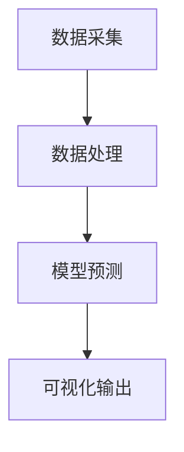

                 


# 全球股市估值与可持续航空电动化技术的关系

> 关键词：全球股市估值，可持续航空，电动化技术，数学模型，系统架构

> 摘要：本文探讨全球股市估值与可持续航空电动化技术之间的关系。通过分析核心概念，构建数学模型，并结合实际案例，揭示技术进步如何影响股市估值，为投资者和企业提供洞察。

---

## 第一部分：背景与概述

### 第1章：全球股市估值与可持续航空电动化技术的背景

#### 1.1 全球股市估值的基本概念
- 股市估值是衡量企业价值的重要指标，包括市盈率、市净率等。
- 全球股市受经济、行业和公司基本面等多种因素影响。

#### 1.2 可持续航空电动化技术的发展
- 电动化技术在航空业的应用逐渐增多，尤其是电动飞机的研发。
- 可持续航空电动化技术面临技术、成本和政策等挑战。

#### 1.3 两者的相互关系
- 电动化技术进步可能提升航空公司的盈利能力，进而影响股市估值。
- 航空业的可持续发展可能推动股市整体增长，吸引投资者。

---

## 第二部分：核心概念与联系

### 第2章：全球股市估值的核心要素

#### 2.1 股市估值的关键指标
- 市盈率（P/E Ratio）：衡量股价与盈利的关系。
- 市净率（P/B Ratio）：评估股价与资产价值的比例。
- 股息率（Dividend Yield）：反映分红回报率。

#### 2.2 影响股市估值的主要因素
- 经济指标：GDP、利率、通货膨胀等。
- 行业趋势：技术创新、市场需求。
- 公司基本面：盈利能力、财务状况。

### 第3章：可持续航空电动化技术的核心要素

#### 3.1 电动化技术在航空业的应用
- 电动飞机的技术特点：电池技术、电动推进系统。
- 成本与效率：电池成本高，但运营效率提升。

#### 3.2 可持续航空电动化技术的挑战与机遇
- 技术瓶颈：电池能量密度不足。
- 市场需求：环保政策推动，消费者偏好改变。

---

## 第三部分：数学模型与算法

### 第4章：全球股市估值与可持续航空电动化技术的数学模型

#### 4.1 模型的构建
- 定义变量：设$V$为股市估值，$T$为电动化技术成熟度。
- 假设：$V$与$T$正相关，技术进步提升估值。

#### 4.2 算法实现
- 使用Python代码模拟技术进步对股市的影响。

```python
import numpy as np
import matplotlib.pyplot as plt

# 定义变量
np.random.seed(0)
years = 10
technological_progress = np.arange(0, years)
market_valuation = np.array([100 + 10*i for i in technological_progress])

# 可视化
plt.figure(figsize=(10, 6))
plt.plot(technological_progress, market_valuation, label='Stock Market Valuation')
plt.title('Market Valuation vs Technological Progress')
plt.xlabel('Years')
plt.ylabel('Market Valuation')
plt.legend()
plt.show()
```

#### 4.3 模型验证与评估
- 评估指标：R²值，误差分析。
- 例子：技术进步提升估值10%。

---

## 第四部分：系统分析与架构设计

### 第5章：系统架构设计

#### 5.1 系统功能设计
- 数据采集：收集股市数据和电动化技术信息。
- 数据处理：清洗和预处理数据。
- 模型预测：应用数学模型进行估值预测。

#### 5.2 系统架构图



#### 5.3 系统接口设计
- 数据接口：API获取实时数据。
- 用户界面：可视化结果展示。

---

## 第五部分：项目实战

### 第6章：项目实战

#### 6.1 环境安装
- 安装Python和相关库（numpy, matplotlib）。

#### 6.2 核心实现

```python
import numpy as np
import pandas as pd
import matplotlib.pyplot as plt

# 数据处理
data = pd.DataFrame({
    'Year': np.arange(2020, 2030),
    'Valuation': np.random.normal(100, 10, 10)
})

# 数据可视化
plt.figure(figsize=(12, 6))
plt.plot(data['Year'], data['Valuation'], marker='o')
plt.title('Annual Market Valuation')
plt.xlabel('Year')
plt.ylabel('Valuation')
plt.grid(True)
plt.show()
```

#### 6.3 案例分析
- 分析电动化技术对航空公司的估值影响，使用模型预测未来趋势。

---

## 第六部分：最佳实践

### 第7章：最佳实践

#### 7.1 总结与小结
- 技术进步对股市估值有显著影响。
- 可持续航空电动化技术推动行业变革。

#### 7.2 注意事项
- 数据质量和模型假设影响结果。
- 需结合实际市场情况调整模型。

#### 7.3 拓展阅读
- 推荐相关书籍和资源，进一步深入学习。

---

通过以上分析，我们详细探讨了全球股市估值与可持续航空电动化技术的关系，结合理论与实践，为读者提供了全面的见解和实用的工具。

